## 安装 Anaconda/Miniconda

### 下载 Miniconda

各大操作系统最新版本的 Minconda 都可以在下方网址进行下载：

[Miniconda — Anaconda documentation](https://docs.anaconda.com/free/miniconda/index.html#latest-miniconda-installer-links){.md-button}

注意：选择下载的 Miniconda3 版本需要和电脑处理器的架构吻合。为了方便，在此下方直接提供各大操作系统推荐的下载链接。

|      系统      | 下载地址                                                                   |
| :------------: | -------------------------------------------------------------------------- |
|    Windows     | <https://repo.anaconda.com/miniconda/Miniconda3-latest-Windows-x86_64.exe> |
| macOS（Intel） | <https://repo.anaconda.com/miniconda/Miniconda3-latest-MacOSX-x86_64.sh>   |
| macOS（M/ARM） | <https://repo.anaconda.com/miniconda/Miniconda3-latest-MacOSX-arm64.sh>    |
|  Linux（x64）  | <https://repo.anaconda.com/miniconda/Miniconda3-latest-Linux-x86_64.sh>    |
|  Linux（ARM）  | <https://repo.anaconda.com/miniconda/Miniconda3-latest-Linux-aarch64.sh>   |

### 安装 Miniconda

下面我们分别介绍在 Windows 系统和 Linux 系统下的安装流程。

#### Windows 系统安装 Miniconda

- 运行下载好的安装包

  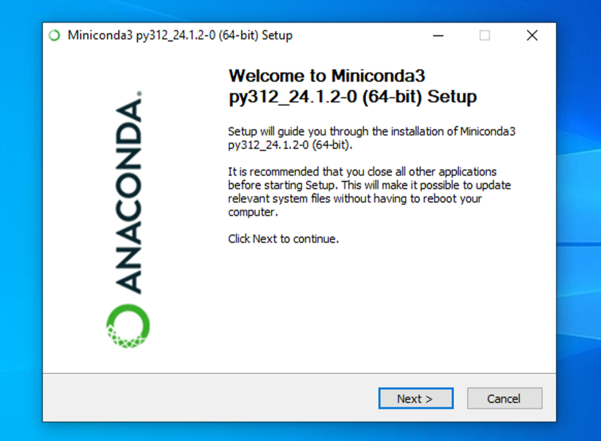{ width="600" }

- 一路next和agree，直到选择路径，可以根据自己偏好选择路径，这里选择默认。

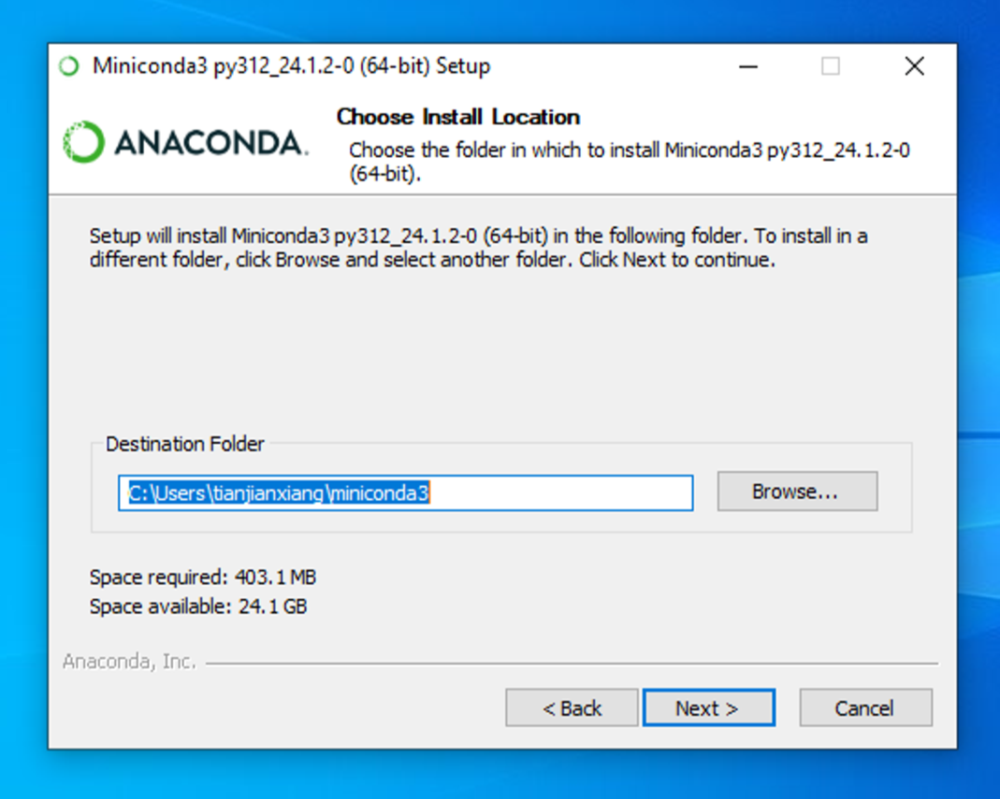{ width="600" }

- 保持默认配置即可，下一步。

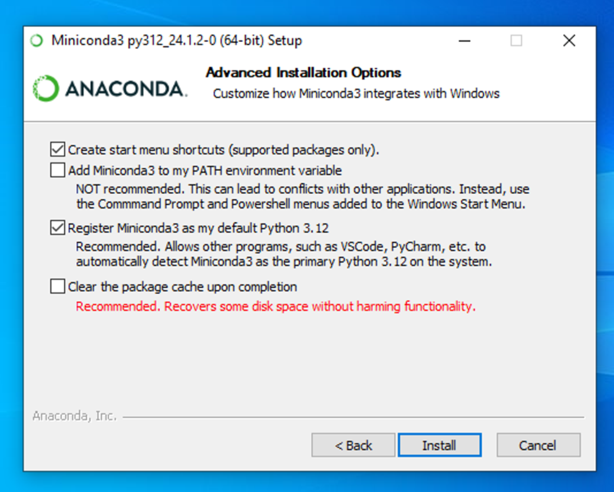{ width="600" }

- 完成，以后使用`conda` 从开始菜单点开即可。

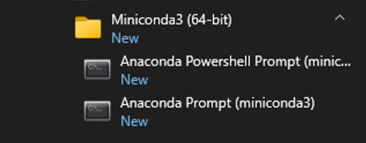{ width="600" }

#### Linux 系统安装 Miniconda

下载好的安装文件放在 Downloads 文件中

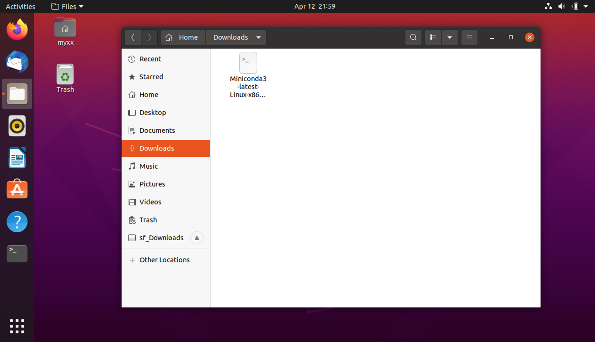{ width="600" }

在`Miniconda3`所在文件夹下打开终端

- 为文件添加执行权限（文件名称要和自己下载的版本一致）命令是：`chmod a+x ./Miniconda3-latest-Linux-x86_64.sh`

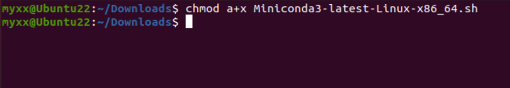{ width="600" }

- 运行安装程序命令，命令是`sh ./Miniconda3-latest-Linux-x86_64.sh` ，然后根据提示回车。

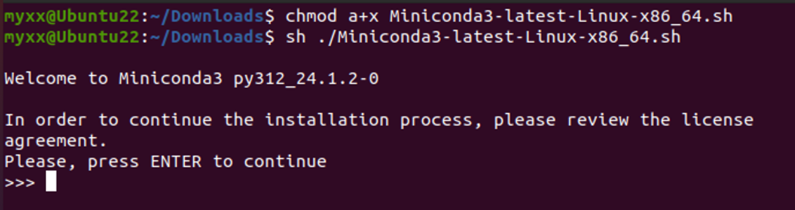{ width="600" }

- 这里会让阅读相关协议，直接按`q` 结束阅读，输入`yes`，然后回车。

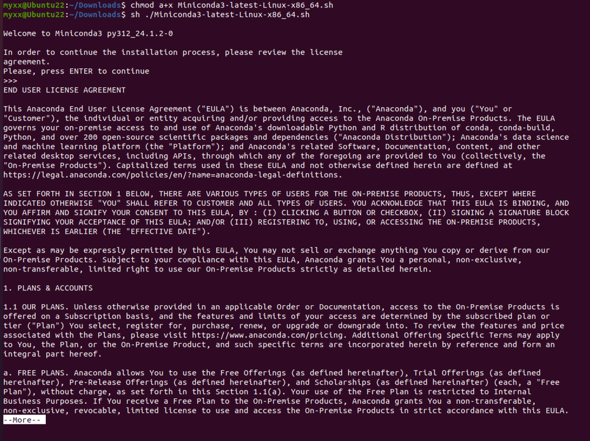{ width="600" }

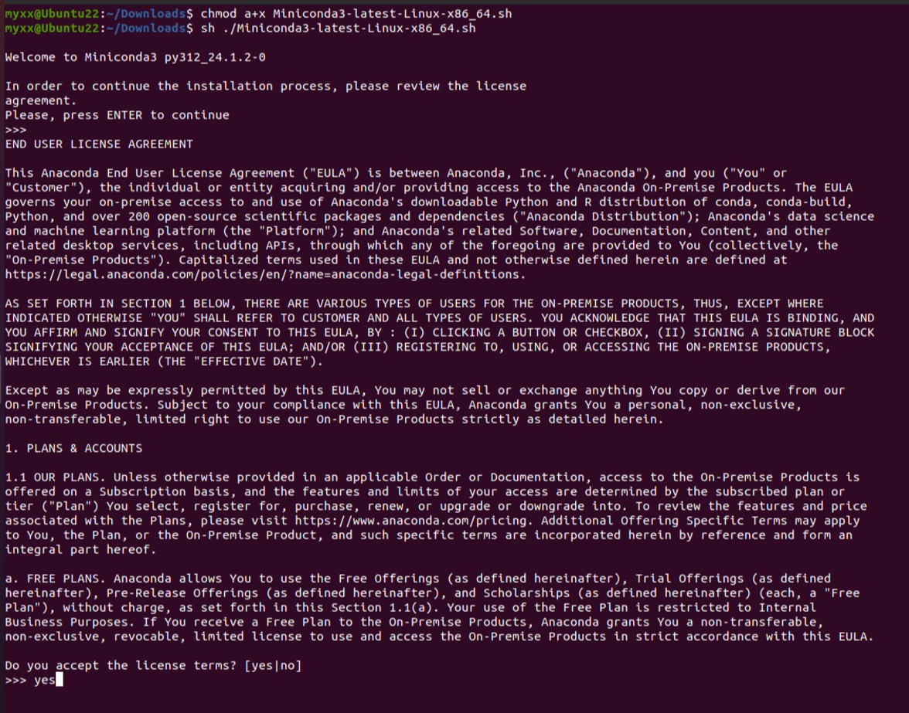{ width="600" }

```bash
- Press ENTER to confirm the location
- Press CTRL-C to abort the installation
- Or specify a different location below
```

- 在这里程序提示以下信息，这里有三种选择，分别是:
    1. 回车使用默认路径`\home\user\miniconda3`
    2. 使用`ctrl c` 终止程序
    3. 用户自定义路径

用户可以根据自己的需要选择安装目录。

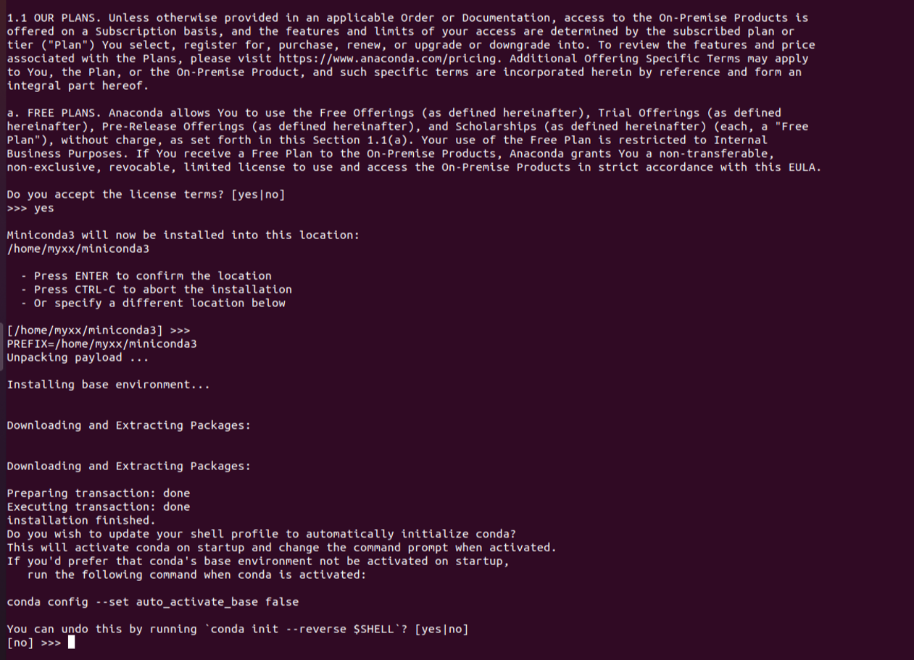{ width="600" }

- 程序经过安装后会询问是否每次启动终端是否自动启动`conda`。输入`yes`然后回车。

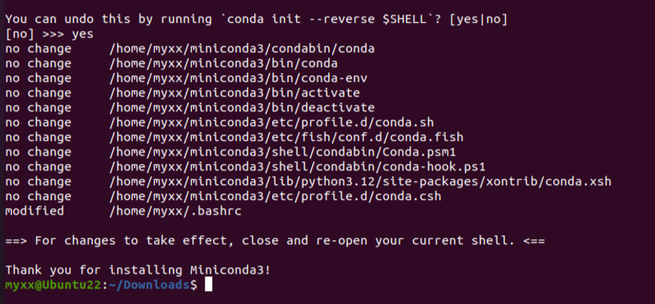{ width="600" }

- 根据提示重启终端，再次打开就会出现`(base)` 。以后就在终端操作`conda`。

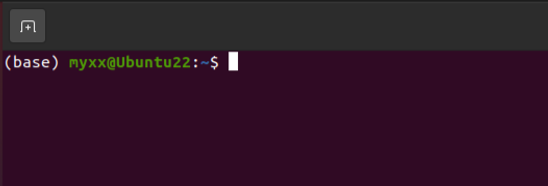{ width="600" }

## 换源

在安装package时，我们经常会使用`pip install package_name`和`conda install package_name`的命令，但是一些package下载速度会很慢，因此我们需要进行换源，换成国内源，加快我们的下载速度。以下便是两种对应方式的换源。

如果我们仅仅想为单次下载换源可以使用`pip install package_name -i https://pypi.tuna.tsinghua.edu.cn/simple`进行下载。

### Windows 系统换源

#### `pip`换源

- 文件管理器文件路径地址栏敲：`%APPDATA%` 回车，快速进入 `C:\Users\User\AppData\Roaming` 文件夹。

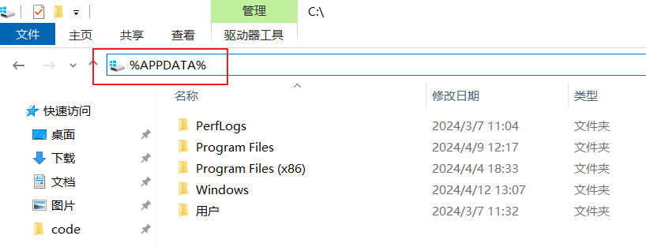{ width="600" }

- 新建 pip 文件夹并在文件夹中新建 `pip.ini` 配置文件。

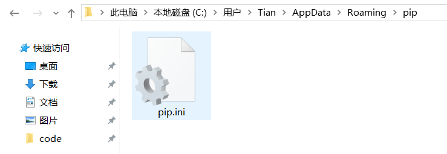{ width="600" }

- 使用记事本打开，输入以下内容，并按下`ctrl+s`保存。

``` title='pip.ini'
[global]
index-url = https://pypi.tuna.tsinghua.edu.cn/simple
[install]
use-mirrors =true
mirrors = https://pypi.tuna.tsinghua.edu.cn/simple/
trusted-host = pypi.tuna.tsinghua.edu.cn
```

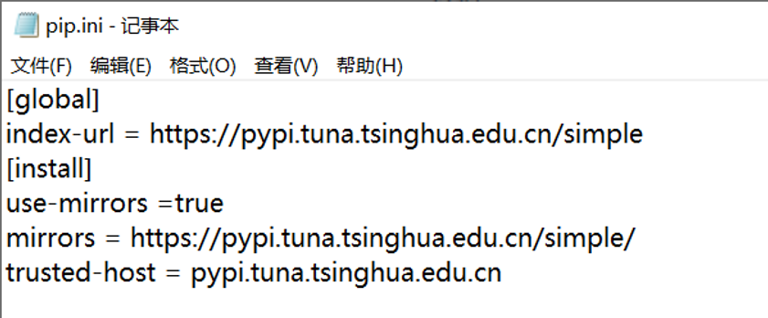{ width="600" }

#### `conda`换源

我们需要在`.condarc`文件内进行换源，但是Windows 用户无法直接创建名为 `.condarc` 的文件，可先执行`conda config --set show_channel_urls yes`生成该文件之后再修改。

- 执行完`conda config --set show_channel_urls yes`后会在用户文件夹找到`.condarc` 文件。

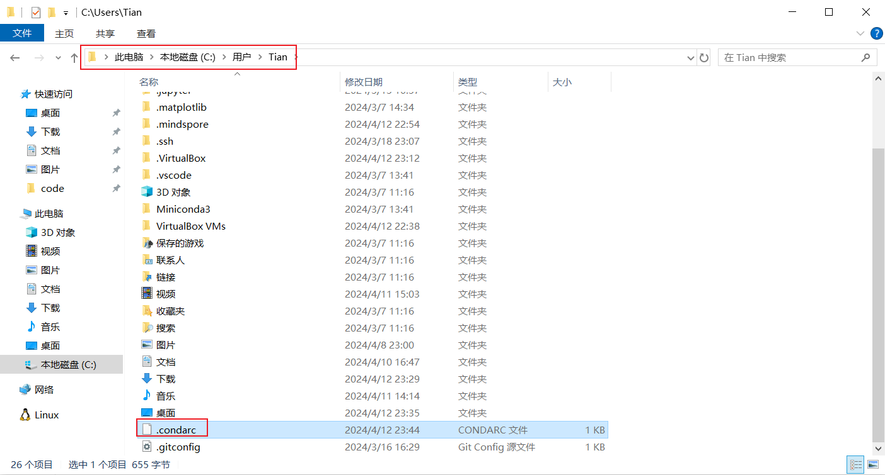{ width="600" }

- 修改这个文件，替换为以下内容。

```txt title='.condarc'
channels:
  - defaults
show_channel_urls: true
default_channels:
  - https://mirrors.tuna.tsinghua.edu.cn/anaconda/pkgs/main
  - https://mirrors.tuna.tsinghua.edu.cn/anaconda/pkgs/r
  - https://mirrors.tuna.tsinghua.edu.cn/anaconda/pkgs/msys2
custom_channels:
  conda-forge: https://mirrors.tuna.tsinghua.edu.cn/anaconda/cloud
  msys2: https://mirrors.tuna.tsinghua.edu.cn/anaconda/cloud
  bioconda: https://mirrors.tuna.tsinghua.edu.cn/anaconda/cloud
  menpo: https://mirrors.tuna.tsinghua.edu.cn/anaconda/cloud
  pytorch: https://mirrors.tuna.tsinghua.edu.cn/anaconda/cloud
  simpleitk: https://mirrors.tuna.tsinghua.edu.cn/anaconda/cloud
auto_activate_base: false
```

### Linux 系统换源

前情提示：在`vim`下，我们需要输入`i`进入编辑模式，将内容粘贴进去，按`ESC`退出编辑模式，输入`:wq`保存并退出。

#### `pip`换源

在终端执行以下命令

```bash
cd ~
mkdir .pip/
cd .pip
vim pip.conf
```

在这个`pip.conf`文件下应该粘贴以下内容，直接复制粘贴到文件内即可，然后结束编辑。

```bash title='pip.conf'
[global]
index-url = https://pypi.tuna.tsinghua.edu.cn/simple
[install]
use-mirrors =true
mirrors = https://pypi.tuna.tsinghua.edu.cn/simple/
trusted-host = pypi.tuna.tsinghua.edu.cn
```

#### `conda`换源

在终端执⾏以下命令

```bash
cd ~
vim .condarc
```

在`.condarc` 文件内应该粘贴以下内容，直接复制粘贴到文件内即可。然后结束编辑

```txt title='.condarc'
channels:
  - defaults
show_channel_urls: true
default_channels:
  - https://mirrors.tuna.tsinghua.edu.cn/anaconda/pkgs/main
  - https://mirrors.tuna.tsinghua.edu.cn/anaconda/pkgs/r
  - https://mirrors.tuna.tsinghua.edu.cn/anaconda/pkgs/msys2
custom_channels:
  conda-forge: https://mirrors.tuna.tsinghua.edu.cn/anaconda/cloud
  msys2: https://mirrors.tuna.tsinghua.edu.cn/anaconda/cloud
  bioconda: https://mirrors.tuna.tsinghua.edu.cn/anaconda/cloud
  menpo: https://mirrors.tuna.tsinghua.edu.cn/anaconda/cloud
  pytorch: https://mirrors.tuna.tsinghua.edu.cn/anaconda/cloud
  simpleitk: https://mirrors.tuna.tsinghua.edu.cn/anaconda/cloud
auto_activate_base: false
```

最后使用`conda clean -i` 清除索引缓存。

## `conda`/`pip`的使用

- 查看现有虚拟环境：`conda env list`
- 创建虚拟环境：`conda create -n env_name python=version`
  - `create`： 创建环境命令
  - `n`：`-name` 缩写，后面紧接着是虚拟环境名称
  - `env_name`：虚拟环境名称：见名知意，可以根据实际需求更改
  - `version` ：Python版本，例如3.8，以下是具体示例

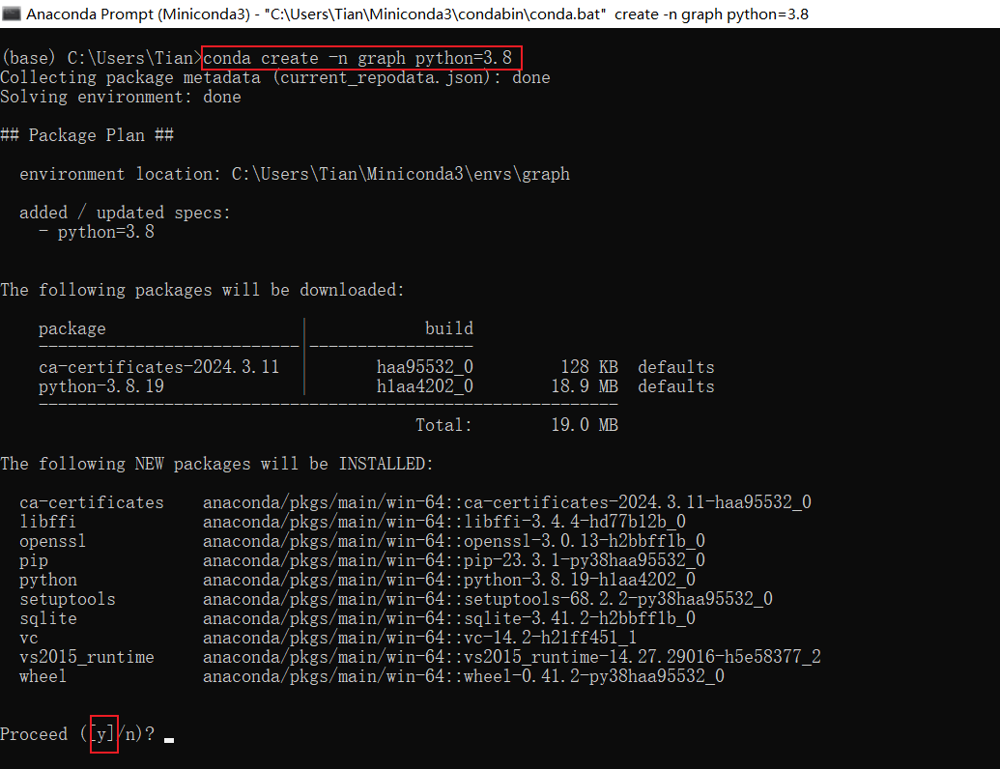{ width="600" }

- 激活虚拟环境：`conda activate env_name` ，激活虚拟环境后，终端将会在括号内显示当前环境名称。

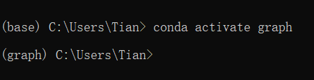{ width="600" }

- 安装包：`conda install package_name`或者`pip install package_name`
    - `pip`在安装包时临时更换镜像源：`pip install package_name -i https://pypi.tuna.tsinghua.edu.cn/simple`
- 卸载包：`conda remove package_name`或者`pip uninstall package_name`
- 显示所有安装的包：`conda list`
- 删除指定虚拟环境：`conda remove -n env_name --all`
- 退出当前环境：`conda deactivate`

更多的`conda`命令参考官网。

[Commands — conda 24.3.1.dev30 documentation](https://docs.conda.io/projects/conda/en/latest/commands/index.html){.md-button}

## 安装函数库

???+ warning
    :100:当你想在虚拟环境安装包的时候，确认你正处在正确的虚拟环境中！！

```bash title='pip/conda'
pip install numpy pandas matplotlib transformers datasets peft evaluate diffusers gradio torch jupyterlab
```

## 参考

<div class="grid cards" markdown>

- Datawhale 开源 PyTorch 教程

    ---

    [深入浅出 `PyTorch`](https://datawhalechina.github.io/thorough-pytorch/)

- Miniconda 官方文档

	---

	[Miniconda documentation](https://docs.anaconda.com/free/miniconda/index.html#latest-miniconda-installer-links)

</div>
