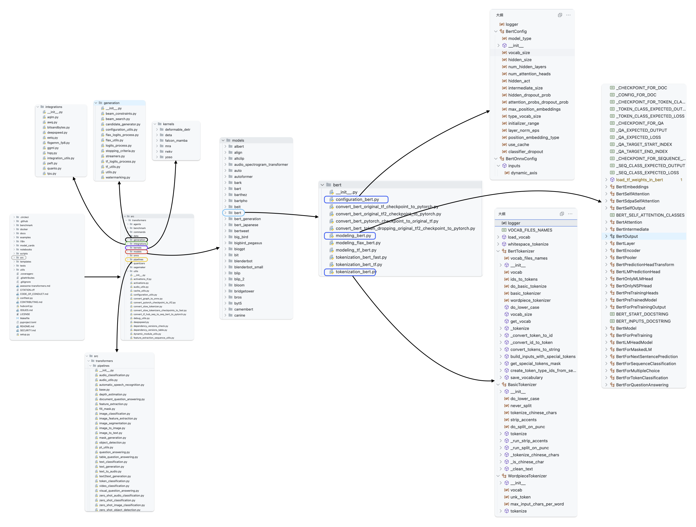

## 前言

`transformers` 已然成为自然语言处理领域**不可或缺**的一部分，因为它是一个简洁、标准、高效且强大的工具。

俗话说“工欲善其事，必先利其器”，为了手拿把掐 `transformers`，理解其仓库结构及相关代码至关重要。

本文将介绍[`transformers`](https://github.com/huggingface/transformers)仓库的重要部分。

## 总体



在根目录可以看到

```text
.circleci/
.github/
benchmark/
docker/
...
scripts
src
templates
...
```

1. 重点就在于 `src` 目录下的 `transformers` 下的代码，开发者在使用 `transformers` 的时候就是在这里调用函数。
2. 在transformers目录下，重要的部分就是`generation`、`intergration`、`kernels`、`models`、`pipelines`这些目录。
    1. `generation`：存储用于文本生成的各种算法，例如`beam search`、`greedy search`等算法。
    2. `intergration`：包含与其他库和框架的集成代码，例如内置一部分 `PEFT` 算法、 `deepspeed` 加速组件。
    3. `kernels`：存储自定义实现的`CUDA`算子。
    4. `models`：存储着各种预训练模型的实现，是这个仓库的灵魂所在。
    5. `pipelines`：存储着高阶接口，这些接口允许开发者方便地使用预训练模型完成各种任务。
3. 对于某模型，其相关配置，处理器和模型实现都会被存放到同一文件夹下。同时不同模型文件夹又会统一放在 `models` 文件夹下。
4. 在某一 NLP 领域模型文件夹下，通常会包括**配置文件**，**模型实现**，**分词器**，其余文件因模型而异。
      1. 计算机视觉的模型可能还会存在预处理器文件。
      2. 部分模型存在不同框架权重文件转化器。
      3. 可能有的模型用的是别的模型的分词器，自然也就不会在模型文件夹下存在分词器文件。
      4. 文件名称中存在`tf`、`flax`等不同框架缩写的，表示该文件是在对应深度学习框架下实现的。
      5. $\cdots$
5. `configuration_xxx.py` 通常代表预训练模型的配置参数。`model_xxx.py` 通常代表预训练模型的实现。`tokenization_xxx.py` 通常代表与模型配套的分词器。
