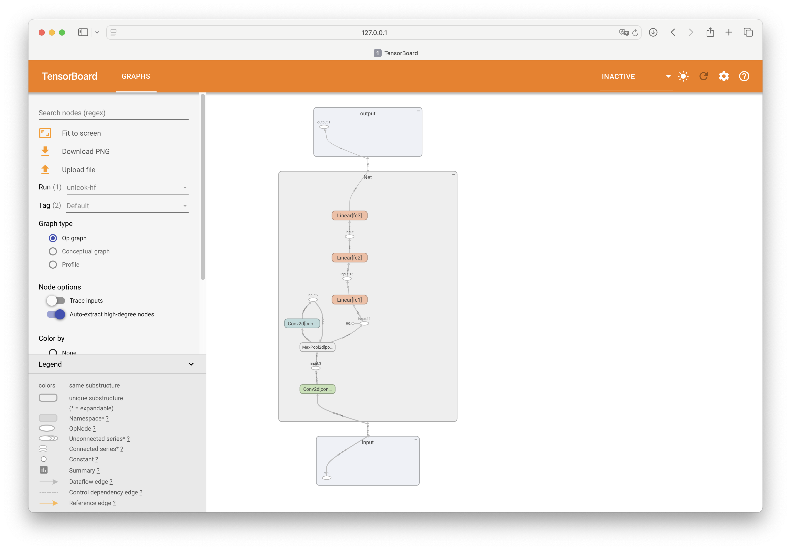

## 快速开始

```bash
tensorboard --logdir=runs
```

在终端执行`tensorboard`命令，指定`logdir`参数为存储日志数据的目录。

```python
from torch.utils.tensorboard import SummaryWriter

# default `log_dir` is "runs" - we'll be more specific here
writer = SummaryWriter('runs/unlock-hf')
```

创建**TensorBoard日志记录器**，日志数据将被存储在 `runs/unlock-hf` 目录下。

!!! note "上下文管理器"
    也可以使用`with`语句建立日志记录器。

## 可视化网络

定义神经网络。

```python
class Net(nn.Module):
    def __init__(self):
        super(Net, self).__init__()
        self.conv1 = nn.Conv2d(1, 6, 5)
        self.pool = nn.MaxPool2d(2, 2)
        self.conv2 = nn.Conv2d(6, 16, 5)
        self.fc1 = nn.Linear(16 * 4 * 4, 120)
        self.fc2 = nn.Linear(120, 84)
        self.fc3 = nn.Linear(84, 10)

    def forward(self, x):
        x = self.pool(F.relu(self.conv1(x)))
        x = self.pool(F.relu(self.conv2(x)))
        x = x.view(-1, 16 * 4 * 4)
        x = F.relu(self.fc1(x))
        x = F.relu(self.fc2(x))
        x = self.fc3(x)
        return x

net = Net()
```

- 利用`add_graph`方法向日志记录器中添加网络模型结构。

```python
with SummaryWriter('runs/unlock-hf') as writer:
    writer.add_graph(net, torch.rand(1, 1, 28, 28))
```



## 可视化图片

```python
imgs = torch.zeros(3, 3, 256, 256)

imgs[0, 0, :, :] = 255
imgs[1, 1, :, :] = 255
imgs[2, 2, :, :] = 255

imgs = torchvision.utils.make_grid(imgs)

with SummaryWriter('runs/unlock-hf') as writer:
    writer.add_image('example', imgs)
```

- 利用`add_image`方法向日志记录器中添加图片。


## 可视化变量

```python
with SummaryWriter('runs/unlock-hf') as writer:
    for i in range(100):
        x = i
        y = x**2
        writer.add_scalar("x", x, i) #日志中记录x在第step i 的值
        writer.add_scalar("y", y, i) #日志中记录y在第step i 的值
```

- 利用`add_scalar`方法向日志记录器中添加变量数据。


## 可视化向量空间

```python
images = torch.randn(100, 1, 28, 28)
labels = torch.randint(0, 10, (100,))
with SummaryWriter('runs/unlock-hf') as writer:
    features = images.view(-1, 28 * 28)
    class_labels = [f'Class {i}' for i in labels]
    labels = labels.unsqueeze(1)
    writer.add_embedding(features, metadata=labels, label_img=images)
```

- 利用`add_embedding`方法向日志记录器中添加向量数据。


!!! warning "注意"
    部分浏览器可能无法正常显示此部分界面。

## 参考资料

<div class="grid cards" markdown>

- [Visualizing Models, Data, and Training with TensorBoard](https://pytorch.org/tutorials/intermediate/tensorboard_tutorial.html)
- [TensorBoard Projector 简易指南](https://blog.csdn.net/u010099080/article/details/122394146)

</div>