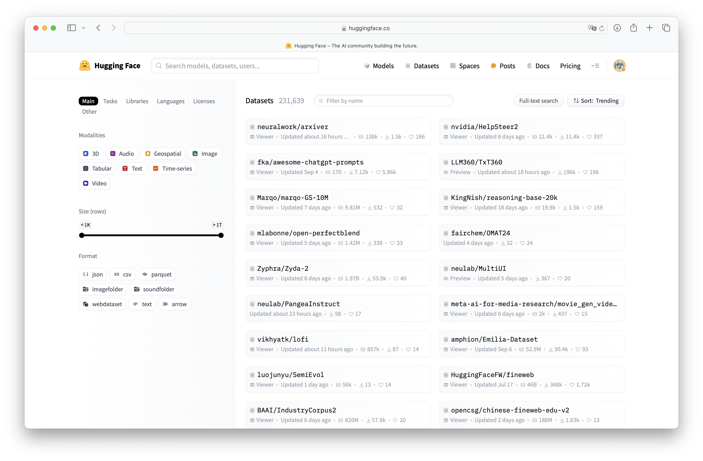
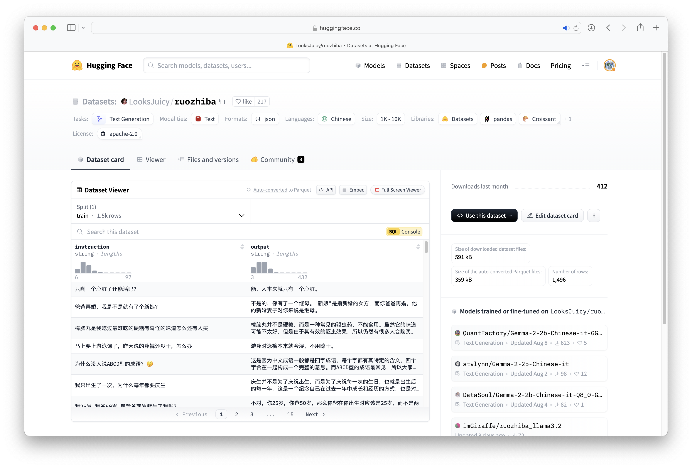
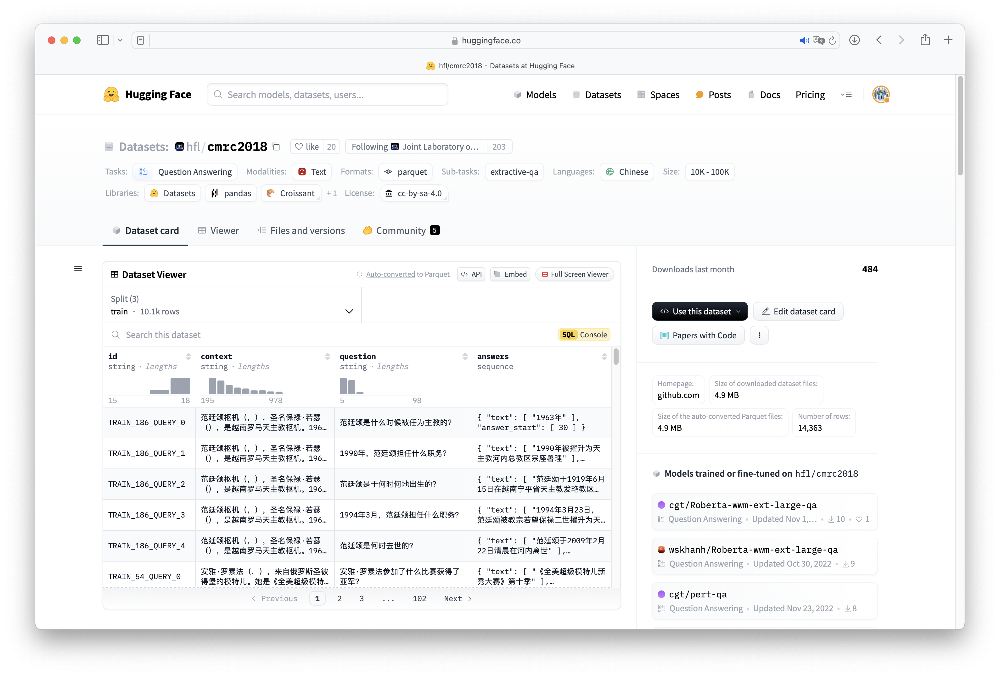
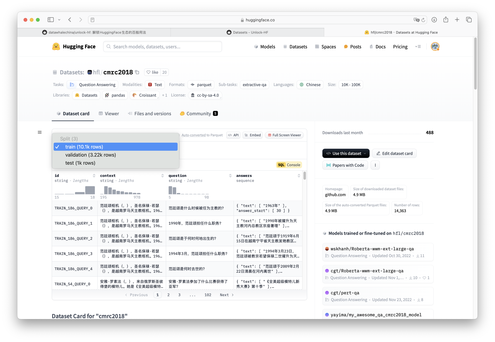
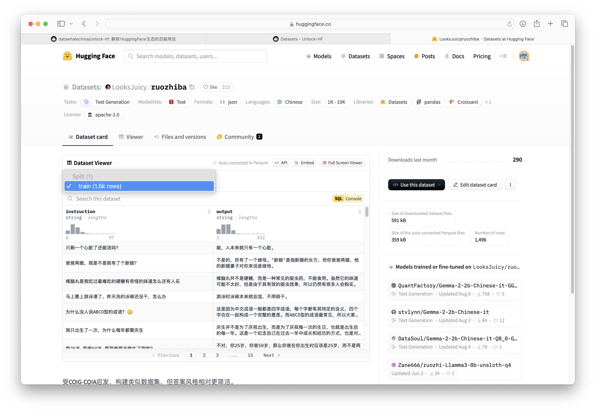

## 前言

无论是计算机视觉还是自然语言处理领域，想要训练一个智能系统必然是从数据加载开始，然后针对数据进行千变万化以符合模型的输入要求。

在过去，开发者面对不同任务时会遇到不尽相同的数据格式，甚至同一个任务也会遇到不同的数据格式。下面举出了一些常见的问题：

| 问题             | 说明                                                                                             |
| ---------------- | ------------------------------------------------------------------------------------------------ |
| 文本格式不一致   | 某些数据集使用 `json` 格式存储，有些使用 `csv` 或 `txt` 格式，而且字段命名和数据结构也可能不同。 |
| 标签表示方法多样 | 在文本分类任务中，某些数据集使用数字标签，某些则使用文本标签。                                   |
| $\cdots$         |                                                                                                  |

为了尽快完成任务，开发者需要编写不同的处理函数，以满足模型的输入要求，这些问题导致开发者需要为每个项目甚至每个数据集编写大量重复的代码，极大地降低了开发效率。

但现在， `Datasets` 的出现有效解决了这些问题，它提供了一套恰到好处、强有力、标准化的数据格式和处理流程，帮助开发者摆脱繁琐的数据预处理工作，专注于模型开发。与传统数据集工具相比，`Datasets` 的优势主要体现在以下几个方面：

| 优势                           | 说明                                                                                         |
| ------------------------------ | -------------------------------------------------------------------------------------------- |
| 简化数据加载                   | 无需手动下载、解压、解析数据文件，`Datasets` 提供一键加载功能，极大简化数据获取流程。        |
| 内置处理函数                   | 强大的内置函数 (例如 `map`, `filter`, `sort`, `shuffle` 等) 用于数据清洗、转换、增强等操作。 |
| 高效处理大型数据集             | 使用 `Apache Arrow` 格式存储数据，支持并行处理，可以高效处理海量数据。                       |
| 支持多种数据格式               | `Datasets` 广泛支持数据格式，方便用户使用来自不同来源的数据集。                              |
| ==自定义函数==                 | ==用户可以使用 `map` 函数应用自定义函数对数据集进行灵活处理，满足个性化需求。==              |
| 代码易于共享和复用             | 标准化的数据格式和处理流程使得代码更易于共享和复用，提高研究的可重复性。                     |
| 与 `transformers` 生态无缝集成 | 可以轻松地将处理后的数据集用于训练和评估 `transformers` 模型。                               |

## 安装 `Datasets`

```bash title='pip'
pip install datasets
```

## 加载数据集

在下文，从以下两个角度演示 `Datasets` 库提供的一键加载数据集的功能。

1. 从 Hub 加载数据集
2. 从本地加载数据集

### 从 Hub 加载数据集

所有被托管的数据集都可以在[数据集主页](https://huggingface.co/datasets)查看，利用左侧的选项可以更快地筛选出符合需求的数据集。



经过选择后，可以打开数据集介绍页查看详细信息。对于每个数据集都会有其独特的仓库路径，待会加载数据集时，函数会根据仓库路径自动从 Hub 下载并加载数据集，例如下图的仓库路径为 `LooksJuicy/ruozhiba`，再比如另一个仓库路径为 `hfl/cmrc2018`。

<div class="grid" markdown>





</div>

当开发者选定了数据集后，便可以使用 `load_dataset` 函数根据仓库 `ID` 加载数据集。

```python title='hfl/cmrc2018'
from datasets import load_dataset

data = load_dataset("hfl/cmrc2018")
```

```python title='data'
{
    'test': Dataset(
        {
            'features': ['id', 'context', 'question', 'answers'],
            'num_rows': 1002
        }
    ),
    'train': Dataset(
        {
            'features': ['id', 'context', 'question', 'answers'],
            'num_rows': 10142
        }
    ),
    'validation': Dataset(
        {
            'features': ['id', 'context', 'question', 'answers'],
            'num_rows': 3219
        }
    )
}
```

通过返回结果可以看出 `data` 的数据类型为 `DatasetDict`，它是 `Datasets` 库中重要的数据类型。

!!! note "train_test_split"

	并非所有数据集都包含训练集、验证集和测试集。有些数据集可能只有一个或两个子集。
	对于数据集 `hfl/cmrc2018` 存在训练集、验证集和测试集。但是对于 `LooksJuicy/ruozhiba` 却只存在训练集。

	在实际的开发中，可以使用 `train_test_split` 函数将训练集划分为训练集和测试集。

    <div class="grid" markdown>

	

	
    </div>

`DatasetDict` 就像一个 `Python` 字典，它包含多个数据集，每个数据集都有一个**名字**作为键和对应的**数据集对象**作为值。

开发者可以像访问普通字典一样访问 `DatasetDict` 中的数据集。

```python
train_dataset = data['train']  # 获取训练集

print(len(dataset_dict['validation']))  # 获取验证集大小
```

```python title='train_dataset'
Dataset({
    features: ['id', 'context', 'question', 'answers'],
    num_rows: 10142
})
```

```python title='len(dataset_dict["validation"])'
3219
```

在使用 `load_dataset` 的时候还有一个参数值得被关注，那就是 `split`，对于一个数据集，`split` 可以是**键**或者**键组成的列表**以表示加载哪部分数据。

- 如果使用 `data = load_datase("hfl/cmrc2018")` 时不指定 `split`，那么 `data` 会像下面一样。

```python
{
    'test': Dataset(
        {
            'features': ['id', 'context', 'question', 'answers'],
            'num_rows': 1002
        }
    ),
    'train': Dataset(
        {
            'features': ['id', 'context', 'question', 'answers'],
            'num_rows': 10142
        }
    ),
    'validation': Dataset(
        {
            'features': ['id', 'context', 'question', 'answers'],
            'num_rows': 3219
        }
    )
}
```

- 如果使用 `data = load_datase("hfl/cmrc2018", split='train')` ，那么 `data` 会像下面一样。

```python title="split='train'"
Dataset({
    features: ['id', 'context', 'question', 'answers'],
    num_rows: 10142
})
```

- 如果使用 `data = load_datase("hfl/cmrc2018", split=["train", "test"])` ，那么 `data` 会像下面一样。

```python title='split=["train", "test"]'
[
    Dataset({
        features: ['id', 'context', 'question', 'answers'],
        num_rows: 10142
    }),
    Dataset({
        features: ['id', 'context', 'question', 'answers'],
        num_rows: 1002
    })
]

```

!!! note "配置"

	### 配置 (Configurations)

	* 一些数据集包含多个子数据集，子数据集又可能包含训练集、测试集和验证集。例如`Minds-14`数据集，每个子数据集包含不同语言的音频数据。这些子数据集被称为配置 (configurations)。
	* 在加载有不同配置的数据集时，需要明确选择一个配置。可以使用 `get_dataset_config_names()` 函数检索数据集的所有可用配置列表。例如，`get_dataset_config_names("PolyAI/minds14")` 返回`Minds-14`数据集的所有可用语言配置列表。
	* 加载数据集时，指定要加载的配置，例如`load_dataset("PolyAI/minds14", "fr-FR", split="train")`加载法语训练集。

## Dataset 方法介绍

### `add_column` 方法

该方法向数据集中增加一列数据。以下是该方法的参数表格。

| 参数名称          | 数据类型                | 默认值 | 说明           |
| ----------------- | ----------------------- | ------ | -------------- |
| `name`            | `str`                   |        | 列名           |
| `column`          | `list` or `numpy.array` |        | 所要添加的数据 |
| `new_fingerprint` |                         |        |                |
| `feature`         | `FeatureType` or `None` | `None` | 列数据类型     |

```python
from datasets import load_dataset

ds = load_dataset("rotten_tomatoes", split="validation")
```

下面是使用 `ds.to_pandas()` 方法获取的数据。

| text                                                                                    | label    |
| --------------------------------------------------------------------------------------- | -------- |
| compassionately explores the seemingly irreconcilable contradictions of love and faith  | 1        |
| the soundtrack alone is worth the price of admission                                    | 1        |
| rodriguez does a splendid job of racial profiling in a balanced and complex way         | 1        |
| beneath the film's obvious determination to shock lies genuine intelligence and insight | 1        |
| bielinsky is a filmmaker of impressive talent                                           | 1        |
| $\cdots$                                                                                | $\cdots$ |

现在调用 `add_column` 方法向原有数据增加一列数据，在这里将列名为 `text` 列的数据添加数据集中，并命名为 `new_column`。

```python
new_column = ds["text"]

ds.add_column(name="new_column", column=new_column)
```

下面是变化后的数据。

| text                                                                                    | label    | new_column                                                                              |
| --------------------------------------------------------------------------------------- | -------- | --------------------------------------------------------------------------------------- |
| compassionately explores the seemingly irreconcilable contradictions of love and faith  | 1        | compassionately explores the seemingly irreconcilable contradictions of love and faith  |
| the soundtrack alone is worth the price of admission                                    | 1        | the soundtrack alone is worth the price of admission                                    |
| rodriguez does a splendid job of racial profiling in a balanced and complex way         | 1        | rodriguez does a splendid job of racial profiling in a balanced and complex way         |
| beneath the film's obvious determination to shock lies genuine intelligence and insight | 1        | beneath the film's obvious determination to shock lies genuine intelligence and insight |
| bielinsky is a filmmaker of impressive talent                                           | 1        | bielinsky is a filmmaker of impressive talent                                           |
| $\cdots$                                                                                | $\cdots$ | $\cdots$                                                                                |

!!! Bug "注意"
	确保添加的数据和原数据的数目一致，否则抛出错误：`ValueError: Failed to concatenate on axis=1 because tables don't have the same number of rows`。

### `add_item` 方法

该方法向数据集中增加一条数据。以下是该方法的参数表格。

| 参数名称 | 数据类型 | 默认值 | 说明               |
| -------- | -------- | ------ | ------------------ |
| `item`   | `dict`   |        | 要添加的数据样本。 |

现在调用 `add_item` 方法向原有数据增加一条数据。

```python
from datasets import load_dataset
ds = load_dataset("rotten_tomatoes", split="validation")
new_review = {'label': 0, 'text': 'this movie is the absolute worst thing I have ever seen'}
ds = ds.add_item(new_review)
```

```python title="ds[-1]"
{
  "text": "this movie is the absolute worst thing I have ever seen",
  "label": 0
}
```

### `from_pandas` 方法

该方法利用 `pandas.DataFrame` 创建数据集。以下是该方法的参数表格。

| 参数名称         | 数据类型           | 默认值 | 说明                                                                                                                                                 |
| ---------------- | ------------------ | ------ | ---------------------------------------------------------------------------------------------------------------------------------------------------- |
| `df`             | `pandas.DataFrame` |        | 包含数据集的 `DataFrame`。                                                                                                                           |
| `features`       | `Features`         | `None` | 数据集特征。                                                                                                                                         |
| `info`           | `DatasetInfo`      | `None` | 数据集信息。                                                                                                                                         |
| `split`          | `NamedSplit`       | `None` | 数据集分割的名称。                                                                                                                                   |
| `preserve_index` | `bool`             | `None` | 是否将索引存储为结果中一个附加列。如果为 `None`，则将索引存储为一列，除了 `RangeIndex` 之外会作为元数据。使用 `preserve_index=True` 强制存储为一列。 |

下面创建 `DataFrame` 数据案例。

```python
import pandas as pd

df = pd.DataFrame({"text": ["Hello", "World"], "label": [0, 1]})
```

使用方法 `from_pandas` 从 `DataFrame` 创建数据集。

```python
from datasets import Dataset

ds = Dataset.from_pandas(df)
```

```python title="ds"
Dataset(
    {
        features: ["text", "label"],
        num_rows: 2,
    }
)
```

### `from_dict` 方法

该方法将字典转换为 `pyarrow.Table` 以创建数据集。以下是该方法的参数表格。

| 参数名称 | 类型          | 默认值 | 说明                                 |
| -------- | ------------- | ------ | ------------------------------------ |
| mapping  | `Mapping`     |        | 字符串到数组或 `python` 列表的映射。 |
| features | `Features`    | `None` | 数据集特征。                         |
| info     | `DatasetInfo` | `None` | 数据集信息。                         |
| split    | `NamedSplit`  | `None` | 数据集分割的名称。                   |

```python title="mapping"
mapping = {
    "product_id": [101, 102, 103, 104],
    "product_name": ["Laptop", "Smartphone", "Tablet", "Headphones"],
    "price": [999.99, 499.99, 299.99, 89.99],
    "stock_quantity": [20, 35, 50, 100],
}
```

下面的代码是利用方法 `from_dict` 最基础的创建方式，只需要传入格式为字典的数据即可。转换过程中，方法会自动推测每列的数据类型。

```python
ds = Dataset.from_dict(mapping)
```

下面的代码是在基础代码上又传入特征类型 `features`，作用是：指定数据类型，确保数据一致性和优化加载性能，同时可以避免数据类型推断错误，尤其是当数据复杂时（例如有嵌套结构或非标准类型）。

```python
from datasets import Features, Value

features = Features(
    {
        "product_id": Value("int64"),
        "product_name": Value("string"),
        "price": Value("float"),
        "stock_quantity": Value("int64"),
    }
)
ds = Dataset.from_dict(mapping, features=features)
```

```python title="ds.features"
{
    "product_id": Value(dtype="int64", id=None),
    "product_name": Value(dtype="string", id=None),
    "price": Value(dtype="float32", id=None),
    "stock_quantity": Value(dtype="int64", id=None),
}
```

下面的代码是在基础代码上加入描述和引用信息 `info`，方便数据集文档化和展示详细信息。

```python
from datasets import DatasetInfo

info = DatasetInfo(
    description="包含四种电子商品的ID、名称、价格和库存数量的信息数据集",
    citation="数据来源：Example Corporation",
)
ds = Dataset.from_dict(mapping, info=info)
```

```python title="ds.info"
DatasetInfo(
    description="包含四种电子商品的ID、名称、价格和库存数量的信息数据集",
    citation="数据来源：Example Corporation",
    homepage="",
    license="",
    features={
        "product_id": Value(dtype="int64", id=None),
        "product_name": Value(dtype="string", id=None),
        "price": Value(dtype="float64", id=None),
        "stock_quantity": Value(dtype="int64", id=None),
    },
    post_processed=None,
    supervised_keys=None,
    builder_name=None,
    dataset_name=None,
    config_name=None,
    version=None,
    splits=None,
    download_checksums=None,
    download_size=None,
    post_processing_size=None,
    dataset_size=None,
    size_in_bytes=None,
)
```

下面的代码是在基础代码上加入数据集分割信息 `split`，用于将数据集分为训练集、测试集或验证集。

```python
ds_train = Dataset.from_dict(mapping, split="train")
ds_test = Dataset.from_dict(mapping, split="test")
```

### `from_generator` 方法

| 参数名称         | 类型         | 默认值                          | 说明                                                                                               |
| ---------------- | ------------ | ------------------------------- | -------------------------------------------------------------------------------------------------- |
| `generator`      | `Callable`   |                                 | 生成器函数，用于逐个生成数据实例，迭代每条数据。                                                   |
| `features`       | `Features`   | `None`                          | 数据特征类型。                                                                                     |
| `cache_dir`      | `str`        | `~/.cache/huggingface/datasets` | 缓存目录，用于保存下载的数据。可以指定不同位置，以便管理和存储大规模数据集。                       |
| `keep_in_memory` | `bool`       | `False`                         | 是否将数据保存在内存中。若设置为 `True`，数据将被加载至内存，适合小数据集处理。                    |
| `gen_kwargs`     | `dict`       | `None`                          | 传递给生成器函数的关键字参数字典。可以定义分片数据集，适合大数据分布式处理场景。                   |
| `num_proc`       | `int`        | `None`                          | 本地下载或生成数据集时使用的进程数。启用多进程可以加速多文件数据集的加载，适合分布式数据处理场景。 |
| `split`          | `NamedSplit` | `Split.TRAIN`                   | 数据集分割的名称。                                                                                 |
| `kwargs`         |              |                                 | 传递给 `GeneratorConfig` 的其他关键字参数，用于进一步配置生成器。                                  |

下面的代码是利用方法 `from_generator` 从迭代器创建数据的基础案例。

```python
from datasets import Dataset

def gen():
    yield {"text": "Good", "label": 0}
    yield {"text": "Bad", "label": 1}


ds = Dataset.from_generator(gen)
```

```python title="ds"
Generating train split: 2 examples [00:00, 660.16 examples/s]

{
    'features': {
        'text': ['Good', 'Bad'],
        'label': [0, 1]
    },
    'num_rows': 2
}
```

### `data` 方法

该方法会返回数据集的底层数据结构（由 `Apache Arrow ` 库提供的表格格式）。

```python
from datasets import load_dataset

ds = load_dataset("rotten_tomatoes", split="validation")
```

```python title="ds"
MemoryMappedTable
text: string
label: int64
----
text: [["compassionately explores the seemingly irreconcilable situation between conservative christian parents and their estranged gay and lesbian children .","the soundtrack alone is worth the price of admission .","rodriguez does a splendid job of racial profiling hollywood style--casting excellent latin actors of all ages--a trend long overdue .","beneath the film's obvious determination to shock at any cost lies considerable skill and determination , backed by sheer nerve .","bielinsky is a filmmaker of impressive talent .",...,"the movie does such an excellent job of critiquing itself at every faltering half-step of its development that criticizing feels more like commiserating .","i found it slow , predictable and not very amusing .","director yu seems far more interested in gross-out humor than in showing us well-thought stunts or a car chase that we haven't seen 10 , 000 times .","viewers will need all the luck they can muster just figuring out who's who in this pretentious mess .","a pint-sized 'goodfellas' designed to appeal to the younger set , it's not a very good movie in any objective sense , but it does mostly hold one's interest ."],["get out your pooper-scoopers .","while the material is slight , the movie is better than you might think .","it's definitely not made for kids or their parents , for that matter , and i think even fans of sandler's comic taste may find it uninteresting .","sheridan seems terrified of the book's irreverent energy , and scotches most of its élan , humor , bile , and irony .","more busy than exciting , more frantic than involving , more chaotic than entertaining .",...,"this picture is murder by numbers , and as easy to be bored by as your abc's , despite a few whopping shootouts .","hilarious musical comedy though stymied by accents thick as mud .","if you are into splatter movies , then you will probably have a reasonably good time with the salton sea .","a dull , simple-minded and stereotypical tale of drugs , death and mind-numbing indifference on the inner-city streets .","the feature-length stretch . . . strains the show's concept ."]]
label: [[1,1,1,1,1,...,0,0,0,0,0],[0,0,0,0,0,...,0,0,0,0,0]]
```

### `cache_files` 方法

该方法会返回数据集的缓存地址。

```python title="ds.cache_files"
[
    {
        "filename": "/root/.cache/huggingface/datasets/rotten_tomatoes/default/0.0.0/aa13bc287fa6fcab6daf52f0dfb9994269ffea28/rotten_tomatoes-validation.arrow"
    }
]
```
