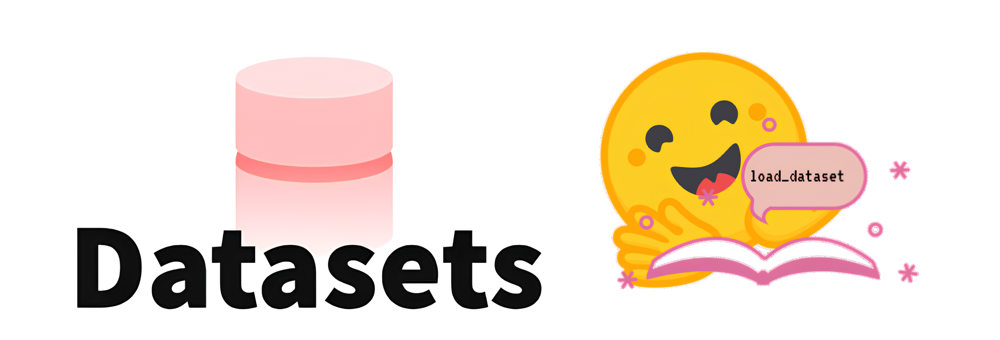
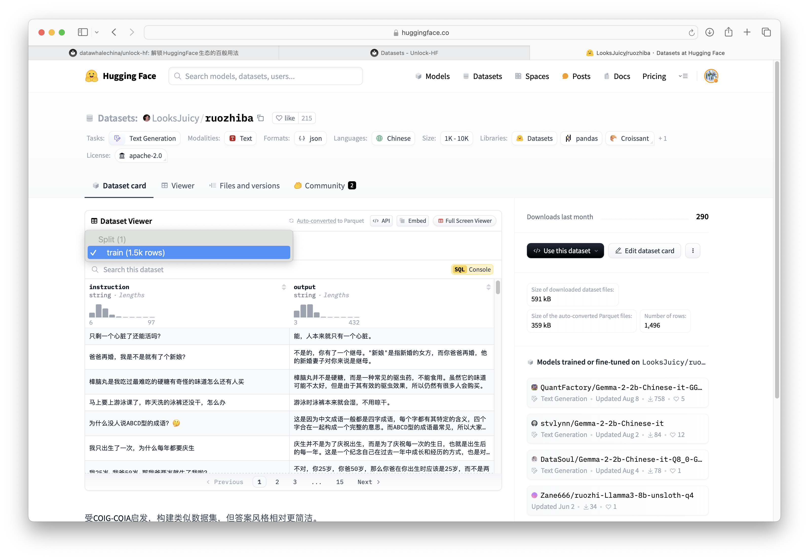

## 前言

无论是计算机视觉还是自然语言处理领域，想要训练一个智能系统必然是从数据加载开始，然后对这些数据进行千变万化以符合模型的输入要求。

在过去，开发者面对不同任务时会遇到不尽相同的数据格式，甚至同一个任务也会遇到不同的数据格式。下面举出了一些常见的问题：

- 文本格式不一致：某些数据集使用 `json` 格式存储，有些使用 `csv` 或 `txt` 格式，而且字段命名和数据结构也可能不同。
- 标签表示方法多样：在文本分类任务中，某些数据集使用数字标签，有些使用文本标签。
- 预处理需求各异： 数据集的质量参差不齐，需要开发者编写不同的清洗和预处理代码。
- $\cdots$

为了尽快完成任务，开发者需要编写不同的处理函数，以满足模型的输入要求，这些问题导致开发者需要为每个项目甚至每个数据集编写大量重复的代码，极大地降低了开发效率。

但现在， `Datasets` 的出现有效解决了这些问题，它提供了一套恰到好处、强有力、标准化的数据格式和处理流程，帮助开发者摆脱繁琐的数据预处理工作，专注于模型开发。与传统数据集工具相比，`Datasets` 的优势主要体现在以下几个方面：

| 优势                           | 说明                                                                                         |
| ------------------------------ | -------------------------------------------------------------------------------------------- |
| 简化数据加载                   | 无需手动下载、解压、解析数据文件，`Datasets` 提供一键加载功能，极大简化数据获取流程。        |
| 内置处理函数                   | 强大的内置函数 (例如 `map`, `filter`, `sort`, `shuffle` 等) 用于数据清洗、转换、增强等操作。 |
| 高效处理大型数据集             | 使用 `Apache Arrow` 格式存储数据，支持并行处理，可以高效处理海量数据。                       |
| 支持多种数据格式               | `Datasets` 广泛支持数据格式，方便用户使用来自不同来源的数据集。                              |
| ==自定义函数==                 | ==用户可以使用 `map` 函数应用自定义函数对数据集进行灵活处理，满足个性化需求。==              |
| 代码易于共享和复用             | 标准化的数据格式和处理流程使得代码更易于共享和复用，提高研究的可重复性。                     |
| 与 `transformers` 生态无缝集成 | 可以轻松地将处理后的数据集用于训练和评估 `transformers` 模型。                               |

## 安装 `Datasets`

```bash title='pip'
pip install datasets
```

## 加载数据集

在下文，从以下两个角度演示 `Datasets` 库提供的一键加载数据集的功能。

1. 从 Hub 加载数据集
2. 从本地加载数据集

### 从 Hub 加载数据集

所有被托管的数据集都可以在[数据集主页](https://huggingface.co/datasets)查看，利用左侧的选项可以更快地筛选出符合需求的数据集。


经过选择后，可以打开数据集介绍页查看详细信息。对于每个数据集都会有其独特的仓库路径，待会加载数据集时，函数会根据仓库路径自动从 Hub 下载并加载数据集，例如下图的仓库路径为 `LooksJuicy/ruozhiba`，再比如另一个仓库路径为 `hfl/cmrc2018`。


当开发者选定了数据集后，便可以使用 `load_dataset` 函数加载数据集。

```python title='hfl/cmrc2018'
from datasets import load_dataset

data = load_dataset("hfl/cmrc2018")
```

```python title='data'
{
    'test': Dataset(
        {
            'features': ['id', 'context', 'question', 'answers'],
            'num_rows': 1002
        }
    ),
    'train': Dataset(
        {
            'features': ['id', 'context', 'question', 'answers'],
            'num_rows': 10142
        }
    ),
    'validation': Dataset(
        {
            'features': ['id', 'context', 'question', 'answers'],
            'num_rows': 3219
        }
    )
}
```

通过返回结果可以看出 `data` 的数据类型为 `DatasetDict`，它是 `Datasets` 库中重要的数据类型。

!!! Note

	并非所有数据集都包含训练集、验证集和测试集。有些数据集可能只有一个或两个子集。
	对于数据集 `hfl/cmrc2018` 存在训练集、验证集和测试集。但是对于 `LooksJuicy/ruozhiba` 却只存在训练集。

	在实际的开发中，可以使用 `train_test_split` 函数将训练集划分为训练集和测试集。

	
	

`DatasetDict` 就像一个 `Python` 字典，它包含多个数据集，每个数据集都有一个**名字**作为键和对应的**数据集对象**作为值。

开发者可以像访问普通字典一样访问 `DatasetDict` 中的数据集。

```python
train_dataset = data['train']  # 获取训练集

print(len(dataset_dict['validation']))  # 获取验证集大小
```

```python title='train_dataset'
Dataset({
    features: ['id', 'context', 'question', 'answers'],
    num_rows: 10142
})
```

```python title='len(dataset_dict["validation"])'
3219
```

在使用 `load_dataset` 的时候还有一个参数值得被关注，那就是 `split`，对于一个数据集，`split` 可以是**键**或者**键组成的列表**以表示加载哪部分数据。

- 如果使用 `data = load_datase("hfl/cmrc2018")` 时不指定 `split`，那么 `data` 会像下面一样。

```python
{
    'test': Dataset(
        {
            'features': ['id', 'context', 'question', 'answers'],
            'num_rows': 1002
        }
    ),
    'train': Dataset(
        {
            'features': ['id', 'context', 'question', 'answers'],
            'num_rows': 10142
        }
    ),
    'validation': Dataset(
        {
            'features': ['id', 'context', 'question', 'answers'],
            'num_rows': 3219
        }
    )
}
```

- 如果使用 `data = load_datase("hfl/cmrc2018", split='train')` ，那么 `data` 会像下面一样。

```python title="split='train'"
Dataset({
    features: ['id', 'context', 'question', 'answers'],
    num_rows: 10142
})
```

- 如果使用 `data = load_datase("hfl/cmrc2018", split=["train", "test"])` ，那么 `data` 会像下面一样。

```python title='split=["train", "test"]'
[
    Dataset({
        features: ['id', 'context', 'question', 'answers'],
        num_rows: 10142
    }),
    Dataset({
        features: ['id', 'context', 'question', 'answers'],
        num_rows: 1002
    })
]

```

!!! Note

	### 配置 (Configurations)

	* 一些数据集包含多个子数据集，子数据集又可能包含训练集、测试集和验证集。例如`Minds-14`数据集，每个子数据集包含不同语言的音频数据。这些子数据集被称为配置 (configurations)。
	* 在加载有不同配置的数据集时，需要明确选择一个配置。可以使用 `get_dataset_config_names()` 函数检索数据集的所有可用配置列表。例如，`get_dataset_config_names("PolyAI/minds14")` 返回`Minds-14`数据集的所有可用语言配置列表。
	* 加载数据集时，指定要加载的配置，例如`load_dataset("PolyAI/minds14", "fr-FR", split="train")`加载法语训练集。