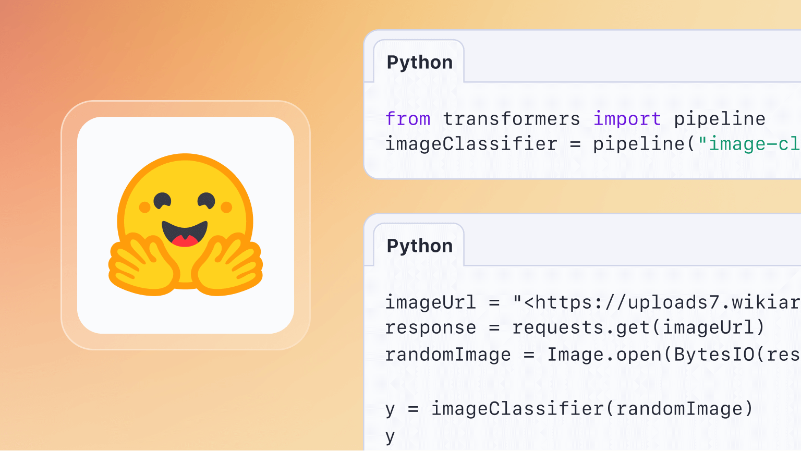

## 前言

近年来，自然语言处理技术突飞猛进，各种模型架构层出不穷。然而，对于想要利用 NLP 技术却对复杂模型望而却步的新手来说，无疑是一道难以逾越的鸿沟。Pipelines 应运而生，它将复杂的 NLP 任务流程封装成简洁易用的接口，让 NLP 的力量触手可及。

Pipelines 的奥秘在于其将模型加载、预处理、推理和后处理等步骤整合在一起，形成一个完整的流水线。开发者只需将数据输入 Pipelines，即可获得处理结果，无需关心内部细节，大大降低了 NLP 的使用门槛。

Pipelines 的优势远不止于此：

- 丰富的模型库: Pipelines 接入了 Hugging Face Hub 上的海量预训练模型，涵盖各种 NLP 任务和语言，任君挑选。
- 便捷的模型部署: Pipelines 支持一键部署模型到生产环境，让你快速将 NLP 应用落地。
- 灵活的定制化: Pipelines 也允许你根据实际需求调整模型参数、添加自定义组件，打造个性化的 NLP 解决方案。

无论你是 NLP 初学者还是经验丰富的开发者，Pipelines 都能帮助你更高效地构建 NLP 应用。接下来，我们将介绍 Pipelines 的使用方法，并结合实际案例，一起领略 Pipelines 的强大魅力。

## 任务类型

让我们把讨论范畴暂时限定在自然语言处理领域。


HuggingFace 拥有一个巨大的模型库，不同的模型实现不同的功能，不同的功能解决不同的现实世界需求，但是我们可以指定 pipelines 任务类型以精准调用模型，化解现实难题。所以深入了解 HuggingFace 所支持的任务类型，便显得尤为重要。开发者可以在 [pipelines任务类型](https://huggingface.co/docs/transformers/main/en/main_classes/pipelines)页面右侧大纲查阅所有任务管道。以下为目前所支持的任务管道。

=== "自然语言处理"

	| 任务       | Pipeline                       | 调用字符串                      |
	| -------- | ------------------------------ | -------------------------- |
	| 掩码填充     | FillMaskPipeline               | `"fill-mask"`                |
	| 问答       | QuestionAnsweringPipeline      | `"question-answering"`      |
	| 文本摘要     | SummarizationPipeline          | `"summarization"`            |
	| 表格问答     | TableQuestionAnsweringPipeline | `"table-question-answering"` |
	| 文本分类     | TextClassificationPipeline     | `"text-classification"`      |
	| 文本生成     | TextGenerationPipeline         | `"text-generation"`          |
	| 文本到文本生成  | Text 2 TextGenerationPipeline  | `"text2text-generation"`   |
	| Token 分类 | TokenClassificationPipeline    | `"token-classification"`    |
	| 翻译       | TranslationPipeline            | `"translation"`              |
	| 零样本分类    | ZeroShotClassificationPipeline | `"zero-shot-classification"` |

=== "音频"

	|任务|Pipeline|调用字符串|
	|---|---|---|
	|音频分类|AudioClassificationPipeline|`"audio-classification"`|
	|语音识别|AutomaticSpeechRecognitionPipeline|`"automatic-speech-recognition"`|
	|文本转语音|TextToAudioPipeline|`"text-to-speech"`|
	|文本转音频|TextToAudioPipeline|`"text-to-audio"`|
	|零样本音频分类|ZeroShotAudioClassificationPipeline|`"zero-shot-audio-classification"`|

=== "计算机视觉"

	|任务|Pipeline|调用字符串|
	|---|---|---|
	|深度估计|DepthEstimationPipeline|`"depth-estimation"`|
	|图像分类|ImageClassificationPipeline|`"image-classification"`|
	|图像分割|ImageSegmentationPipeline|`"image-segmentation"`|
	|图像到图像转换|ImageToImagePipeline|`"image-to-image"`|
	|目标检测|ObjectDetectionPipeline|`"object-detection"`|
	|视频分类|VideoClassificationPipeline|`"video-classification"`|
	|零样本图像分类|ZeroShotImageClassificationPipeline|`"zero-shot-image-classification"`|
	|零样本目标检测|ZeroShotObjectDetectionPipeline|`"zero-shot-object-detection"`|

=== "多模态"

	|任务|Pipeline|调用字符串|
	|---|---|---|
	|文档问答|DocumentQuestionAnsweringPipeline|`"document-question-answering"`|
	|特征提取|FeatureExtractionPipeline|`"feature-extraction"`|
	|图像特征提取|ImageFeatureExtractionPipeline|`"image-feature-extraction"`|
	|图像到文本|ImageToTextPipeline|`"image-to-text"`|
	|掩码生成|MaskGenerationPipeline|`"mask-generation"`|
	|视觉问答|VisualQuestionAnsweringPipeline|`"visual-question-answering"`|

## 常见任务演示

对于pipelines，通常只是做验证使用，它可以接收单样本，多样本，Datasets类或者是迭代器。

=== "文本分类"

	```python title='text-classification单样本'
	from transformers import pipeline
	cls = pipeline("text-classification")
	cls(
		[
			"I've been waiting for a HuggingFace course my whole life."
		]
	)
	```

	```json title='out'
	 [
	 {'label': 'POSITIVE', 'score': 0.9598049521446228},
	 ]
	```
	```python title='text-classification多样本'
	from transformers import pipeline
	cls = pipeline("text-classification")
	cls(
		[
			"I've been waiting for a HuggingFace course my whole life.",
			"wow, this model is amazing!",
		]
	)
	```

	```json title='out'
	 [
	 {'label': 'POSITIVE', 'score': 0.9598049521446228},
	 {'label': 'POSITIVE', 'score': 0.9998725652694702}
	 ]
	```

=== "掩码填充"

	```python title='fill-mask'
	from transformers import pipeline

	unmasker = pipeline("fill-mask")
	unmasker("This course will teach you all about <mask> models.", top_k=2)
	```

	```json title='output'
	[
	    {
	        "sequence": "This course will teach you all about mathematical models.",
	        "score": 0.19619831442832947,
	        "token": 30412,
	        "token_str": " mathematical",
	    },

	    {

	        "sequence": "This course will teach you all about computational models.",
	        "score": 0.04052725434303284,
	        "token": 38163,
	        "token_str": " computational",
	    },
	]
	```

=== "问答系统"

	```python title="question-answering"
	from transformers import pipeline
	question_answerer = pipeline("question-answering")
	question_answerer(
	    question="Where do I work?",
	    context="My name is Sylvain and I work at Hugging Face in Brooklyn",
	)
	```

	```json title='output'
	{"score": 0.6949766278266907, "start": 33, "end": 45, "answer": "Hugging Face"}
	```

=== "文本摘要"

	```python title="summarization"
	from transformers import pipeline

	summarizer = pipeline("summarization")
	summarizer(
	    """
	    America has changed dramatically during recent years. Not only has the number of
	    graduates in traditional engineering disciplines such as mechanical, civil,
	    electrical, chemical, and aeronautical engineering declined, but in most of
	    the premier American universities engineering curricula now concentrate on
	    and encourage largely the study of engineering science. As a result, there
	    are declining offerings in engineering subjects dealing with infrastructure,
	    the environment, and related issues, and greater concentration on high
	    technology subjects, largely supporting increasingly complex scientific
	    developments. While the latter is important, it should not be at the expense
	    of more traditional engineering.

	    Rapidly developing economies such as China and India, as well as other
	    industrial countries in Europe and Asia, continue to encourage and advance
	    the teaching of engineering. Both China and India, respectively, graduate
	    six and eight times as many traditional engineers as does the United States.
	    Other industrial countries at minimum maintain their output, while America
	    suffers an increasingly serious decline in the number of engineering graduates
	    and a lack of well-educated engineers.
	"""
	)
	```

	```json title='output'
	[
	  {
	"summary_text": "America has changed dramatically during recent years. The number of engineering graduates in the U.S. has declined in traditionalengineering disciplines such as mechanical, civil, electrical, chemical, and aeronautical engineering. Rapidly developing economies such as China and India continue to encourage and advance the teaching of engineering."
	  }
	]
	```

!!! info "自定义管道工具的分词器与模型"
	管道工具在执行任务的时候会自动分配一个模型，如果需要自定义分词器或者模型，那么需要提前加载分词器或模型，传入pipeline中，将形参`model`设置为自定义的模型，将形参`tokenizer`设置为自定义的分词器。

	```python title='管道中自定义预训练模型与分词器'
	from transformers import AutoModelForSequenceClassification, AutoTokenizer, pipeline

	model = AutoModelForSequenceClassification.from_pretrained(
	    "uer/roberta-base-finetuned-dianping-chinese"
	)

	tokenizer = AutoTokenizer.from_pretrained("uer/roberta-base-finetuned-dianping-chinese")
	pipes = pipeline("text-classification", model=model, tokenizer=tokenizer)
	```
	```json title="output"
	[{'label': 'positive (stars 4 and 5)', 'score': 0.9877167344093323}]
	```