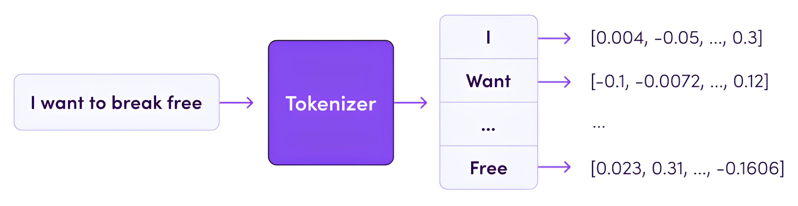

## 加载分词器

```python
from transformers import AutoTokenizer

tokenizer = AutoTokenizer.from_pretrained('hfl/chinese-roberta-wwm-ext')
```

`AutoTokenizer.from_pretrained()` 方法用于加载预训练的分词器。以下是该方法常用的参数及其介绍。

| 参数名称                            | 功能                                                                                    |
| ------------------------------- | ------------------------------------------------------------------------------------- |
| `pretrained_model_name_or_path` | 指定要加载的分词器，其值为预训练模型名称或模型在本地的路径。                                                        |
| `use_fast`                      | 此参数控制是否使用基于 `Rust` 的快速分词器。如果设置为 True 且模型支持快速分词器，则将优先使用快速分词器。否则，将使用基于 `Python` 的标准分词器。 |
| `trust_remote_code`             | 是否允许执行远程代码。默认情况下，为了安全起见，它是关闭的。如果开发者完全信任代码来源，可以启用它以获得额外的功能，但请谨慎操作，因为这会增加安全风险。          |

经过上述代码，会产生一个与所预训练模型相对应的 **分词器实例**。

!!! note "备注"

    - 如果你加载的是 `bert-base-uncased` 模型，那么 `AutoTokenizer.from_pretrained("bert-base-uncased")` 会返回一个 `BertTokenizer` 实例。
    - 如果你加载的是 `gpt2` 模型，那么 `AutoTokenizer.from_pretrained("gpt2")` 会返回一个 `GPT2Tokenizer` 实例。
    - $\cdots$

## 分词器属性与方法

分词器实例常用的方法和属性会因具体的分词器类而略有不同，但一般都会包含以下常用方法和属性：

| 方法                                | 说明                 | 输入示例                                                | 输出示例                                                |
| --------------------------------- | ------------------ | --------------------------------------------------- | --------------------------------------------------- |
| `tokenize(text)`                  | 将文本分割成词或子词列表       | `"这是一个句子。"`                                         | `['这', '是', '一', '个', '句', '子', '。']`               |
| `encode(text)`                    | 将文本编码成数字序列         | `"这是一个句子。"`                                         | `[101, 6821, 3221, 671, 702, 1368, 2094, 511, 102]` |
| `decode(ids)`                     | 将数字序列解码回文本         | `[101, 6821, 3221, 671, 702, 1368, 2094, 511, 102]` | `'[CLS] 这是一个句子。 [SEP]'`                             |
| `add_special_tokens(token_ids)`   | 添加特殊标记             |                                                     |                                                     |
| `convert_tokens_to_ids(tokens)`   | 将词或子词列表转换为数字 ID 列表 | `['这', '是', '一']`                                   | `[6821, 3221, 671]`                                 |
| `convert_ids_to_tokens(ids)`      | 将数字 ID 列表转换为词或子词列表 | `[1368, 2094, 511]`                                 | `['句', '子', '。']`                                   |
| `save_pretrained(save_directory)` | 保存分词器到本地目录         | `"./local_chinese-roberta-wwm-ext"`                 |                                                     |

| 属性           | 说明             | 示例                         |            |
| ------------ | -------------- | -------------------------- | ---------- |
| `vocab_size` | 词汇表大小          | `tokenizer.vocab_size`     | `21128`    |
| `bos_token`  | 开头标记           | `tokenizer.bos_token`      | `None`     |
| `eos_token`  | 结尾标记           | `tokenizer.eos_token`      | `None`     |
| `unk_token`  | 未知词标记          | `tokenizer.unk_token`      | `'[UNK]'`  |
| `sep_token`  | 分隔符标记          | `tokenizer.sep_token`      | `'[SEP]'`  |
| `pad_token`  | 填充标记           | `tokenizer.pad_token`      | `'[PAD]'`  |
| `cls_token`  | 分类标记           | `tokenizer.cls_token`      | `'[CLS]'`  |
| `mask_token` | 掩码标记           | `tokenizer.mask_token`     | `'[MASK]'` |
| `vocab`      | 词汇表，词或子词到数字的映射 | `tokenizer.vocab['[CLS]']` | `101`      |

## 编码函数

在分词器的使用中，最重要的方法就是编码函数，因此我们单独来学习编码函数。

```python
def encode(
    self,
    text: Union[TextInput, PreTokenizedInput, EncodedInput],
    text_pair: Optional[Union[TextInput, PreTokenizedInput, EncodedInput]] = None,
    add_special_tokens: bool = True,
    padding: Union[bool, str, PaddingStrategy] = False,
    truncation: Union[bool, str, TruncationStrategy] = None,
    max_length: Optional[int] = None,
    stride: int = 0,
    return_tensors: Optional[Union[str, TensorType]] = None,
    **kwargs,
) -> List[int]:
```

以下是编码函数常用的参数、参数类型、默认值对照表。

| 参数                   | 类型                                           | 默认值     | 说明                                                                                 |
| -------------------- | -------------------------------------------- | ------- | ---------------------------------------------------------------------------------- |
| `text`               | `Union[str, List[str], List[int]]`           |         | 进行编码时第一个句子。可以是字符串、字符串列表或整数列表                                                       |
| `text_pair`          | `Optional[Union[str, List[str], List[int]]]` | `None`  | 进行编码时第二个句子。可以是字符串、字符串列表或整数列表                                                       |
| `add_special_tokens` | `bool`                                       | `True`  | 编码序列时是否添加特殊标记                                                                      |
| `padding`            | `Union[bool, str, PaddingStrategy]`          | `False` | 控制是否进行填充                                                                           |
| `truncation`         | `Union[bool, str, TruncationStrategy]`       | `False` | 控制当序列长度超过 `max_length` 时是否进行截断                                                     |
| `max_length`         | `Optional[int]`                              | `None`  | 控制截断和填充参数使用的最大长度                                                                   |
| `return_tensors`     | `Optional[Union[str, TensorType]]`           | `None`  | 默认为列表数据类型，也可以设置为 `'tf'`，`'pt'`，`'np'`，分别表示返回的结果为 `TensorFlow`，`PyTorch`，`Numpy` 格式 |

```python title='是否添加特殊标记'
text = "这是一个测试句子。"
text_pair = "这是第二个句子。"

encoded_inputs = tokenizer(text, text_pair, add_special_tokens=False)
encoded_inputs = tokenizer(text, text_pair, add_special_tokens=True)
```

```python title='不添加特殊标记'
{
    'input_ids': [
        6821, 3221, 671, 702, 3844, 6407, 1368, 2094, 511,
        6821, 3221, 5018, 753, 702, 1368, 2094, 511
    ],
    'token_type_ids': [
        0, 0, 0, 0, 0, 0, 0, 0, 0,
        1, 1, 1, 1, 1, 1, 1, 1
    ],
    'attention_mask': [
        1, 1, 1, 1, 1, 1, 1, 1, 1,
        1, 1, 1, 1, 1, 1, 1, 1
    ]
}
```

```python title='添加特殊标记'
{
    'input_ids': [
        101, 6821, 3221, 671, 702, 3844, 6407, 1368, 2094, 511, 102,
        6821, 3221, 5018, 753, 702, 1368, 2094, 511, 102,
    ],
    'token_type_ids': [
        0, 0, 0, 0, 0, 0, 0, 0, 0, 0, 0,
        1, 1, 1, 1, 1, 1, 1, 1, 1, 1,
    ],
    'attention_mask': [
        1, 1, 1, 1, 1, 1, 1, 1, 1, 1, 1,
        1, 1, 1, 1, 1, 1, 1, 1, 1, 1,
    ]
}

```

- **`input_ids`**: 将输入文本分词并转换为对应的词汇表索引。
- **`token_type_ids`**: 区分两个句子，第一个句子所有词的 ID 为 0，第二个句子所有词的 ID 为 1。
- **`attention_mask`**: 标识哪些是真实词（值为 1），哪些是填充词（值为 0）。这里没有填充，所以全是 1。
- 与 "不添加特殊标记" 相比，这里添加了：
  - `[CLS]` 标记 (ID: 101) 在句子开头。
  - `[SEP]` 标记 (ID: 102) 在第一个句子末尾和整个输入末尾。

```python title='是否进行填充'
encoded_inputs = tokenizer(
    ["这是一个测试句子。", "这。"],
    padding="max_length",  # 设置填充方式为 'max_length'
    truncation=True,  # 句子长度超过 max_length 时进行截断
    max_length=10,  # 设置最大长度
    return_tensors="pt",  # 返回 PyTorch 张量
)
```

```python title='进行填充'
{
    'input_ids': tensor(
        [
            [101, 6821, 3221, 671, 702, 3844, 6407, 1368, 2094, 102],
            [101, 6821, 511, 102, 0, 0, 0, 0, 0, 0]，
        ]
    ),
    'token_type_ids': tensor(
        [
            [0, 0, 0, 0, 0, 0, 0, 0, 0, 0],
            [0, 0, 0, 0, 0, 0, 0, 0, 0, 0],
        ]
    ),
    'attention_mask': tensor(
        [
            [1, 1, 1, 1, 1, 1, 1, 1, 1, 1],
            [1, 1, 1, 1, 0, 0, 0, 0, 0, 0]   # 只关注前4个token
        ]
    )
}
```

```python title='是否截断'
encoded_inputs = tokenizer(text, text_pair, truncation=False)
encoded_inputs = tokenizer(text, text_pair, max_length=10, truncation=True)
```

```python title='不进行截断'
{
    'input_ids': [
        101, 6821, 3221, 671, 702, 3844, 6407, 1368, 2094, 511, 102,
        6821, 3221, 5018, 753, 702, 1368, 2094, 511, 102
    ],
    'token_type_ids': [
        0, 0, 0, 0, 0, 0, 0, 0, 0, 0, 0,
        1, 1, 1, 1, 1, 1, 1, 1, 1
    ],
    'attention_mask': [
        1, 1, 1, 1, 1, 1, 1, 1, 1, 1, 1,
        1, 1, 1, 1, 1, 1, 1, 1, 1
    ]
}

```

```python title='进行截断'
{
  "input_ids": [101, 6821, 3221, 671, 702, 102, 6821, 3221, 5018, 102],
  "token_type_ids": [0, 0, 0, 0, 0, 0, 1, 1, 1, 1],
  "attention_mask": [1, 1, 1, 1, 1, 1, 1, 1, 1, 1]
}

```

- 将输入文本截断到最大长度，保留了 `[CLS]` 和 `[SEP]` 标记，并截取了部分句子内容。

```python title='返回的数据类型'
encoded_inputs = tokenizer(text, text_pair, return_tensors=None)
encoded_inputs = tokenizer(text, text_pair, return_tensors="pt")
encoded_inputs = tokenizer(text, text_pair, return_tensors="tf")
encoded_inputs = tokenizer(text, text_pair, return_tensors="np")
```

```python title='PyTorch张量'
{
  'input_ids': tensor([[101, 6821, 3221, 671, 702, 3844, 6407, 1368, 2094, 511, 102,
                       6821, 3221, 5018, 753, 702, 1368, 2094, 511, 102]]),
  'token_type_ids': tensor([[0, 0, 0, 0, 0, 0, 0, 0, 0, 0, 0, 1, 1, 1, 1, 1, 1, 1, 1, 1]]),
  'attention_mask': tensor([[1, 1, 1, 1, 1, 1, 1, 1, 1, 1, 1, 1, 1, 1, 1, 1, 1, 1, 1, 1]])
}

```

```python title='TensorFlow 张量'
{
    'input_ids': <tf.Tensor: shape=(1, 20), dtype=int32, numpy=
    array([[ 101, 6821, ...,  511,  102]])>,
    'token_type_ids': <tf.Tensor: shape=(1, 20), dtype=int32, numpy=array([[0, 0, ..., 1, 1]])>,
    'attention_mask': <tf.Tensor: shape=(1, 20), dtype=int32, numpy=array([[1, 1, ..., 1, 1]])>
}

```

```python title='NumPy数组'
{
    'input_ids': array([[101, 6821, ..., 511, 102]]),
    'token_type_ids': array([[0, 0, ..., 1, 1]]),
    'attention_mask': array([[1, 1, ..., 1, 1]])
}
```
