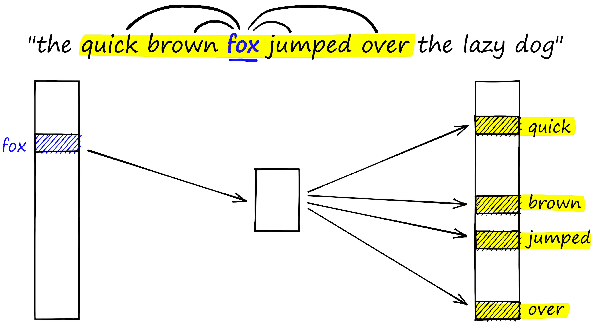
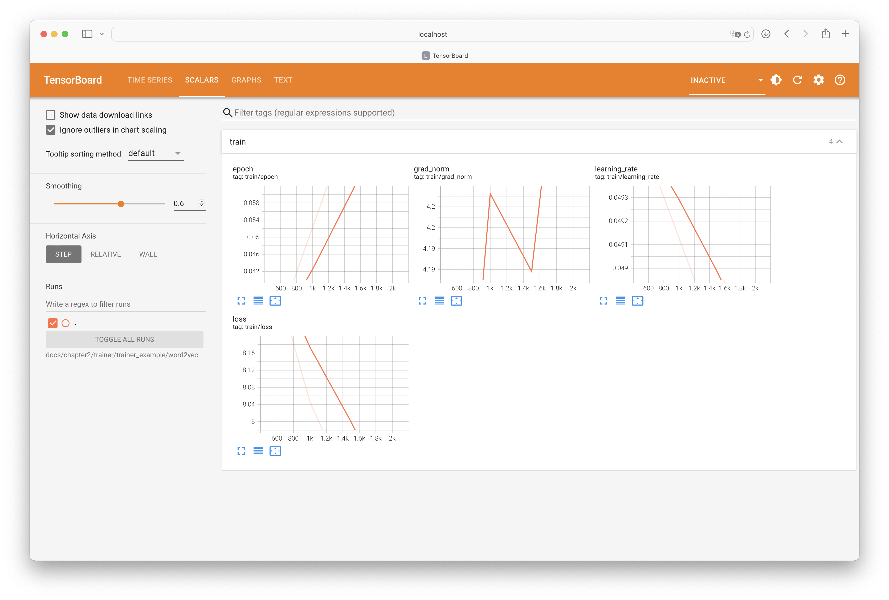
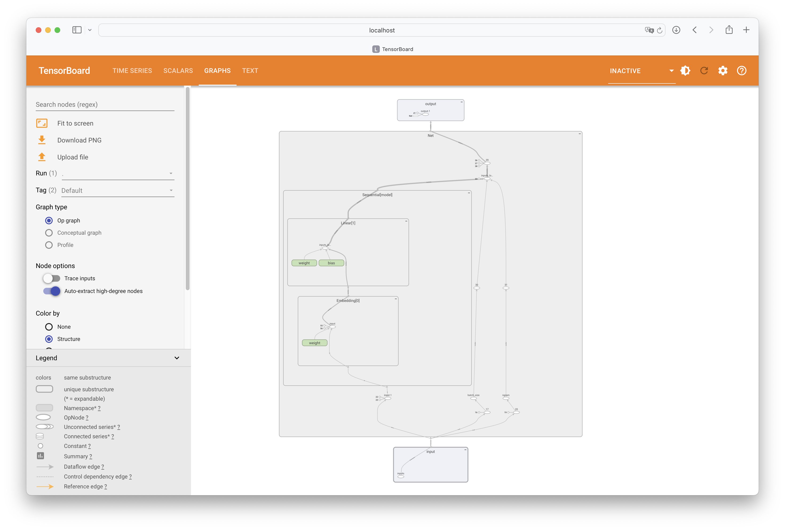
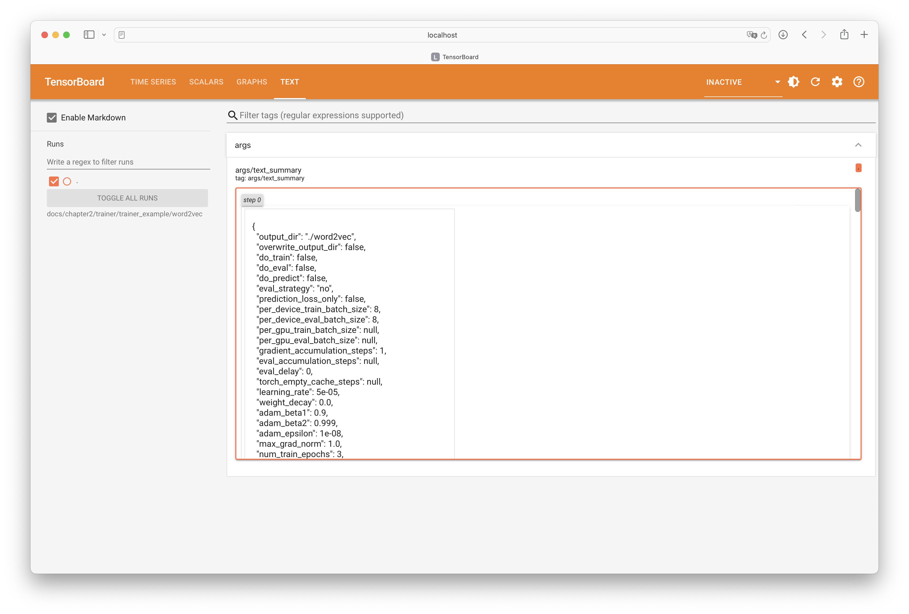

## 前言

基于相对独立的各个前文：

<div class="grid cards" markdown>

1. [Trainer工具介绍](../trainer/trainer.md)
2. [Trainer训练自定义模型](../module2trainer/module2trainer.md)
3. [Callbacks回调函数](../callbacks/callbacks.md)

</div>

本文希望综合前文借助使用`Word2Vec`的具体案例进行`Trainer`工具实战。

## 代码

### 导入函数库

```python
import jieba
import pandas as pd
import torch
import numpy as np
from torch import nn
from transformers import TrainingArguments, Trainer, TrainerCallback
from torch.utils.tensorboard import SummaryWriter
```

### 定义词典

```python
class Vocab:
    def __init__(self, vocab_file, stop_words_file=None):
        self.stop_words_file = self.load_stop_words(stop_words_file)
        self.idx2word, self.word2idx, self.words = self.load_vocab(vocab_file)
        self.word_size = len(self.words)
        self.vocab_size = len(self.idx2word)

    def load_vocab(self, vocab_file):
        idx2word = {}
        word2idx = {}

        words = []
        contents = pd.read_csv(vocab_file, encoding="GBK", header=None)

        for idx, row in contents.iterrows():
            line = row[0]
            if not self.stop_words_file:
                current_line_words = [
                    word for word in jieba.cut(line) if word not in self.stop_words_file
                ]
            else:
                current_line_words = list(jieba.cut(line))
            words.extend(current_line_words)

        for idx, word in enumerate(set(words)):
            idx2word[idx] = word
            word2idx[word] = idx
        return idx2word, word2idx, words

    def load_stop_words(self, stop_words_file):
        if stop_words_file is None:
            return set()
        else:
            with open(stop_words_file, "r") as f:
                return set(f.read().splitlines())

    def get_idx(self, word):
        return self.word2idx[word]

    def get_word(self, idx):
        return self.idx2word[idx]
```

该字典类实现了：

1. `load_vocab`方法返回：
      1. `idx2word`：索引到词对。
      2. `word2idx`：词到索引对。
      3. `words`：数据集中按词出现的顺序排列的所有词。
2. `load_stop_words`方法返回所有停用词组成的元组。
3. `get_idx`方法根据词返回对应的`idx`。
4. `get_word`方法根据`idx`返回对应的词。

```python
vocab = Vocab("./数学原始数据.csv", "./stopwords.txt")
```

```python title="vocab.word_size, vocab.vocab_size"
(152832, 5296)
```

### 定义数据集

```python
class MyDataset(torch.utils.data.Dataset):
    def __init__(self, ngram: int, vocab: Vocab):
        self.ngram = ngram
        self.vocab = vocab
        self.word_size = vocab.word_size
        self.vocab_size = vocab.vocab_size

    def __len__(self):
        return self.word_size - 2 * self.ngram - 1

    def __getitem__(self, idx):
        left_idx = idx
        right_idx = idx + 2 * self.ngram + 1
        words = self.vocab.words[left_idx:right_idx]
        current_word = words.pop(self.ngram)
        label = self.vocab.get_idx(current_word)

        another_word = [self.vocab.get_idx(word) for word in words]
        return {
            "inputs": torch.tensor(another_word, dtype=torch.long),
            "labels": torch.tensor(label, dtype=torch.long),
        }
```

```python
data = MyDataset(2, vocab)
data_iter = torch.utils.data.DataLoader(data, batch_size=512, shuffle=True)
```

### 定义神经网络

```python
class Net(nn.Module):
    def __init__(self, vocab_size, embedding_size):
        super().__init__()
        self.vocab_size = vocab_size
        self.embedding_size = embedding_size

        self.model = nn.Sequential(
            nn.Embedding(
                vocab_size,
                embedding_size,
            ),
            nn.Linear(
                embedding_size,
                vocab_size,
                bias=True,
            ),
        )

    def forward(self, inputs, labels=None):

        loss_fn = nn.CrossEntropyLoss()
        batch_size, ngram = inputs.shape
        # [batch_size, ngram] -> [batch_size * ngram]
        inputs = inputs.flatten()
        # [batch_size * ngram] -> [batch_size * ngram, vocab_size]
        inputs_logits = self.model(inputs)
        # [batch_size * ngram, vocab_size] -> [batch_size, ngram, vocab_size]
        inputs_logits = inputs_logits.reshape(batch_size, ngram, self.vocab_size)
        # [batch_size, ngram, vocab_size] -> [batch_size, vocab_size]
        inputs_logits = torch.mean(inputs_logits, dim=1)
        if labels is not None:
            # [batch_size, vocab_size] 和 [batch_size, vocab_size]
            loss = loss_fn(inputs_logits, labels)
            return {"logits": inputs_logits, "loss": loss}
        else:
            return {"logits": inputs_logits}
```

```python
model = Net(vocab.vocab_size, 512)
```

### 定义回调函数

```python
class MyCallBacks(TrainerCallback):

    def on_train_begin(self, args, state, control, model, optimizer, lr_scheduler, **kwargs):
        with SummaryWriter('./word2vec/run') as writer:
            writer.add_graph(model, torch.rand(1, 4))
        print("\nStarting training")
        print(f"\nUsing optimizer: {optimizer}")
        print(f"\nUsing lr_scheduler: {lr_scheduler}")

    def on_train_end(self, args, state, control, optimizer, **kwargs):
        print(f"\nlr: {optimizer.param_groups[0]['lr']}")

    def on_save(self, args, state, control, **kwargs):
        print("\nSaving model")
```

1. 在训练开始时：
      1. 使用`TensorBoard`工具记录图结构。
      2. 输出`Starting training`。
      3. 输出优化器实例。
      4. 输出学习率调度器实例。
2. 在训练结束时：输出当前学习率。
3. 在保存模型时：输出`Saving model`。

### 定义超参

```python
training_args = TrainingArguments(
    output_dir="./word2vec",
    num_train_epochs=3,
    logging_strategy="steps",
    logging_dir='./word2vec/run'
    save_strategy="epoch",
    use_cpu=False,
    save_total_limit=3,
)
```

### 定义训练器

```python
trainer = Trainer(
    model=model,
    args=training_args,
    train_dataset=data,
    optimizers=(torch.optim.SGD(model.parameters(), 0.05), None),
    callbacks=[MyCallBacks],
)
```

```python
trainer.train()
```

```python
Starting training

Using optimizer: AcceleratedOptimizer (
Parameter Group 0
    dampening: 0
    differentiable: False
    foreach: None
    fused: None
    initial_lr: 0.05
    lr: 0.05
    maximize: False
    momentum: 0
    nesterov: False
    weight_decay: 0
)

Using lr_scheduler: <torch.optim.lr_scheduler.LambdaLR object at 0xffff4bcb5520>
```

=== "变量可视化"
    

=== "网络结构"
    

=== "历史记录"
    

### 保存模型

```python
torch.save(model.state_dict(), "./word2vec.pth")
```

### 推理

```python
model.eval()
```

```python
def cos(a, b):
    return a.dot(b) / (a.norm() * b.norm())
```

在这里词向量的相似度量使用余弦相似度。

```python
encoder = model.model[0]

token = "算术"
embedding1 = encoder(torch.tensor([vocab.get_idx(token)], device="cpu"))

token2similarity = {}
```

```python
for idx, word in vocab.idx2word.items():
    embedding2 = encoder(torch.tensor([idx], device="cpu"))
    cos_similarity = cos(embedding1.flatten(), embedding2.flatten()).item()
    token2similarity[word] = cos_similarity

sorted(token2similarity, key=token2similarity.get, reverse=True)[:10]
```

```python
['算术', '一元方程', '导数', '建模', '只取', 'p1', '类型', '表述', '各类', '扇形']
```

## 参考资料

<div class="grid cards" markdown>

1. [word2vec 词向量!手写代码!](https://www.bilibili.com/video/BV1VP4y1s7eS/)

</div>
