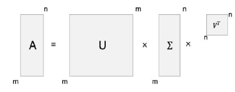

## 前言

在 LoRA 的基础上，微软研究院与普林斯顿大学、佐治亚理工学院的研究者们进一步提出了[AdaLoRA (Adaptive Low-Rank Adaptation)](https://arxiv.org/pdf/2303.10512.pdf)方法。

## 核心思想

AdaLoRA旨在解决 LoRA 中存在的一些局限性，通过动态调整不同权重矩阵的秩来实现更高效的参数适配。

## 技术细节

### `SVD` 矩阵低秩分解

- 定义
    - 奇异值分解（Singular Value Decomposition, SVD）是一种在数学和信号处理中常用的矩阵分解技术。
    - 它将任意一个矩阵分解为三个特定的矩阵之间的乘积：左奇异向量矩阵、奇异值矩阵和右奇异向量矩阵。
    - 该过程如上图所示。

- 数学表示：对于任意一个矩阵 $A$ , SVD 表示为下式，其中，$U$ 和 $V$ 是正交矩阵，分别表示左右奇异向量，$\Sigma$ 是对角矩阵，对角线上的元素是奇异值。

$$
A = U\Sigma V^T \tag{1}
$$

- 应用
    - 在数据科学和机器学习中，SVD 常用于降维、数据压缩、噪声过滤等。
    - 在自然语言处理中，SVD 常用于提取文本数据的潜在语义结构。

### 公式讲解

$$
W = W_{0} + \Delta W = W_{0} + P\Lambda Q \tag{2}
$$

其中：

- $W_{0}$ 是原始预训练权重矩阵。
- $\Lambda \in \mathbb{R}^{r\times r}$ 是对角矩阵，包含奇异值。
- $P \in \mathbb{R}^{d_1\times r}$ 是左奇异向量矩阵。
- $Q \in \mathbb{R}^{r\times d_2}$ 是右奇异向量矩阵。

关键改进在于正交性约束。为了确保 $P$ 和 $Q$ 的正交性，AdaLoRA 引入了一个正则项：

$$
R(P,Q) = |P^T P - I|^2_F + |QQ^T - I|^2_F \tag{3}
$$

这个正则项确保 $P$ 和 $Q$ 保持正交，这对于维持 SVD 的性质很重要。

!!! note
    上述的公式讲解可能有点抽象晦涩，但是我们可以把它理解为一个更精细的调味系统：

    - $W_{0}$ 是基本菜品。
    - $P$，$\Lambda$，和 $Q$ 组合起来形成了一个更复杂的调味方案。

    想象 $P$ 和 $Q$ 是不同类型的香料,而 $\Lambda$ 控制每种香料的用量。AdaLoRA的巧妙之处在于，它可以自动调整每种香料的重要性(通过调整 $\Lambda$ 中的值)，就像一个经验丰富的厨师知道哪种调料更能提升菜品的风味。

    ---

    AdaLoRA 还引入了一个特殊的品控机制：

    $$
    R(P,Q) = |P^T P - I|^2_F + |QQ^T - I|^2_F  \tag{3}
    $$

    这个看似复杂的公式其实就是确保我们的"香料"( $P$ 和 $Q$ )保持纯净,不会相互干扰。就像在烹饪中，我们要确保每种调料都保持其独特的风味，不会相互掩盖。

    通过这些改进，AdaLoRA能够更精确、更高效地"调味"，使得模型能够更好地适应新任务，同时保持原有的"基础风味"。

### 重要性建模

AdaLoRA 引入了一个新的重要性度量标准，用于量化每个三元组 $\mathcal{G}_{k,i} = \{P_{k,*i}, \lambda_{k,i}, Q_{k,i*}\}$  对模型性能的贡献：

$$
S_{k,i} = s(\lambda_{k,i}) + \frac{1}{d_1}\sum_{j=1}^{d_1}s(P_{k,ji}) + \frac{1}{d_2}\sum_{j=1}^{d_2}s(Q_{k,ij}) \tag{4}
$$

其中：

- $S_{k,i}$ 表示重要性得分
- $s(\lambda_{k,i})$ 是奇异值（对角矩阵）
- $\frac{1}{d_1}\sum_{j=1}^{d_1}s(P_{k,ji})$ 是左奇异向量
- $\frac{1}{d_2}\sum_{j=1}^{d_2}s(Q_{k,ij})$ 是右奇异向量

$\overline{I}^{(t)}$ 是平滑后的敏感度，$U^{(t)}$ 是不确定性项。这两个值通过指数移动平均(EMA)来更新:

$$
\overline{I}^{(t)}(w_{ij}) = \beta_1\overline{I}^{(t-1)}(w_{ij}) + (1-\beta_1)I^{(t)}(w_{ij}) \tag{5}
$$

$$
\overline{U}^{(t)}(w_{ij}) = \beta_2U^{(t-1)}(w_{ij}) + (1-\beta_2)|I^{(t)}(w_{ij}) - \overline{I}^{(t)}(w_{ij})| \tag{6}
$$

其中 $I^{(t)}(w_{ij}) = |w_{ij}\nabla_{w_{ij}}L|$ 是参数对损失函数的敏感度。

!!! note
    为了简单理解，我们可以考虑在烹饪比喻中，AdaLoRA 引入了一个更精细的调味评分系统。这个系统帮助我们判断每种调料组合的重要性。

    调味组合的评分：

    对于每个调味组合 $G_{k,i}$（想象这是一种特定的香料混合），AdaLoRA 会给出一个重要性分数。

    $$
    S_{k,i} = s(\lambda_{k,i}) + \frac{1}{d_1}\sum_{j=1}^{d_1}s(P_{k,ji}) + \frac{1}{d_2}\sum_{j=1}^{d_2}s(Q_{k,ij}) \tag{7}
    $$

    这个公式可以理解为:  $s(\lambda_{k,i})$ 是这种调料混合的基础重要性，后面两项则考虑了这种调料如何与其他食材互动。简单来说,这个分数不仅考虑调料本身的重要性，还考虑了它如何影响整道菜的口味。

    调料重要性的动态评估：

    AdaLoRA使用一个特殊的方法来评估每种调料的重要性。

    $$
    s^{(t)}(w_{ij}) = \overline{I}^{(t)}(w_{ij}) \cdot U^{(t)}(w_{ij}) \tag{8}
    $$

    这里的$\overline{I}^{(t)}(w_{ij})$ 可以理解为调料的"受欢迎度"，$U^{(t)}(w_{ij})$ 则代表这种调料使用的"创新性"。

    就像一个厨师会根据顾客反馈和新的烹饪趋势来调整菜单,AdaLoRA也会不断更新这些评估:

    $$
    \overline{I}^{(t)}(w_{ij}) = \beta_1\overline{I}^{(t-1)}(w_{ij}) + (1-\beta_1)I^{(t)}(w_{ij}) \tag{9}
    $$

    $$
    U^{(t)}(w_{ij}) = \beta_2U^{(t-1)}(w_{ij}) + (1-\beta_2)|I^{(t)}(w_{ij}) - \overline{I}^{(t)}(w_{ij})| \tag{10}
    $$

    这些公式表示,调料的受欢迎度会随时间慢慢变化，但也会根据最新反馈快速调整。如果一种调料的使用方式突然改变(比如一种传统上用于主菜的香料开始用于甜点),系统会迅速注意到这种创新。

    通过这种方式，AdaLoRA 就像一个不断学习和创新的顶级厨师，能够精确地控制每种调料的用量，创造出最适合当前"口味"(任务需求)的菜品，同时保持菜品的基本风格不变。

### 剪枝和自适应调整本征秩

在这部分涉及原理部分有些复杂，直接引用之前的烹饪比喻，AdaLoRA 不仅能评估调料的重要性，还能根据这个评估动态调整调味方案。这个过程可以分为几个关键步骤：

- 调味组合的重要性评分。每种调味组合 $G_{k,i} = {P_{k,i}, \lambda_{k,i}, Q_{k,i}}$ 都有自己的重要性评分。这就像厨师对每种香料混合的评价。同时，AdaLoRA 还确保调料之间不会相互干扰，保持各自的独特风味，这个过程可以表示为：

$$
R(P,Q) = |P^T P - I|^2_F + |QQ^T - I|^2_F \tag{11}
$$

- 调整调味方案。AdaLoRA 的目标是找到最佳的调味方案，这个过程可以表示为：

$$
L(P, E, Q) = C(P, E, Q) + \gamma \sum_{k=1}^n R(P_k, Q_k) \tag{12}
$$

这里，$C(P, E, Q)$ 是菜品的整体口感， $R(P_k, Q_k)$  确保每种调料保持其独特性，而 $\gamma$ 控制这种独特性的重要程度。

- 动态调整调料用量。在烹饪过程中，AdaLoRA 会不断调整每种调料的用量，这个过程可以表示为：

$$
\tilde{\Lambda}k^{(t)} = \Lambda_k^{(t)} - \eta \nabla{\Lambda_k} L(P^{(t)}, E^{(t)}, Q^{(t)}) \tag{13}
$$

这就像厨师根据品尝结果微调每种调料的用量。

- 保留最重要的调料。接下来，AdaLoRA 会决定保留哪些调料，去掉不太重要的，这个过程可以表示为：

$$
\Lambda_k^{(t+1)} = T(\tilde{\Lambda}_k^{(t)}, S_k^{(t)}) \tag{14}
$$

其中，$T$ 函数只保留重要性排名前 $b^{(t)}$ 的调料，其他的调料量会被设为 $0$ 。这就像厨师决定哪些调料是菜品必不可少的，哪些可以略去。

- 最后，AdaLoRA 会根据烹饪进程动态调整可用的调料总量（预算），这个过程可以表示为：

$$
b^{(t)} =
\begin{cases}
b^{(0)} & 0 \leq t < t_i \\
b^{(T)} + (b^{(0)} - b^{(T)}) \left( 1 - \frac{t - t_i - t_f}{T - t_i - t_f} \right)^3 & t_i \leq t < T - t_f \\
b^{(T)} & \text{otherwise}
\end{cases} \tag{15}
$$

这就像厨师在烹饪过程中逐渐减少添加新调料的量：一开始（ $0 \leq t < t_i$ ），厨师会使用较多调料来调味。在中间阶段（ $t_i \leq t < T - t_f$ ），厨师会逐渐减少新添加的调料量。最后阶段，厨师只使用最少量的调料来微调口味。

通过这种方式，AdaLoRA 就像一个精通烹饪艺术的大厨，能够在烹饪过程中不断调整调料的种类和用量，最终创造出既保留原有风味又适应新口味的完美菜品。

## 优势

与 LoRA 相比，AdaLoRA 具有以下优势:

1. 自适应性：能够根据不同权重矩阵和层的重要性动态调整秩，实现更高效的参数分配。
2. 灵活性：SVD-based的参数化允许在训练过程中灵活调整矩阵秩，而无需重新初始化。
3. 稳定性：通过保留奇异向量而只剪枝奇异值，AdaLoRA 能够在需要时恢复被错误剪枝的参数，提高了训练的稳定性。
4. 性能提升：在多项任务上，AdaLoRA 展现出比 LoRA 更优的性能，特别是在低参数预算的情况下。

## 结论

AdaLoRA作为LoRA的改进版本，通过引入动态秩调整、全面的模块适配和基于SVD的参数化，成功地提高了参数效率微调(PEFT)的性能。它不仅在多个NLP任务上取得了优异的结果，而且在低参数预算的情况下表现尤为出色。AdaLoRA的成功为大型语言模型的高效微调开辟了新的方向，为未来的研究提供了宝贵的思路。

在实际应用中，AdaLoRA 可以帮助研究者和工程师在有限的计算资源下更好地适配大型语言模型到特定任务，这对于推动AI技术的普及和应用具有重要意义。

## 参考资料

1. Zhang, Q., Chen, M., Bukharin, A., Karampatziakis, N., He, P., Cheng, Y., Chen, W., & Zhao, T. (2023). AdaLoRA: Adaptive Budget Allocation for Parameter-Efficient Fine-Tuning. In International Conference on Learning Representations (ICLR 2023). [原始论文]
2. Hu, E. J., Shen, Y., Wallis, P., Allen-Zhu, Z., Li, Y., Wang, S., Wang, L., & Chen, W. (2022). LoRA: Low-Rank Adaptation of Large Language Models. In International Conference on Learning Representations (ICLR 2022). [LoRA原始论文]
3. He, J., Zhou, C., Ma, X., Berg-Kirkpatrick, T., & Neubig, G. (2022). Towards a Unified View of Parameter-Efficient Transfer Learning. In International Conference on Learning Representations (ICLR 2022). [PEFT方法综述]
4. Devlin, J., Chang, M. W., Lee, K., & Toutanova, K. (2019). BERT: Pre-training of Deep Bidirectional Transformers for Language Understanding. In Proceedings of the 2019 Conference of the North American Chapter of the Association for Computational Linguistics: Human Language Technologies. [BERT模型]
5. He, P., Liu, X., Gao, J., & Chen, W. (2021). DeBERTa: Decoding-enhanced BERT with Disentangled Attention. In International Conference on Learning Representations (ICLR 2021). [DeBERTa模型]
6. Williams, A., Nangia, N., & Bowman, S. R. (2018). A Broad-Coverage Challenge Corpus for Sentence Understanding through Inference. In Proceedings of the 2018 Conference of the North American Chapter of the Association for Computational Linguistics: Human Language Technologies. [MNLI数据集]
