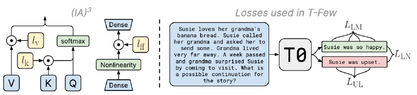

## 前言

为了使微调更加高效，北卡罗来纳教堂山分校的研究人员提出新的增量训练方法[$IA^3$](https://arxiv.org/pdf/2205.05638)，这种方法通过学习向量来对激活层加权进行缩放。作者团队基于之前的 `T0` 基础模型，修改了损失函数以适应小样本学习，无需针对特定任务进行调整即可应用于新任务，命名为`T-Few`，并在`RAFT`基准测试上取得了全新的SOTA结果，超过了人类基准水平。

## 核心思想

$IA^3$ 的核心思想是在原始预训练语言模型的关键位置注入少量可训练参数，来实现参数的高效微调。

具体来说，$IA^3$ 引入了三个学习向量 $l_k$ ，$l_v$ 和 $l_{ff}$ ，分别用于缩放注意力机制中的键（key）和值（value），以及前馈网络（FFN）中的中间激活。

## 技术细节

### 注意力机制中的$IA^3$

在自注意力和交叉注意力机制中，$IA^3$ 引入了两个可学习的向量 $l_k$ 和 $l_v$，分别用于缩放键（key）和值（value）。

原始的注意力计算：

$$
Attention(Q, K, V) = softmax(\frac{QK^T}{\sqrt{d_k}})V \tag{1}
$$

$IA^3$ 修改后的注意力计算：

$$
Attention_{IA^3}(Q, K, V) = softmax(\frac{Q(l_k \circ K)^T}{\sqrt{d_k}})(l_v \circ V) \tag{2}
$$

其中：

- $Q$，$K$,，$V$ 分别对应查询、键和值矩阵。
- $l_k, l_v \in \mathbb{R}^{d_k}$ 是可学习的缩放向量。
- $\circ$ 表示哈达玛积（即按位乘）。
- $d_{k}$ 表示注意力头的维度。

---

### 前馈网络中的IA3

在前馈网络（FFN）中，$IA^3$ 引入了可学习的向量 $l_{ff}$ 来缩放第一个线性变换的输出。

原始的FFN计算：

$$
FFN(x) = W_2(\gamma(W_{1}x + b_{1})) + b_{2} \tag{3}
$$

$IA^3$ 修改后的FFN计算：

$$
FFN_{IA3}(x) = W_2(l_{ff} \odot \gamma(W_{1}x + b_{1})) + b_{2} \tag{4}
$$

其中:

- $W_1$，$W_2$ 是权重矩阵。
- $b_1$，$b_2$ 是偏置项。
- $l_{ff} \in \mathbb{R}^{d_{ff}}$ 是可学习的缩放向量。
- $d_{ff}$ 是FFN的隐藏维度。
- $\odot$ 表示逐元素乘法。
- $\gamma(x)$ 表示激活函数。

### 参数初始化

所有的 $IA^3$ 参数（$l_k$，l_v$ ，$l_{ff}$）都初始化为全 $1$ 向量以确保了在训练开始时，模型的行为与原始预训练模型相同。即

$$
l_k = l_v = l_{ff} = [1, 1, \cdots, 1] \tag{5}
$$

### $IA^3$ 参数更新

在反向传播过程中，只有 $IA^3$ 参数（$l_k$，l_v$ ，$l_{ff}$）会被更新，而原始模型的参数保持冻结：

$$
l_k^{(t+1)} = l_k^{(t)} - \eta \nabla_{l_k} L \tag{6}
$$

$$
l_v^{(t+1)} = l_v^{(t)} - \eta \nabla_{l_v} L \tag{7}
$$

$$
l_{ff}^{(t+1)} = l_{ff}^{(t)} - \eta \nabla_{l_{ff}} L \tag{8}
$$

其中:

- $\eta$ 是学习率。
- $L$ 是损失函数。
- $\nabla_{l} L$ 表示损失函数对参数 $l$ 的梯度。

### 推理时的优化

在推理阶段，将 $IA^3$ 的缩放向量直接与原始权重相乘，从而避免额外的计算开销。

- 对于注意力机制: $K_{eff} = l_k \circ K$,  $V_{eff} = l_v \circ V$
- 对于FFN:  $W_{1,eff} = diag(l_{ff}) W_1$

其中 $diag(l_{ff})$ 是以 $l_{ff}$ 为对角元素的对角矩阵。通过这种方式，$IA^3$ 在保持高效推理的同时，实现了对大型语言模型的参数高效微调。

### 关键特性

| 特性           | 描述                                                                                   |
| -------------- | -------------------------------------------------------------------------------------- |
| 参数效率高     | 只在模块上引入少量的可训练参数，大大减少了需要微调的参数数量。                         |
| 计算效率高     | 由于 $IA^3$ 只是对现有的激活进行缩放，而不是引入新的层或复杂的结构，因此计算开销很小。 |
| 易于实现       | $IA^3$ 的实现相对简单。                                                                |
| 与其他方法兼容 | $IA^3$与其他PEFT方法兼容性高。                                                         |

### $IA^3$ 与 $LoRA$ 的比较

虽然 $IA^3$ 与 $LoRA$ 都是旨在实现参数高效微调的方法，但它们有一些关键区别：

| 特性         | $IA^3$                             | $LoRA$                           |
| ------------ | ---------------------------------- | -------------------------------- |
| 参数注入位置 | 直接对激活进行缩放                 | 在权重矩阵中注入低秩更新         |
| 参数数量     | 更少 (约 0.01% 的模型参数)         | 通常需要更多 (> 0.1% 的模型参数) |
| 实现复杂度   | 更简单，只需元素级乘法             | 需要对权重矩阵进行修改           |
| 适用范围     | 更广泛，可用于注意力机制和前馈网络 | 主要用于注意力机制的权重矩阵     |

## 结论

$IA^3$ 作为一种新型的参数高效微调方法，通过简单而有效的激活缩放机制，实现了大语言模型的高效适配。它不仅大大减少了微调所需的计算资源，还保持了与全参数微调相当的性能。

## 参考文献

1. Liu, H., Tam, D., Muqeeth, M., Mohta, J., Huang, T., Bansal, M., & Raffel, C. (2022). Few-Shot Parameter-Efficient Fine-Tuning is Better and Cheaper than In-Context Learning. arXiv preprint arXiv:2205.05638.
2. Hu, E. J., Shen, Y., Wallis, P., Allen-Zhu, Z., Li, Y., Wang, S., Wang, L., & Chen, W. (2021). LoRA: Low-Rank Adaptation of Large Language Models. arXiv preprint arXiv:2106.09685.
3. Pfeiffer, J., Rückle, A., Poth, C., Kamath, A., Vulić, I., Ruder, S., Cho, K., & Gurevych, I. (2020). AdapterHub: A Framework for Adapting Transformers. arXiv preprint arXiv:2007.07779.
4. Li, X. L., & Liang, P. (2021). Prefix-Tuning: Optimizing Continuous Prompts for Generation. arXiv preprint arXiv:2101.00190.
5. Lester, B., Al-Rfou, R., & Constant, N. (2021). The Power of Scale for Parameter-Efficient Prompt Tuning. arXiv preprint arXiv:2104.08691.
