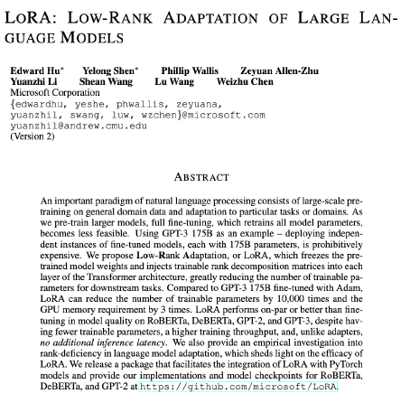
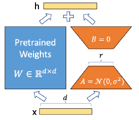
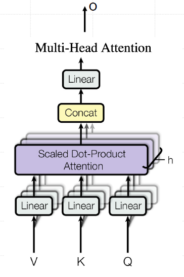
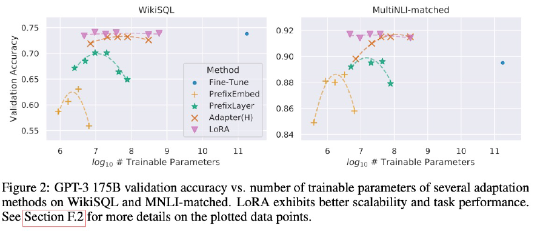
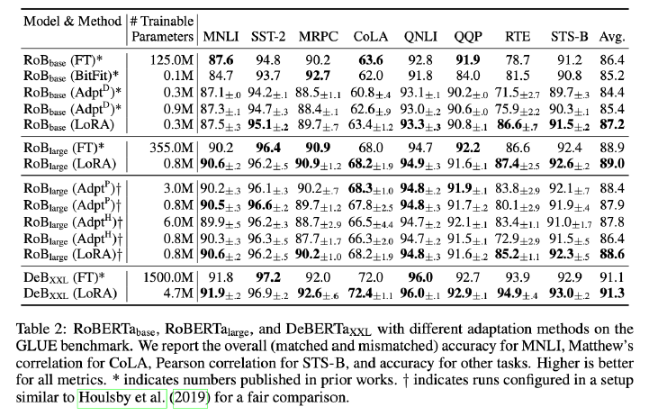
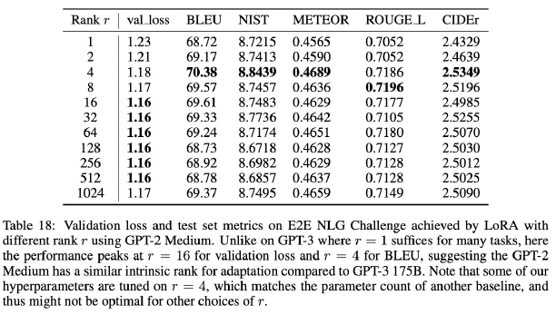

# LoRA: 大语言模型的低秩适配

## 前言

在自然语言处理(NLP)领域,一个重要的范式是在通用领域数据上进行大规模预训练,然后适配到特定任务或领域。随着我们预训练越来越大的模型,全参数微调(即重新训练所有模型参数)变得越来越不可行。以GPT-3 175B为例 - 为每个下游任务部署独立的微调模型实例,每个实例都有175B参数,这在计算和存储上都是极其昂贵的。

为了解决这个问题,微软研究院提出了[低秩适配(Low-Rank Adaptation, LoRA)](https://arxiv.org/pdf/2106.09685v2)方法。LoRA冻结预训练模型的权重,并将可训练的低秩分解矩阵注入到Transformer架构的每一层中,大大减少了下游任务的可训练参数数量。

## LoRAl:小模型有大智慧(2021)

为了使微调更加高效，LoRA的方法是通过低秩分解将权重更新表示为两个较小的矩阵(称为更新矩阵，即下图的A和B)。这些新矩阵可以在适应新数据的同时保持整体变化数量较少进行训练。  

原始权重矩阵保持冻结状态，并且不再接受任何进一步的调整。最终结果是通过将原始权重和适应后的权重进行组合得到。

## LoRA核心技术解密
在LORA方法中，实际上是在原始预训练语言模型(PLM)旁增加一个附加的网络通路这可以视作一种“外挂”结构。这个外挂结构的目的是通过两个短阵A和B的相乘来模拟本征秩(intrinsic rank)。  

下图展示了LoRA的核心结构：

    

$$h = W_0x + \Delta Wx = W_0x + BAx$$

其中：
- $h$ 是输出
- $W_0$ 是原始预训练权重，$W_0 \in \mathbb{R}^{d \times k}$
- $x$ 是输入
- $\Delta W$ 是权重更新
- $B$ 和 $A$ 是LoRA引入的低秩矩阵，$B \in \mathbb{R}^{d \times r}, A \in \mathbb{R}^{r \times k}$

- 整体设计：（两个小模型）输入和输出的维度均为d，这与预训练模型层的维度相同。
- 低秩分解：A矩阵会将输入的d维数据降维至r维（增量矩阵的本征秩），r远小于d（r << d）。矩阵计算从d x d变为d x r + r x d，减少了模型的参数量和计算量。  
- 回映射：B矩阵将这些r维数据再映射回d维，以便与预训练模型的其他部分保持兼容。  

通过这样的低秩适配，LoRA能够有效地在保持预训练模型的复杂性和表达能力的同时，减少所需的计算资源，并提高微调的效率。这种结构使得只有一小部分参数 （A和B矩阵）。
需要在特定任务上进行训练，而不是整个模型，从而提高了微调的效率和实用性。
### LoRA的核心原理

对于预训练权重矩阵 $W_0 \in \mathbb{R}^{d \times k}$,LoRA通过以下方式对其进行更新:

$$W = W_0 + BA$$

其中:
- $B \in \mathbb{R}^{d \times r}$
- $A \in \mathbb{R}^{r \times k}$
- $r$ 是秩,且 $r \ll \min(d,k)$

在训练过程中:
- $W_0$ 被冻结,不接受梯度更新
- A 和 B 包含可训练参数

对于输入 $x$, 前向传播过程如下:

$h = W_0x + BAx$

### 初始化和缩放

- A 使用高斯随机初始化
- B 初始化为零矩阵
- $BAx$ 被缩放因子 $\alpha/r$ 缩放,其中 $\alpha$ 是一个常数

### LoRA在Transformer中的应用

LoRA主要应用于Transformer架构中的自注意力模块，这是因为自注意力机制是Transformer的核心组件，对模型性能影响最大。让我们详细探讨LoRA如何与Transformer的多头注意力机制结合。

#### 1. 多头注意力机制概述

如图所示，Transformer的多头注意力机制包含以下关键组件：
- 查询(Q)、键(K)和值(V)的线性变换
- 缩放点积注意力计算
- 多头的拼接和线性输出变换

#### 2. LoRA的具体应用

在LoRA方法中，我们主要关注以下投影矩阵：

1. **查询(Q)投影**：$W_Q \in \mathbb{R}^{d_{model} \times d_k}$
2. **键(K)投影**：$W_K \in \mathbb{R}^{d_{model} \times d_k}$
3. **值(V)投影**：$W_V \in \mathbb{R}^{d_{model} \times d_v}$
4. **输出(O)投影**：$W_O \in \mathbb{R}^{d_v \times d_{model}}$

对于每个投影矩阵，LoRA引入了对应的低秩更新：

$$W_i = W_{i,0} + B_iA_i, \quad i \in \{Q, K, V, O\}$$

其中：
- $W_{i,0}$ 是原始预训练权重（保持冻结）
- $B_i \in \mathbb{R}^{d_{model} \times r}$，$A_i \in \mathbb{R}^{r \times d_k}$（或 $d_v$ 对于 $W_V$ 和 $W_O$）
- $r$ 是LoRA的秩，通常远小于 $d_{model}$ 和 $d_k$（或 $d_v$）

#### 3. 实现细节

- **初始化**：$A_i$ 通常初始化为高斯分布，$B_i$ 初始化为零矩阵。
- **缩放**：在实践中，我们通常对LoRA的输出进行缩放：$W_i = W_{i,0} + \alpha \frac{B_iA_i}{r}$，其中 $\alpha$ 是一个可调节的超参数。
- **训练**：在训练过程中，只有 $A_i$ 和 $B_i$ 参与梯度更新，$W_{i,0}$ 保持不变。

#### 4. 优化策略

- **选择性应用**：实践表明，通常只需要对Q和V进行LoRA适配就能取得良好效果，这进一步减少了可训练参数。
- **不同的秩**：可以为不同的投影矩阵选择不同的秩r，以平衡性能和参数效率。

#### 5. MLP模块

值得注意的是，LoRA通常不应用于Transformer的前馈神经网络（FFN或MLP）模块。这是因为：
1. 自注意力模块通常对模型性能影响更大。
2. 保持FFN模块冻结可以进一步减少可训练参数，提高效率。

#### 6. 推理阶段

在推理时，我们可以将LoRA的更新合并到原始权重中：

$$W_i = W_{i,0} + \alpha \frac{B_iA_i}{r}$$

这样，模型在推理时不会引入额外的计算开销，保持了与原始Transformer相同的推理速度。

通过这种方式，LoRA实现了对Transformer模型的高效适配，在显著减少可训练参数的同时，保持了模型的强大性能。

## LoRA 相比 Adapter 方法的优势

1. 推理性能高效：
   - 与Adapter方法相比，LoRA在推理阶段直接利用训练好的A、B低秩矩阵替换原预训练模型的对应参数。这种替换避免了增加网络深度所带来的额外计算量和推理延时。
   - LoRA方法使得推理过程与全参数微调（Full-finetuning）相似，但并不增加额外的计算负担。保持了高效的推理性能，同时实现了对模型的有效调整。

2. 模拟全参数微调的效果：
   - LoRA通过对模型关键部分的低秩调整，实际上模拟了全参数微调的过程。
   - 这种方法几乎不会导致训练效果的损失，后续实验结果也证明了这一点。

综上所述，LoRA提供了一种在保持推理效率的同时，有效微调大型预训练模型的方法，特别适用于对推理速度和模型性能都有高要求的应用场景。  

## LoRA 相比 Soft Prompts 方法的优势

1. 更深层次的模型修改：
   - LoRA通过修改模型的权重矩阵，直接影响模型的内部表示和处理机制，而不仅仅是输入层级。
   - 这意味着LoRA能够在模型的更深层次上产生影响，可能导致更有效的学习和适应性。

2. 无需牺牲输入空间：
   - Soft prompts通常需要占用模型的输入空间，这在有限的序列长度下可能限制了其他实际输入内容的长度。
   - LoRA不依赖于Prompt调整方法，避免了相关的限制，因此不会影响模型能处理的输入长度。

3. 直接作用于模型结构：
   - LoRA通过在模型的特定层（如Transformer层）内引入低秩矩阵来调整模型的行为，这种修改是直接作用于模型结构的。
   - 相比之下，soft prompts更多是通过操纵输入数据来影响模型的输出。

4. 更高的灵活性和适应性：
   - LoRA提供了更大的灵活性，在不同的层和模型部件中引入低秩矩阵，可以根据具体任务进行调整。
   - 这种灵活性使得LoRA可以更精细地调整模型以适应特定的任务。

5. 模拟全参数微调的效果：
   - LoRA的设计思路是模拟全参数微调的过程，这种方法通常能够带来更接近全面微调的效果，尤其是在复杂任务中。

总的来说，LoRA的优势在于其能够更深入地、不占用额外输入空间地修改模型，从而提供更高的灵活性和适应性，尤其适合于需要深层次模型调整的场景。  

## LoRA实验结果

### GPT-3 175B上的性能比较

上图展示了GPT-3 175B在WikiSQL和MultiNLI-matched任务上,不同适配方法的验证准确率与可训练参数数量的关系。

- LoRA在两个任务上都表现出优秀的可扩展性和任务性能，以较小的参数量获得了与全参数微调相当的性能。
- 随着可训练参数数量的增加,LoRA的性能持续提升,而其他方法(如PrefixEmbed和PrefixLayer)在某个点后性能开始下降
### BERT系列模型上的性能

在GLUE基准测试上,LoRA同样展现出优秀的性能:

- RoBERTa base: LoRA (0.3M参数) 在大多数任务上优于或接近全量微调 (125M参数)
- RoBERTa large: LoRA (0.8M参数) 性能与全量微调 (355M参数) 相当
- DeBERTa XXL: LoRA (4.7M参数) 在某些任务上甚至超过了全量微调 (1500M参数)

这些结果证明了LoRA在保持模型性能的同时,能够显著减少可训练参数的数量。

### LoRA秩的影响

  

实验表明,即使是非常小的rank(如r=1或r=2)也能在很多任务上取得不错的效果。这进一步证实了更新矩阵确实具有很低的"内在秩"。  

## 回顾LoRA核心思想与可改进问题  

### 核心思想
- 对下游任务增量训练小模型 ($W=W0+\Delta W$)

### 可改进问题
1. 预先指定超参数增量矩阵的本征秩 r，无法自适应调整
2. 低估了权重矩阵的种类和不同层对的微调效果影响
3. 只微调了 Attention，忽略了 FFN 模块。  

这些问题为微软在2023年提出AdaLoRA方法提供了改进方向。

## 实践建议
1. **选择合适的rank**: 从小的rank(如1或2)开始尝试,根据任务需求逐步增加。
2. **权重选择**: 优先考虑同时适配查询(Q)和值(V)矩阵。
3. **与其他技术结合**: 可以尝试将LoRA与其他PEFT方法结合使用。
4. **缩放因子调优**: 可以尝试不同的α值,但通常默认值就能工作得很好。

## 结论

LoRA作为一种简单而有效的参数高效微调方法,为大规模语言模型的高效适配提供了一种重要的解决方案。它不仅大大降低了计算和存储成本,还保持了与全参数微调相当的性能。随着模型规模的不断增长,LoRA及其衍生方法必将在未来的NLP应用中发挥越来越重要的作用。

## 参考文献

1. Edward J. Hu, et al. "LoRA: Low-Rank Adaptation of Large Language Models." arXiv preprint arXiv:2106.09685 (2021).

2. Neil Houlsby, et al. "Parameter-Efficient Transfer Learning for NLP." ICML 2019.

3. Xiang Lisa Li and Percy Liang. "Prefix-Tuning: Optimizing Continuous Prompts for Generation." ACL 2021.

4. Elad Ben-Zaken, et al. "BitFit: Simple Parameter-efficient Fine-tuning for Transformer-based Masked Language-models." ACL 2022.