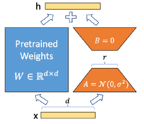

## 前言

随着预训练语言模型规模的不断增大，全量微调（即重新训练所有模型参数）需要花费巨大的计算资源，而且难以保证性能。为解决这个问题，微软研究院提出了[低秩适配(Low-Rank Adaptation, LoRA)](https://arxiv.org/pdf/2106.09685v2)方法，即通过低秩分解的方式高效地微调大规模语言模型。

## 核心思想

LoRA 的核心思想是通过只更新一小部分参数，从而高效地将大型语言模型适配到下游任务的问题。

这种方法冻结整个预训练权重矩阵 $W_0$，然后将权重更新 $\Delta W$ 分解为低秩表示。即

$$
W = W_0 + \Delta W = W_0 + BA \tag{1}
$$

其中：

* $W_0$ 表示原始的预训练权重。
* $B \in \mathbb{R}^{d \times r}$ 和 $A \in \mathbb{R}^{r \times k}$ 表示可训练参数的低秩矩阵，其中 $r << min(d, k)$。

在训练过程中，输入 $x$ 乘以原始权重矩阵 ($W_0x$) 并加上低秩适配 ($BAx$) 的结果。由于 $r$ 远小于 $d$ 和 $k$，因此与更新整个 $W_0$ 相比，可训练参数的数量大大减少。

!!! note
      为了确保训练的稳定性和效率，LoRA 对低秩矩阵的初始化和输出进行了特殊处理：

      - $A$ 矩阵使用高斯分布进行随机初始化，为模型引入了随机性，有助于探索更广泛的参数空间。
      - $B$ 矩阵初始化为零矩阵，这样在训练开始时，LoRA 的输出主要由原始模型决定，然后逐渐加入低秩适配的影响。
      - **为了控制低秩适配对最终输出的影响，将  $BAx$  的结果乘以一个缩放因子**  $\frac{\alpha}{r}$，通过这种缩放操作，可以平衡原始模型和低秩适配的贡献，防止低秩适配过度影响最终输出。
          - $\alpha$ 是一个常数，通常设置为 $1$ 或根据经验进行调整。
          - $r$ 是低秩矩阵的秩。

在推理时，将预训练的低秩适配矩阵 $A$ 和 $B$ 加回到原始预训练权重矩阵 $W$ 上，得到一个新的权重矩阵，即上文提到的 $W$ 。它包含了原始预训练模型的信息和 LoRA 在训练过程中学习到的特定任务知识。

!!! note
      具体来说，权重合并的过程如下：

      1. 将训练好的 $B$ 和 $A$ 矩阵相乘，然后将结果乘以缩放因子 $\frac{\alpha}{r}$ 。
      2. 将上述的最后结果加到原始权重矩阵 $W_{0}$ 上，得到新的权重矩阵 。
      3. 使用新权重矩阵进行推理： 使用新的权重矩阵 $W$ 对输入 $x$ 进行推理，得到最终的输出。

## 优势

LoRA 为微调大型语言模型提供了几项显著优势：

* 参数效率：LoRA 通过仅训练低秩矩阵显著减少了可训练参数的数量，从而最大限度地减少了存储需求并允许在资源有限的设备上进行微调。
* 计算效率：由于减少了参数更新，LoRA 降低了计算复杂度，使得微调过程更快、更高效。
* 与全量微调相当的性能：尽管 LoRA 具有效率优势，但它在各种下游任务中仍能保持与全量微调相当的性能。

## 实践建议

为了在实践中有效地利用 LoRA ，可以考虑以下建议：

* 选择合适的秩（r）：从较小的 $r$ 值开始，并根据任务需求逐渐增加，以平衡效率和性能。
* 权重选择：优先考虑同时调整查询（Q）和值（V）矩阵以获得最佳结果。
* 与其他技术相结合：探索将 LoRA 与其他参数高效微调方法相结合以获得潜在的额外收益。
* 缩放因子调优：尝试不同的 $\alpha$ 值以优化特定任务的性能。

## 结论

1. LoRA 是一种简单而有效的方法，用于对大型语言模型进行参数高效的微调。
2. 该方法通过利用低秩分解，减少了计算和内存需求，同时保持了与全量微调相当的性能。
3. 随着大语言模型的不断发展，LoRA 等参数高效微调技术在实际应用中变得越来越重要。

## 参考资料

1. [Edward J. Hu, et al. "LoRA: Low-Rank Adaptation of Large Language Models." arXiv preprint arXiv:2106.09685 (2021).](https://arxiv.org/pdf/2106.09685v2)
2. [Neil Houlsby, et al. "Parameter-Efficient Transfer Learning for NLP." ICML 2019.](https://arxiv.org/pdf/1902.00751)
3. [Elad Ben-Zaken, et al. "BitFit: Simple Parameter-efficient Fine-tuning for Transformer-based Masked Language-models." ACL 2022.](https://arxiv.org/pdf/2106.10199)
