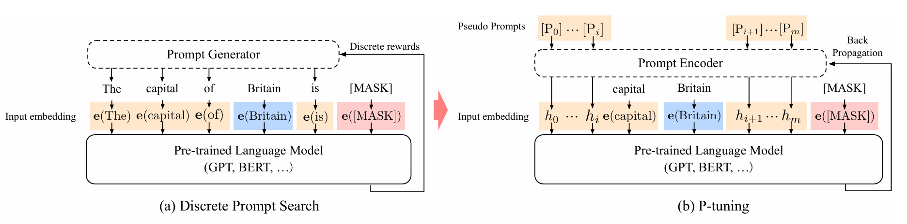

## 前言

不论是`Prefix Tuning`还是`Prompt Tuning`都需要手动设计离散的提示词，于是清华大学与麻省理工学院的学者们合作提出了[P-Tuning](https://arxiv.org/pdf/2103.10385.pdf)方法，即通过连续可学习的prompt embedding来高效地微调大规模语言模型。

## 核心思想

具体来说，`P-Tuning`在输入序列的不同位置插入一系列特殊token [P]，每个[P]对应一个可学习的embedding向量。这些连续的 prompt embedding与离散文本的embedding共同构成模型的输入。

`P-Tuning`的创新之处在于构建一个（Prompt）软化的可学习的嵌入层（Embedding Layer）。

## 技术细节

- 在（a）中，提示生成器只接收离散奖励；
- 在（b）中，连续的提示嵌入（Prompt Embedding）和提示编码器（Prompt Encoder）以可微的方式进行优化。

### 整体框架

`P-Tuning`的整体框架如下：

1. 为每个下游任务设计一个 prompt 模板，包含离散文本和特殊token [P]；
2. 将prompt模板应用于输入样本，得到混合序列；
3. 使用prompt encoder将[P] token映射为连续向量；
4. 将连续prompt向量与离散token embedding拼接，输入预训练语言模型；
5. 优化prompt参数和任务特定参数（如分类头），固定预训练模型参数。

### Prompt 编码器

`P-Tuning`引入了prompt编码器来建模[P] token之间的依赖关系。

常用的编码器包括：

- LSTM：捕捉长程依赖
- MLP：简单有效
- 线性层：直接学习独立的embedding

实验表明LSTM和MLP通常效果较好，而简单的线性层在某些任务上可能不稳定。

### 训练目标

`P-Tuning`的训练目标是最小化下游任务的损失函数。以分类任务为例：

$$
L = CrossEntropy(f(x_prompt), y) \tag{1}
$$

其中 $x_prompt$ 是加入连续prompt后的输入，$f$ 是预训练语言模型，$y$ 是真实标签。

### 推理

在推理时，`P-Tuning`将训练好的prompt embedding与输入文本拼接，直接送入预训练模型即可。这既避免了离散prompt搜索的复杂性，又保持了较低的参数量和计算开销。

## 优势

与传统方法相比，`P-Tuning`具有以下优势：

1. 参数效率高：只需训练少量prompt参数，大大减少了计算资源需求
2. 性能优异：在多个NLU任务上超越了人工设计的离散prompt
3. 训练稳定：连续性使得优化过程更加平滑，不易受局部最优影响
4. 通用性强：适用于各种预训练模型（如 BERT、GPT 等）和下游任务
5. 易于使用：无需大量prompt工程，自动学习任务相关知识

## P-Tuning 和 Prefix-Tuning 主要区别在于

当我们了解完Prefix-Tuning后，再来理解P-Tuning，会发现常常将二者混淆，因为它们都是为了解决人工设计提示的问题。

| 特点     | `Prefix Tuning`                                                             | `P-Tuning`                                                      |
| -------- | ------------------------------------------------------------------------- | ------------------------------------------------------------- |
| 嵌入位置 | 倾向于在模型初始输入的嵌入层 (embedding)                                  | 更为灵活的嵌入位置                                            |
| 实现方法 | 在每个注意力层增加独立小型输入嵌入装置，并使用多层感知机 (MLP) 进行初始化 | 仅在输入部分增加，并通过长短期记忆网络 (LSTM) 加MLP进行初始化 |

## 结论

`P-Tuning`为大规模语言模型的高效适配提供了一种新的范式。它巧妙地结合了离散prompt的先验知识和连续embedding的可学习性，在多种设置下都展现出了优异的性能。

## 参考文献

1. [Liu, X., et al. (2021). GPT Understands, Too. arXiv preprint arXiv:2103.10385.](https://arxiv.org/pdf/2103.10385.pdf)
2. [Schick, T., & Schütze, H. (2020). It's Not Just Size That Matters: Small Language Models Are Also Few-Shot Learners. arXiv preprint arXiv:2009.07118.](https://arxiv.org/pdf/2009.07118)
3. [Brown, T. B., et al. (2020). Language Models are Few-Shot Learners. arXiv preprint arXiv:2005.14165.](https://arxiv.org/pdf/2005.14165)
