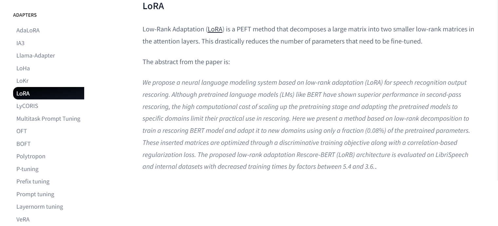
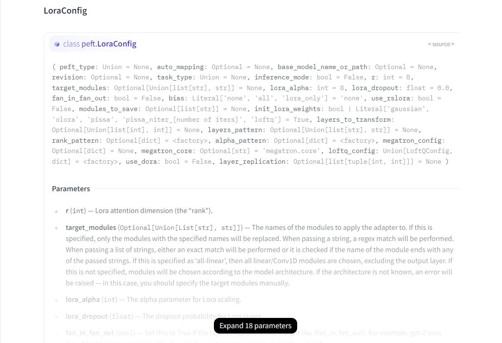

# PEFT（Parameter-Efficient Fine-Tuning）

## 什么是 PEFT（Parameter-Efficient Fine-Tuning）

🤗 `PEFT`（参数高效微调）是一个用于高效地将大规模预训练模型适配到各种下游应用的库。

由于微调模型的所有参数成本高昂且难以实现，而 `PEFT` 方法只需要微调少量额外模型参数，从而显著降低了计算和存储成本，同时实现了与模型全量微调**近乎相当**的性能。这使得在消费级硬件上训练和保存大语言模型 (LLM) 变得更加容易。

安装 `peft`

```bash title='安装peft'
pip install peft
```

PEFT 涵盖众多主流低参高校微调技术，并可以和 `Transformers`、`Accelerate` 一起使用，比如

1. `LoRa`
2. `Prefix Tuning`
3. `AdaLoRA`
4. `Prompt Tuning`
5. `MultiTask Prompt Tuning`
6. `LoHa`
7. $\cdots$

`PEFT` 库支持的方法均可在 [Adapters HuggingFace](https://huggingface.co/docs/peft/main/en/package_reference/adalora#peft.AdaLoraConfig) 左侧导航栏查找

接下来的内容将介绍 `PEFT` 的主要组成，以及如何训练或运行那些通常在消费级设备上难以训练的大规模语言模型。

## `PeftConfig`

每种 `PEFT` 方法都对应一个独特的 `PeftConfig` 类，用于存储构建**相应** `PeftModel` 的所有必要参数。

当你想要调用某个 `PEFT` 方法时，需要先加载并创建一个该方法对应的 `PeftConfig` 类实例，并在实例化过程中指定该方法需要的参数。这些参数会因 `PEFT` 方法的不同而有所差异，例如：

- `LoRa` (`LoraConfig`)：需要指定 `lora_rank`（低秩矩阵的秩）、`lora_alpha`（缩放因子）和 `lora_dropout`（dropout 概率）等参数。
- `Prompt Tuning` (`PromptTuningConfig`)：需要指定 `prompt_tuning_num_tokens`（prompt 中的 token 数量）、`prompt_tuning_init_text`（prompt 的初始化文本）和 `prompt_tuning_placeholder_id`（占位符 ID）等参数。

假如以 `LoRa` 为例子，怎么让 `LoRa` 作用于模型呢？

1. 引入 `LoraConfig` 类。
2. 定义 `LoRa` 的参数，包括 `task_type`，`inference_mode`，`r`，`lora_alpha` 和 `lora_dropout` 等。

```python title='LoraConfig'
from peft import LoraConfig, TaskType

peft_config = LoraConfig(task_type=TaskType.SEQ_2_SEQ_LM, inference_mode=False, r=8, lora_alpha=32, lora_dropout=0.1)
```

这里简单介绍这些参数：

- `Task_type`：下游任务类型，面对不同的任务类型，PEFT 方法将以不同的方式调整模型。
    - `SEQ_CLS` 对应文本分类
    - `SEQ_2_SEQ_LM` 对应序列到序列的语言模型
    - `CAUSAL_LM` 对应因果关系模型
    - `TOKEN_CLS` 对应 Token 分类
    - `QUESTION_ANS` 对应问答问题
    - `FEATURE_EXTRACTION` 对应特征提取
    - $\cdots$
    - 所有的任务类型都可以在官方文档查询 [Task_type Huggingface](https://huggingface.co/docs/peft/main/en/package_reference/peft_types#peft.TaskType)

- `Inference_mode`：是一种用于优化模型推理阶段性能的机制。
    - 当模型需要训练时，将其设置为 `False`，以正常进行梯度更新、启用训练阶段特有的操作（`Dropout` 和 `Batch Normalization` 等）。
    - 当模型需要推理时，将其设置为 `True`，以禁用梯度更新，释放内存空间，提高推理速度，同时也会跳过训练阶段特有的操作，确保模型输出的一致性。

- `r`：低秩矩阵的维度，其值越小，`LoRa` 添加的参数就越少，模型训练速度就越快，但也可能降低模型的性能。
- `lora_alpha`：低秩矩阵的缩放因子。其值越大，`LoRa` 对模型的影响就越大。
- `lora_dropout`：应用于 `LoRa` 层的 `dropout` 概率，其在适当的数值范围内可以防止模型过拟合，提高模型的泛化能力。
- `target_modules`：选择要应用适配器的模块，可以通过正则表达式、精确匹配、模块名称结尾匹配或选择所有线性层来实现。如果未指定该参数，PEFT 会根据模型架构自动选择目标模块。如果无法识别模型架构，则会引发错误，需要手动指定目标模块。所有默认的微调模块都可以在 [peft.utils.constants](https://github.com/huggingface/peft/blob/main/src/peft/utils/constants.py) 查看。

上面的例子是针对于 `LoRa` 的，但是现实中可能需要更多不同的 `PEFT` 方法, 不同的 `PEFT` 方法又需要指定不同的参数，在不了解需要什么参数的时候怎么操作呢？

所有的微调方法的配置及其参数介绍都能在 [Adapters HuggingFace](https://huggingface.co/docs/peft/main/en/package_reference/adalora#peft.AdaLoraConfig) 左侧导航栏被找到。

进入详细介绍界面，整体能看到相应 `PEFT` 方法的介绍


其次是相应 `PEFT` 方法的内置的参数，在 `Parameters` 栏列出了最为重要的参数，使用者可以根据说明及需求自定义相关参数。



---

## `PeftModel`

设置完 `PeftConfig` 后，然后使用 `get_peft_model()` 函数创建 `PeftModel`。 `get_peft_model()` 需要一个从 `transformers` 加载的基础模型和已经定义好的 `PeftModel` 实例。

```python title='base model'
from transformers import AutoModelForSeq2SeqLM

model = AutoModelForSeq2SeqLM.from_pretrained("bigscience/mt0-large")
```

使用 `get_peft_model()` 和 `peft_config` 创建 `PeftModel` 是使用 `PEFT` 的标准方法。

```python title='LoraModel'
from peft import get_peft_model

model = get_peft_model(model, peft_config)
```

`PeftModel` 拥有许多内置的属性和方法，这里主要介绍以下三种。

1. `peft_model.base_model`: 访问基础模型
2. `peft_model.print_trainable_parameters()`: 打印可训练参数的数量和名称
3. `peft_model.save_pretrained()`: 保存 `PeftModel`，包括基础模型和 `PEFT` 适配器

现在让我们看看全量微调与使用低参高效微调时，参与梯度更新的参数对比吧。

```text title='model.print_trainable_parameters()'
"output: trainable params: 2359296 || all params: 1231940608 || trainable%: 0.19151053100118282"
```

`bigscience/mt0-large` 模型拥有 $12$ 亿参数，而我们只需要微调其中 $0.19%$ 就能实现令人印象深刻的效果！总的来说面对庞大的预训练模型，`PEFT` 巧妙地冻结大部分参数，只微调少量的额外参数，就能取得与全量微调相当甚至更好的效果。这是一项多么令人心情愉悦的事情！

## 训练

🎉 到现在已经成功地设置好了被 `PEFT` 方法包裹后的模型了，并且准备好开始训练了！接下来就可以使用 `Trainer`, `Accelerate`, 或者自定义的 `PyTorch` 的训练流程。

训练部分不是本节的重点，故直接引用官方的代码。

```python title='training_args'
training_args = TrainingArguments(
    output_dir="your-name/bigscience/mt0-large-lora",
    learning_rate=1e-3,
    per_device_train_batch_size=32,
    per_device_eval_batch_size=32,
    num_train_epochs=2,
    weight_decay=0.01,
    evaluation_strategy="epoch",
    save_strategy="epoch",
    load_best_model_at_end=True,
)
```

现在就可以把模型、训练参数、数据集、分词器和其他必要组件统统扔给 `Trainer` ，然后调用 `train()` 方法开始训练！

```python title='Trainer'
trainer = Trainer(
    model=model,
    args=training_args,
    train_dataset=tokenized_datasets["train"],
    eval_dataset=tokenized_datasets["test"],
    tokenizer=tokenizer,
    data_collator=data_collator,
    compute_metrics=compute_metrics,
)

trainer.train()
```

## 保存模型、推理

### 保存

当模型完成训练后，我们可以使用 `model.save_pretrained()` 函数将其保存到指定的目录中。

### 推理

无论是自己还是别人使用 `PEFT` 训练出来的模型，只要拿到模型文件，就可以使用 `AutoPeftModel` 类及其 `from_pretrained` 方法轻松加载 `PEFT` 训练的模型以进行推理。这种方法提供了一种无缝的方式来加载和使用你的微调模型，而无需手动指定模型架构或 `PEFT` 配置。

```python title='PeftModel infer'
from peft import AutoPeftModelForCausalLM
from transformers import AutoTokenizer
import torch

model = AutoPeftModelForCausalLM.from_pretrained("ybelkada/opt-350m-lora")
tokenizer = AutoTokenizer.from_pretrained("facebook/opt-350m")

model = model.to("cuda")
model.eval()
inputs = tokenizer("Preheat the oven to 350 degrees and place the cookie dough", return_tensors="pt")

outputs = model.generate(input_ids=inputs["input_ids"].to("cuda"), max_new_tokens=50)
print(tokenizer.batch_decode(outputs.detach().cpu().numpy(), skip_special_tokens=True)[0])
```

```text title='output'
"Preheat the oven to 350 degrees and place the cookie dough in the center of the oven. In a large bowl, combine the flour, baking powder, baking soda, salt, and cinnamon. In a separate bowl, combine the egg yolks, sugar, and vanilla."
```

### 注

- 我们既可以在训练完成后立即使用训练好的 `PEFT` 模型进行推理，也可以将模型保存到磁盘，稍后再加载它进行推理。选择哪种方法取决于你的具体需求。如果只是想快速测试模型，那么第一种方法更方便。如果需要长期保存和管理模型，那么第二种方法更合适。

## 参考资料

<div class="grid cards" markdown>

- `PEFT`支持的微调方法

    ---

    了解 已有的 `PEFT` 方法。

    [--> Adapters HuggingFace](https://huggingface.co/docs/peft/main/en/package_reference/adalora#peft.AdaLoraConfig)

- `PEFT` 支持的任务类型

    ---

    探索 `PEFT` 支持用于微调的不同下游任务类型。

    [--> Task_type Huggingface](https://huggingface.co/docs/peft/main/en/package_reference/peft_types#peft.TaskType)

- Get Started with PEFT

    ---

    Hugging Face 官方的的参数高效微调快速入门和示例。

    [--> PEFT HuggingFace](https://huggingface.co/docs/peft/quicktour)

- `PEFT`方法默认的目标模块

    ---

    `PEFT` 库中 `constants.py` 文件定义了 `PEFT` 库中使用的各种常量，其中包括了默认的目标模块。

    [--> peft.utils.constants](https://github.com/huggingface/peft/blob/main/src/peft/utils/constants.py)

</div>
