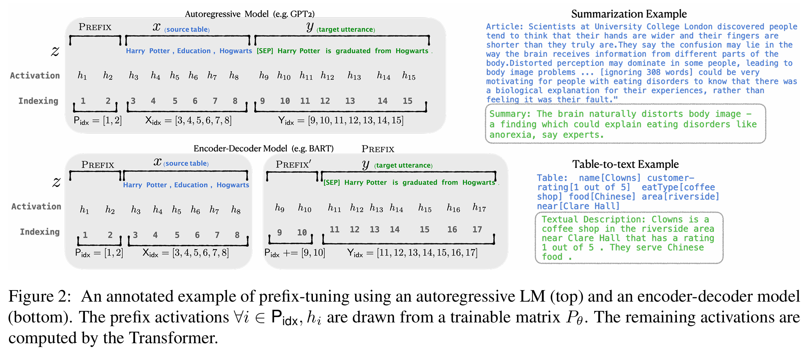

## 前言

微调（fine-tuning）作为利用预训练大语言模型执行下游任务的标准方法，虽然效果显著，却需要修改模型的所有参数，导致每个任务都需要存储一个完整的模型副本，造成存储成本的上升。为了解决这个问题，斯坦福大学的研究者们提出一种轻量级替代方法[Prefix-Tuning](https://arxiv.org/pdf/2101.00190.pdf)方法，该方法仅优化一小段连续的任务特定向量（前缀），即可高效地微调大规模语言模型，而无需修改和存储整个模型的参数。

## 技术细节

### `Fine-Tuning` vs `Prefix-Tuning`

上图直观地展示了`Prefix-Tuning`和传统`Fine-tuning`的差异：

- `Fine-Tuning`：更新模型的所有参数，并为每个任务存储一个完整的模型副本（图示顶部）。
- `Prefix-Tuning`：仅优化前缀部分的参数，并且冻结模型的所有参数（图示底部）。

!!! note
    `Prefix-Tuning`这种方法允许模型为每个任务设置特定指令集，从而引导模型生成特定任务相关的输出。

### 前缀嵌入

`Prefix-Tuning`在预训练的`Transformer`模型的每一层前都添加了一段可训练的前缀向量。

- 前缀是添加在输入序列之前，作为虚拟的`token`，模型在生成过程中可以对其进行关注。
- 这些前缀是自由参数，不对应于词汇表中的任何特定词语。

另外：

- 对于自回归语言模型（如 GPT），前缀被添加到每一层的键和值向量中。
- 对于编码器-解码器模型（如 BART），前缀被分别添加到编码器和解码器的每一层中。

即对于一个 $n$ 层的`Transformer`模型，`Prefix-Tuning`会为每一层添加一对前缀向量 $P_i^K, P_i^V \in \mathbb{R}^{|P|\times d}$，其中 $|P|$ 是前缀长度，$d$ 是隐藏状态维度。

### 参数更新

在训练过程中，`Prefix-Tuning`只更新前缀向量的参数，而保持预训练模型的参数不变。这可以表示为：

$$
\theta = [\theta_P; \theta_{LM}] \tag{1}
$$

其中 $\theta_P$ 是可训练的前缀参数，$\theta_{LM}$ 是冻结的语言模型参数。

优化目标可以表示为：

$$
\mathcal{L}(\phi(x; \theta_P, \theta_{LM}), y) \tag{2}
$$

其中 $\phi$ 是模型输出，$x$ 是输入，$y$ 是目标输出，$\mathcal{L}$ 是损失函数。

### 重参数化技巧

为了提高训练稳定性和性能，`Prefix-Tuning`采用了一个重参数化技巧：前缀向量 $P_i$ 不是直接优化的，而是通过一个小型 MLP 网络生成的：

$$
P_i = \text{MLP}_\theta(P'_i) \tag{3}
$$

其中 $P'_i$ 是一个较小的矩阵，MLP 网络将其映射到所需的维度。这种方法可以减少参数数量，并提高优化稳定性。

## 优势

`Prefix-Tuning` 相比于传统的全量微调方法有以下几个显著优势：

1. 参数效率高：只需要训练一小部分前缀参数，大大减少了所需的计算资源和存储空间。
2. 模块化：每个任务只需要存储一个小的前缀，而不是整个模型的副本，便于管理和部署多个任务。
3. 灵活性：可以轻松地为新任务添加前缀，而无需重新训练整个模型。
4. 性能保证：在许多任务上，`Prefix-Tuning` 能够达到与全量微调相当的性能。
5. 适用于大模型：特别适合那些参数数量庞大的模型，如 GPT-3，使微调这些模型成为可能。

## 结论

`Prefix-Tuning` 作为一种新型的参数高效微调方法，通过简单而有效的前缀机制，实现了大语言模型的高效适配。它不仅大大减少了微调所需的计算资源，还保持了与全参数微调相当的性能。这种方法为大规模语言模型在实际应用中的部署和个性化提供了新的可能性。

## 参考资料

1. [Li, X. L., & Liang, P. (2021). Prefix-tuning: Optimizing continuous prompts for generation. arXiv preprint arXiv:2101.00190.](https://arxiv.org/pdf/2101.00190.pdf)
2. [Raffel, C., Shazeer, N., Roberts, A., Lee, K., Narang, S., Matena, M., ... & Liu, P. J. (2020). Exploring the limits of transfer learning with a unified text-to-text transformer. Journal of Machine Learning Research, 21(140), 1-67.](https://arxiv.org/pdf/1910.10683)
