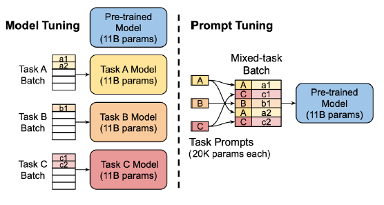

## 前言

OpenAi提出GPT-3时，验证了为任务设计特定prompt可以提升模型的表现，但每次遇到新任务都要花费大量精力去设计合适的prompt并不现实。为了解决这个问题，Google Research的研究人员提出了[Prompt Tuning](https://arxiv.org/pdf/2104.08691)方法。
通过仅微调一小部分连续的“软提示”（soft prompt）参数，这种方法能够高效地将大型语言模型适配到不同的下游任务，从而大大简化了任务适配的过程。

## 技术细节



### Prompt Tuning 训练方法：

1. **设计提示**: 根据任务选择硬提示（固定文本）或软提示（可训练向量）作为输入。

2. **融入输入**: 硬提示直接加入文本，软提示作为向量加入序列,指导模型生成任务特定的输出。

3. **训练过程**: 硬提示下进行全面微调模型；软提示下只调整提示向量，其他参数不变。

4. **执行任务**: 训练后模型用于 NLP 任务（如问答、摘要），输出由提示引导。

这种方法的独特之处在于，它将任务适配信息浓缩在一小组连续向量中，而不是分散在整个模型的参数中。这大大降低了每个任务的参数量，同时保持了与全量微调相当的性能。

### 模型结构

Prompt Tuning基于T5等encoder-decoder架构的预训练语言模型。具体来说:

1. 在输入端添加一段可训练的连续向量序列（软提示）
2. 将软提示与tokenized输入文本拼接
3. 送入encoder进行编码
4. decoder根据encoder输出生成目标序列

模型结构示意图如下:

```
Input: [Soft Prompt] [Input Tokens] 
        ↓
Encoder: Frozen Pre-trained Parameters
        ↓ 
Decoder: Frozen Pre-trained Parameters
        ↓
Output: [Generated Tokens]
```

### 参数初始化

软提示参数的初始化对性能有重要影响。常用的初始化方法包括:

1. 随机初始化：从均匀分布或正态分布中采样
2. 词表采样：从模型词表中随机采样token的embedding
3. 类别词初始化：使用任务输出类别对应token的embedding

实验表明，类别词初始化通常能获得最好的效果。

### 训练过程

训练过程与传统的微调类似，但只更新软提示参数:

1. 准备任务数据，添加软提示
2. 前向传播，计算损失
3. 反向传播，仅更新软提示参数
4. 重复步骤2-3直到收敛

训练目标是最大化条件概率:

$$
\max_{\theta_P} \log P(Y|[P;X], \theta)
$$

其中$\theta_P$是软提示参数，$P$是软提示，$X$是输入，$Y$是目标输出，$\theta$是冻结的预训练模型参数。

### 推理过程

推理时，我们使用训练好的软提示:

1. 将训练好的软提示与新的输入拼接
2. 送入模型进行正常的推理
3. 生成任务相关的输出

这个过程不需要额外的计算开销，保持了原始模型的推理效率。

## 优势

Prompt Tuning相比传统微调方法有以下优势:

1. **直观性**：Prompt tuning 使用直观的语言提示来引导模型，使其更易于理解和操作。

2. **适用性**：这种方法特别适用于那些预训练模型已经掌握了大量通用知识的情况，通过简单的提示就能激发特定的响应。

3. **微调成本低**：Prompt tuning可以在微调时减少所需计算资源，同时保持良好的性能。


## 结论

Prompt Tuning为大型语言模型的高效适配提供了一种新的范式。它在保持模型性能的同时，大大降低了计算和存储成本。这种方法特别适合于参数量超过数十亿的超大模型，为这些模型的广泛应用铺平了道路。

尽管如此，Prompt Tuning仍然存在一些局限性，例如在小模型上效果不佳、对提示长度和初始化敏感等。未来的研究方向包括改进提示的表示方式、探索更好的初始化策略、将Prompt Tuning与其他高效微调方法结合等。


## 参考资料

1. [Lester, B., Al-Rfou, R., & Constant, N. (2021). The Power of Scale for Parameter-Efficient Prompt Tuning. ](https://arxiv.org/pdf/2104.08691)

2. [Liu, X., et al. (2021). GPT Understands, Too. arXiv preprint arXiv:2103.10385.](https://arxiv.org/pdf/2103.10385)

3. [Brown, T., et al. (2020). Language Models are Few-Shot Learners. In Advances in Neural Information Processing Systems.](https://arxiv.org/pdf/2005.14165)
