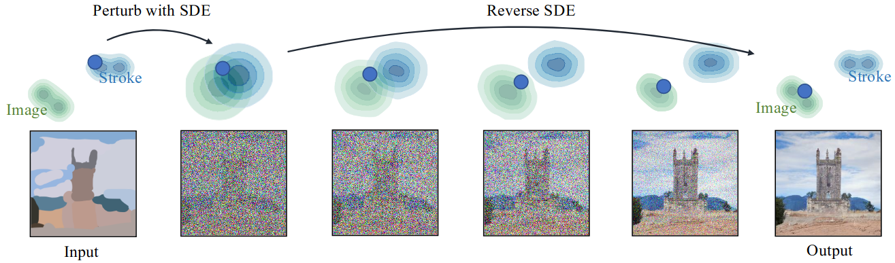
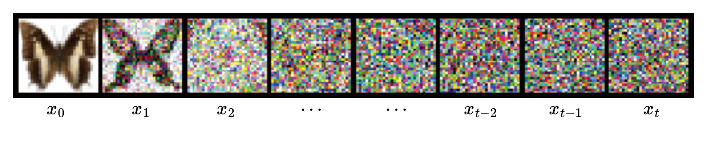
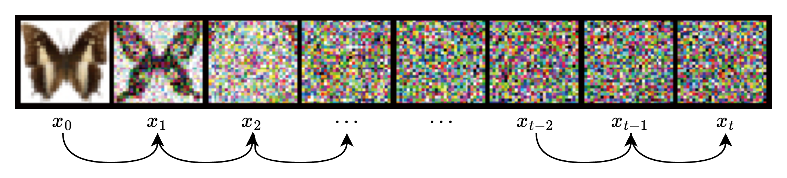

## 前向扩散

现在假定有一张像素值范围为 `[0, 255]` 的彩色 `RGB` 图像 $x_0$ 。

创建和输入图像形状完全一样，服从**正态分布**的随机噪声 $\epsilon$ 。

然后利用公式 1 将图片 $x$ 和高斯噪声 $\epsilon$ 进行加权混合。其中 $\beta$ 是介于 $0$ 和 $1$ 之间的数字。可以看出随着 $\beta$ 的变化，图像和噪声进行混合的时候各自的权重**此消彼长**。

$$
\sqrt{\beta}\times\epsilon+\sqrt{1-\beta}\times x \tag{1}
$$

首先有原始图像 $x_0$ ，后续的 $x_t$ 是由图像 $x_{t-1}$ 和随机高斯噪声 $\epsilon_t$ 加权混合而成。也就是说**后一时刻的噪声图像是由前一时刻的图像加上当前时刻的高斯噪声产生的**。

将上面的过程形式化，也就是用数学公式对这个过程进行表示。

对于 $x_1$ 的产生：

$$
x_1 = \sqrt{\beta_1} \times \epsilon_1 + \sqrt{1 - \beta_1} \times x_{0} \tag{2}
$$

对于 $x_2$ 的产生：

$$
x_2 = \sqrt{\beta_{2}} \times \epsilon_2 + \sqrt{1 - \beta_{2}} \times x_{1} \tag{3}
$$

对于 $x_3$ 的产生：

$$
x_3 = \sqrt{\beta_{3}} \times \epsilon_3 + \sqrt{1 - \beta_{3}} \times x_{2} \tag{4}
$$

以此类推 $\ldots$

$$
\vdots
$$

对于 $x_t$ 的产生：

$$
x_t = \sqrt{\beta_{t}} \times \epsilon_t + \sqrt{1 - \beta_{t}} \times x_{t-1} \tag{5}
$$

我们发现规律：

$$
x_T = \sqrt{\beta_T} \times \epsilon_{T} + \sqrt{1 - \beta_{T}}  \times x_{T-1} \tag{6}
$$

- 其中 $\epsilon_t$ 和其他任意时刻的 $\epsilon_i$ $(i≠t)$ 都是独立同分布的，$\epsilon_t \sim N(0, 1)$。也就是**任意俩时刻的噪声是互不影响**的。
- 特别注意一下，$0<\beta_1<\beta_2<\beta_3<\ldots<\beta_{t-1}<\beta_{t}<1$，在一开始的 $\beta$ 取值较小，也就是噪声的权重较小，越往后的 $\beta$ 的取值逐渐变大，也就是噪声的权重较大。
- **规律就是在前期图像的扩散速率较低，到后期图像的扩散速率逐步加快。**

---

为了简化后续的推导，在这里用 $\alpha_t$ 取代 $1-\beta_t$。

所以公式又能写成：

$$
x_T = \sqrt{1 - \alpha_T} \times \epsilon_T + \sqrt{\alpha_{T}}  \times x_{T-1} \tag{7}
$$

接下来我们将使用公式 7 搞**亿**点事情。

使用公式 7 我们可以从图像 $x_0$ 一步步迭代到 $x_t$ ，但是很多时候我们就是想一步到位，我现在就是想避开这样的一个循环过程，从 $x_0$ 到 $x_t$ 一步到位, 或者到任意时刻。

能做到吗？

首先我们有：

$$
x_t = \sqrt{1 - \alpha_t} \times\epsilon_t + \sqrt{\alpha_t} \times x_{t-1}\tag{8}
$$

然后还有：

$$
x_{t-1} = \sqrt{1 - \alpha_{t-1}} \times\epsilon_{t-1} + \sqrt{\alpha_{t-1}} \times x_{t-2}\tag{9}
$$

然后还有：

$$
x_{t-2} = \sqrt{1 - \alpha_{t-2}} \times\epsilon_{t-2} + \sqrt{\alpha_{t-2}} \times x_{t-3}\tag{10}
$$

还有很多很多，一直到：

$$
\vdots
$$

$$
x_1 = \sqrt{1 - \alpha_{1}} \times\epsilon_{1} + \sqrt{\alpha_{1}} \times x_0\tag{11}
$$

可以看到好像，仅仅是**好像**只要知道这一时刻的图像就能表示出后一时刻的图像，那么我们将这些公式合并起来，看看能用 $x_0$ 来表示 $x_t$ 吗？

首先合并公式 8 和公式 9 我们得到：

$$
x_t = \sqrt{1 - \alpha_{t}} \times\epsilon_{t} + \sqrt{\alpha_{t}(1 - \alpha_{t-1})} \times{\epsilon_{t-1}} + \sqrt{\alpha_t\alpha_{t-1}}\times x_{t-2}\tag{12}
$$

再把公式 10 和上式公式 12 合并能够得出：

$$
x_t = \sqrt{1 - \alpha_{t}} \times\epsilon_{t} + \sqrt{\alpha_{t}(1 - \alpha_{t-1})} \times{\epsilon_{t-1}} + \sqrt{\alpha_{t}\alpha_{t-1}(1-\alpha_{t-2})}\times{\epsilon_{t-2}}+\sqrt{\alpha_t\alpha_{t-1}\alpha_{t-2}}\times x_{t-3}\tag{13}
$$

这样一直合并下去我们可以得到：

$$
x_t = \boxed{\sqrt{1 - \alpha_{t}} \times\epsilon_{t} + \sqrt{\alpha_{t}(1 - \alpha_{t-1})} \times{\epsilon_{t-1}} + \sqrt{\alpha_{t}\alpha_{t-1}(1-\alpha_{t-2})}\times{\epsilon_{t-2}}+\cdots +
\sqrt{\alpha_{t}\alpha_{t-1}\alpha_{t-2}\cdots(1-\alpha_{1})}\times{\epsilon_{1}}}
+\\\sqrt{\alpha_t\alpha_{t-1}\alpha_{t-2}\alpha_{t-3}\cdots\alpha_{2}\alpha_{1}}\times x_0\tag{14}
$$

这个公式可能复杂了一点，但是你要是有耐心一点点进行合并是可以顺理成章推导出来的。

我们看矩形框内的每个 $\epsilon$ ，每个 $\epsilon$ 都服从均值为 $0$ ，方差为 $1$ 的正态分布。那么每个正态分布所有的可能去乘以同一个数会导致其方差变化。

| 分布                                                                                  | 均值       | 方差                                                       |
| ----------------------------------------------------------------------------------- | -------- | -------------------------------------------------------- |
| $\sqrt{1 - \alpha_{t}} \times\epsilon_{t}$                                          | $0$      | $1 - \alpha_{t}$                                         |
| $\sqrt{\alpha_{t}(1 - \alpha_{t-1})} \times{\epsilon_{t-1}}$                        | $0$      | $\alpha_{t}(1 - \alpha_{t-1})$                           |
| $\sqrt{\alpha_{t}\alpha_{t-1}(1-\alpha_{t-2})}\times{\epsilon_{t-2}}$               | $0$      | $\alpha_{t}\alpha_{t-1}(1-\alpha_{t-2})$                 |
| $\vdots$                                                                            | $\vdots$ | $\vdots$                                                 |
| $\sqrt{\alpha_{t}\alpha_{t-1}\alpha_{t-2}\cdots(1-\alpha_{1})}\times{\epsilon_{1}}$ | $0$      | $\alpha_{t}\alpha_{t-1}\alpha_{t-2}\cdots(1-\alpha_{1})$ |

到这里，我们还知道就是多个符合正态分布的分布和进行叠加后的分布还是符合正态分布的，其前后均值和方差还满足一定的规律，这里不详细介绍了。

那么就可以利用**重参数化**技巧得出：公式 14 的矩形框区域的分布是服从均值为 $0$ ，方差为 $\boxed{1 - \alpha_{t}\alpha_{t-1}\alpha_{t-2}\cdots\alpha_{3}\alpha_{2}\alpha_{1}}$ 的正态分布。

$$
x_t = \boxed{\sqrt{
(1 - \alpha_{t}\alpha_{t-1}\alpha_{t-2}\cdots\alpha_{3}\alpha_{2}\alpha_{1}}) \times \epsilon
}
+
\sqrt{\alpha_t\alpha_{t-1}\alpha_{t-2}\alpha_{t-3}\cdots\alpha_{2}\alpha_{1}}\times x_0\tag{15}
$$

这样的关系式还是很冗长，用 $\bar{\alpha}_t$ 来等价于 $\boxed{\alpha_{t}\alpha_{t-1}\alpha_{t-2}\cdots\alpha_{3}\alpha_{2}\alpha_{1}}$。那么公式就能写成：

$$
x_t = \boxed{\sqrt{
(1 - \bar{\alpha}_t)}\times \epsilon
}
+
\sqrt{\bar{\alpha}_t}\times x_0\tag{16}
$$

现在从上式来看，只要给定一个随机噪声分布 $\epsilon$ ，那么我们就能从 $x_0$ 一步到位加入噪声 $\epsilon$ 变成 $x_t$ 。

## 反向过程

刚才介绍的是从一张没有噪声的图如何有规律的加入噪声，现在假设我们有一张几乎都是噪声的图片，我们希望有一种能够和前向扩散完全相反的过程，为什么需要呢？

刚才是从 $x_0$ 到 $x_t$ ，我们想知道有没有一种方法能从 $x_t$ 大致的知道 $x_0$ ，**这样只要给我一张噪声图，那么我一定能生成一张和原始图像分布相似的图像**。

先把需要用到的公式写下来。

$$
x_t = \sqrt{1 - \alpha_t} \times\epsilon_t + \sqrt{\alpha_t} \times x_{t-1}\tag{17}
$$

$$
x_t = \sqrt{
1 - \bar{\alpha}_t}\times \epsilon + \sqrt{\bar{\alpha}_t}\times x_0\tag{18}
$$

$$
P(A|B) = \frac{P(B|A)P(A)}{P(B)}\tag{19}
$$

关于贝叶斯公式（公式 19），补充一点，假如 $A$，$B$ 事件的发生有先后顺序，就假定 $A$ 时间先于 $B$ 事件发生。那么我能通过公式 19 获得在已知 $B$ 已经发生的情况下，发生了 $A$  的概率是多少。

那么结合例子来讲，**知道了前向扩散的这一事件的具体过程，现在我们就可以利用这个过程根据已经发生的前向扩散得到前一时刻噪声图**。

我们用 $P (x_{t-1}|x_t)$ 来表示给定 $x_t$ 的情况下是图像 $x_{t-1}$ 的概率。结合贝叶斯公式那么可以得到：

$$
P(x_{t-1}|x_t) = \frac{P(x_t|x_{t-1})P(x_{t-1})}{P(x_t)} = \frac{P(x_t|x_{t-1})P(x_{t-1}|x_0)}{P(x_t|x_0)} \tag{20}
$$

为了严谨更新一下公式，这样就是说都是从同一张原始图像出发：

$$
P(x_{t-1}|x_t,x_0) = \frac{P(x_t|x_{t-1},x_0)P(x_{t-1}|x_0)}{P(x_t|x_0)} \tag{21}
$$

我们看看等式右边各个正态分布：

$$
\boxed{x_t = \sqrt{1 - \alpha_t} \times\epsilon_t + \sqrt{\alpha_t} \times x_{t-1}} \sim N(\sqrt{\alpha_t} x_{t-1}, 1-\alpha_t)\tag{22}
$$

$$
\boxed{x_t = \sqrt{
(1 - \bar{\alpha}_t)}\times \epsilon +\sqrt{\bar{\alpha}_t}\times x_0} \sim N(\sqrt{\bar{{\alpha}_t}}x_0,1 - \bar{\alpha}_t)\tag{23}
$$

$$
\boxed{x_{t-1} = \sqrt{
(1 - \bar{\alpha}_{t-1})}\times \epsilon + \sqrt{\bar{\alpha}_{t-1}}\times x_0} \sim N(\sqrt{\bar{{\alpha}}_{t-1}}x_0,1 - \bar{\alpha}_{t-1})\tag{24}
$$

那么再转化一下，用正态分布表达式来表示上式：

$$
P(x_{t-1}|x_t,x_0) = \frac{N(x_t|x_{t-1},x_0)N(x_{t-1}|x_0)}{N(x_t|x_0)} \tag{25}
$$

他们写成正态分布的概率密度函数表达式：

$$
P(x_t|x_{t-1}, x_0) = \frac{1}{{\sqrt{2\pi}{\sqrt{1 - {\alpha}_t}}}}e^{[-\frac{1}{2}\frac{(x_t-\sqrt{\bar{\alpha}_t}x_{t-1})^2}{1-\alpha_t}]}\tag{26}
$$

$$
P(x_t|x_0) = \frac{1}{{\sqrt{2\pi}{\sqrt{1 - \bar\alpha_t}}}}e^{[-\frac{1}{2}\frac{(x_t-\sqrt{\bar{\alpha}_t}x_{0})^2}{1-\bar{\alpha}_{t}}]}\tag{27}
$$

$$
P(x_{t-1}|x_0) = \frac{1}{{\sqrt{2\pi}{\sqrt{1 - \bar{\alpha}_{t-1}}}}}e^{[-\frac{1}{2}\frac{(x_{t-1}-\sqrt{\bar{\alpha}_{t-1}}x_{0})^2}{1-\bar{\alpha}_{t-1}}]}\tag{28}
$$

我们将上面的概率密度函数代入公式 25 中，经过化简就能得到：

$$
P(x_{t-1}|x_t,x_0) = \frac{1}{\sqrt{2\pi}
\left({\color{red}{\frac{\sqrt{1-a_t}\sqrt{1-\bar{\alpha}_{t-1}}}{\sqrt{1-\bar{\alpha}_t}}}}\right)}
e^{\left[-\frac{\left(x_{\boldsymbol{t}-\mathbf{1}}-\left({{\color{purple}\frac{\sqrt{\alpha_t}(1-\bar{\alpha}_{t-1})}{1-\bar{\alpha}t}x_t+\frac{\sqrt{\bar{\alpha}{t-1}}(1-\alpha_t)}{1-\bar{\alpha}_t}x_0}}\right) \right)^2}{2 {
\left({\color{red}{\frac{\sqrt{1-\alpha_t}\sqrt{1-\bar{\alpha}_{t-1}}}{\sqrt{1-\bar{\alpha}_t}}}}\right)}^2}\right]}\tag{29}
$$

也就是说：

$$
\begin{aligned}P(x_{t-1}|x_t,x_0)&\sim N\left(\frac{\sqrt{\alpha_t}(1-\bar{\alpha}_{t-1})}{1-\bar{\alpha}_t}x_t+\frac{\sqrt{\bar{\alpha}_{t-1}}(1-\alpha_t)}{1-\bar{\alpha}_t}x_0,\left(\frac{\sqrt{1-\alpha_t}\sqrt{1-\bar{\alpha}_{t-1}}}{\sqrt{1-\bar{\alpha}_t}}\right)^2\right)\end{aligned}\tag{30}
$$

但是我们必须记得我们是想用 $x_t$ 时刻的图像去预测 $x_{t-1}$ 时刻的图像，上述公式竟然出现了 $x_0$ ，话说回来，我们终极目的就是知道  $x_0$ ，现在却需要 $x_0$ ，显然我们得想办法替换 $x_0$ 。

正好有这个公式：

$$
x_t = \sqrt{
(1 - \bar{\alpha}_t)}\times \epsilon + \sqrt{\bar{\alpha}_t}\times x_0\tag{31}
$$

根据这个公式可以用 $x_t$ 表示 $x_0$：

$$
x_0=\frac{x_t-\sqrt{1-\bar{\alpha}_t}\epsilon}{\sqrt{\bar{\alpha}_t}}\tag{32}
$$

还可以表示  $\epsilon_t$ ：

$$
\epsilon_t=\frac{x_t-\sqrt{\bar{\alpha}_t}x_t}{\sqrt{1-\bar{\alpha}_t}}\tag{33}
$$

再把上式代入公式 30，那么就能得到：

$$
P(x_{t-1}|x_t,x_0)\sim N\left(\frac{\sqrt{\alpha_t}(1-\bar{\alpha}_{t-1})}{1-\bar{\alpha}_t}x_t+\frac{\sqrt{\bar{\alpha}_{t-1}}(1-\alpha_t)}{1-\bar{\alpha}_t}\times\frac{x_t-\sqrt{1-\bar{\alpha}_t}\color{red}{\epsilon}}{\sqrt{\bar{\alpha}_t}},\left(\sqrt{\frac{\beta_t(1-\bar{\alpha}_{t-1})}{1-\bar{\alpha}_t}}\right)^2\right)\tag{34}
$$

经过这样的过程：

$$
\begin{aligned}
&\frac{\sqrt{\alpha_t}(1-\bar{\alpha}_{t-1})}{1-\bar{\alpha}_t}x_t+\frac{\sqrt{\bar{\alpha}_{t-1}}(1-\alpha_t)}{1-\bar{\alpha}_t}\times\frac{x_t-\sqrt{1-\bar{\alpha}_t}\color{red}{\epsilon}}{\sqrt{\bar{\alpha}_t}}\\\\=&\frac{\sqrt{\alpha_t}\left(1-\overline{\alpha}_{t-1}\right)x_t+\frac{\sqrt{\bar{\alpha}_{t-1}}}{\sqrt{\bar{\alpha}_t}}(1-\alpha_t)(x_t-\sqrt{1-\overline{\alpha}_t}\epsilon)}{1-\overline{\alpha}_t} \\\\=&\frac{\sqrt{\alpha_t}\left(1-\overline{\alpha}_{t-1}\right)x_t+\frac{1}{\sqrt{\alpha_t}}(1-\alpha_t)(x_t-\sqrt{1-\overline{\alpha}_t}\epsilon)}{1-\overline{\alpha}_t} \\\\
=&\frac1{\sqrt{\alpha_{t}}}\frac{\alpha_{t}\left(1-\overline{\alpha}_{t-1}\right)x_{t}+(1-\alpha_{t})x_{t}-(1-\alpha_{t})\sqrt{1-\overline{\alpha}_{t}}\epsilon)}{1-\overline{\alpha}_{t}} \\\\
=&\frac{1}{\sqrt{\alpha_{t}}}\frac{(1-\overline{\alpha}_{t})x_{t}-(1-\alpha_{t})\sqrt{1-\overline{\alpha}_{t}}\epsilon)}{1-\overline{\alpha}_{t}} \\\\
=&\frac1{\sqrt{\alpha_{t}}}\left(x_{t}-\frac{1-\alpha_{t}}{\sqrt{1-\overline{\alpha}_{t}}}\epsilon\right)
\end{aligned} \tag{35}
$$

我们整理得到：

$$
P(x_{t-1}|x_t,x_0)\sim N\left(\frac1{\sqrt{\alpha_{t}}}\left(x_{t}-\frac{1-\alpha_{t}}{\sqrt{1-\overline{\alpha}_{t}}}\epsilon_t\right),\frac{\beta_t(1-\bar{a}_{t-1})}{1-\bar{a}_t}\right)\tag{36}
$$

???+ success "结论"
     - 根据公式 31 可以知道，只要我们知道原始图像 $x_0$ ，我们就能通过直接加入一个噪声 $\color{red}{\epsilon}$ 变成噪声图像 $x_t$。
     - 根据公式 35 可以知道，只要我们知道了噪声 $\color{red}{\epsilon}$ ，就能知道前一时刻的图像概率分布。
     - 但是问题就在于我们不知道这个噪声 $\color{red}{\epsilon}$ ，那么就能利用神经网络强大的拟合能力，给定一张噪声图去预测噪声 $\color{red}{\epsilon_t}$ 来获取前一时刻的噪声图像，再在前一时刻的噪声图像去预测另一个噪声 $\color{red}{\epsilon}$ 来获取前前一时刻的噪声图像，如此循环一定步数。最终就能得出接近原始图像的图片。

## 参考资料

- Bilibili 大白话 AI

    ---

    [大白话AI | 图像生成模型DDPM | 扩散模型 | 生成模型 | 概率扩散去噪生成模型](https://www.bilibili.com/video/BV1tz4y1h7q1)

	---

	[大白话AI | 神经网络 | 概率空间 | 边缘概率 | 各向同性高斯分布 |](https://www.bilibili.com/video/BV1xQ4y1w7ex)

	---

	[三维动画展示 AIGC 扩散生成全过程！| 大白话 AI | DDPM 模型解析之三 | 扩散生成模型](https://www.bilibili.com/video/BV1hZ421y7id)

