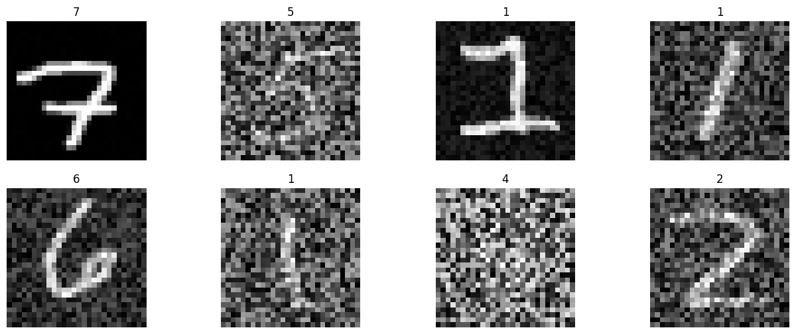
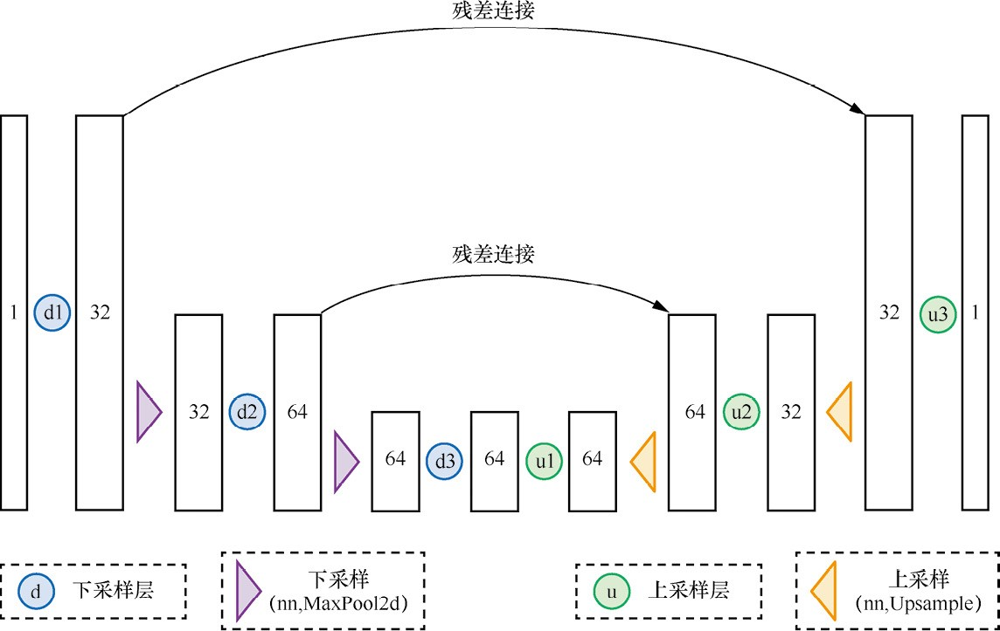
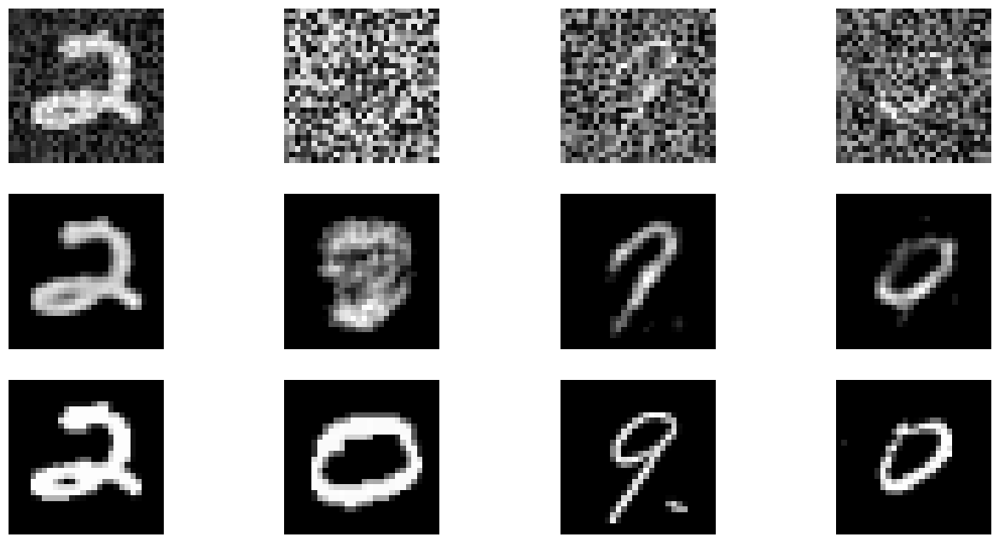

## 前言

随着`sora`的横空出世，文生视频喧嚣一时，究其技术源头仍然是隐扩散去噪模型。

本文希望从手写数字图像去噪代码，来了解以下的知识。

1. 小批量数据添加噪声
2. 自建简单的UNet编解码器
3. 基本的训练流程

## 代码

### 基本函数库的导入

```python
import torch
import pandas as pd
from matplotlib import pyplot as plt
```

### 数据集的加载

```python
class MnistDataset:
    def __init__(self, data_path, test=False):
        if not test: # 根据数据集的真实情况编写代码
            self.data = pd.read_csv(data_path).drop("label", axis=1)
        else:
            self.data = pd.read_csv(data_path)

    def __len__(self):
        return len(self.data)

    def __getitem__(self, index):
        item = self.data.iloc[index, :]
        img = item.to_numpy().reshape(1, 28, 28) / 255
        img = torch.tensor(img)
        return img, img # 第一个img用于加噪声，第二个img用于当作标签。
```

### 前向扩散

```python
def corrupt(image, amount):
    # image: 将要进行加噪声的图像数据
    # amount: 噪声强度的大小组成的张量
    noise = torch.rand_like(image)
    amount = torch.tensor(amount).reshape(-1, 1, 1, 1)
    return image * (1 - amount) + noise * amount
```

加噪声对应前向扩散，具体的代码的逻辑：

1. 利用`torch.rand_like(image)`根据图像的形状生成符合高斯分布的噪声。
2. `amount`是长度为批量大小，数值范围为$0\sim1$的均匀分布数据。为什么要这样呢？**因为我们要对数据加上不同强度的噪声。**
3. 将amount的形状设置为`(batch size, 1, 1, 1)`,第一个维度为`batch size`，每张图都对应一个噪声程度，其余的维度均为$1$便于与每张原始图像在相加的过程中进行**广播**。
4. 对图像加入噪声的方式是，保留一部分原始图像，再加入对应强度的噪声。



### 简单的UNet

```python
class SimpleUNet(nn.Module):
    def __init__(self):
        super().__init__()

        self.downConv2d = nn.Sequential(
            # !
            nn.Conv2d(1, 32, 5, padding=2, has_bias=True),
            nn.Conv2d(32, 64, 5, padding=2, has_bias=True),
            nn.Conv2d(64, 64, 5, padding=2, has_bias=True),
        )

        self.upConv2d = nn.Sequential(
            nn.Conv2d(64, 64, 5, padding=2, has_bias=True),
            nn.Conv2d(64, 32, 5, padding=2, has_bias=True),
            nn.Conv2d(32, 1, 5, padding=2, has_bias=True),
        )

        self.relu = nn.ReLU()
        self.downscale = nn.MaxPool2d(2, 2)
        # !
        self.upscale = nn.Upsample(scale_factor=2.0)

    def forward(self, x):
        stack = []

        for index, layer in enumerate(self.downConv2d):
            x = self.relu(layer(x))

            if index < 2:
                stack.append(x)
                x = self.downscale(x)
        for index, layer in enumerate(self.upConv2d):
            if index > 0:
                x = self.upscale(x)
                x += stack.pop()
            x = self.relu(layer(x))
        return x
```



1. 形状为`(batch size, 1, 28, 28)`的小批量数据不断进行卷积与最大池化操作。特征图的维度变化是这样的
    - 左：`(batch size, 1, 28, 28)`—>`(batch size, 32, 28, 28)`—>`(batch size, 32, 14, 14)`—>`(batch size, 64, 14, 14)`—>`(batch size, 64, 7, 7)`—>`(batch size, 64, 7, 7)`
    - 右：`(batch size, 64, 7, 7)`—>`(batch size, 64, 7, 7)` —> `(batch size, 64, 14, 14)` —>`(batch size, 32, 14, 14)` —>`(batch size, 32, 28, 28)` —>`(batch size, 1, 28, 28)`
2. 对于卷积、池化、采样的顺序来讲，在下采样的过程中，先是卷积池化，后是下采样，在上采样的过程中，先是上采样，后是卷积池化。这句话其实不算严谨，但是get到意思就好了。

## 训练部分

```python
net = SimpleUNet()
batch_size = 128
loss_fn = nn.MSELoss()
num_epoches = 3 # 写文章的时候只让程序跑了一轮
optimizer = optim.Adam(net.parameters(), lr=1e-3)
train_loader = torch.utils.data.DataLoader(train_dataset, batch_size=batch_size, shuffle=True)
test_loader = torch.utils.data.DataLoader(test_dataset, batch_size=batch_size, shuffle=False)
```

```python
for epoch in range(num_epoches):
    for i, (x, y) in enumerate(train_loader):
        # 数据预处理
        x = corrupt(x, torch.rand(x.shape[0]))

        # 前向传播
        y_hat = net(x)
        loss = loss_fn(y_hat, y)

        # 反向传播
        optimizer.zero_grad()  # 清空梯度
        loss.backward()  # 计算梯度
        optimizer.step()  # 更新参数

        # 打印损失
        if i % 10 == 0:
            print(f"epoch:{epoch}, step:{i}, loss:{loss.item()}")
```

在这里就放上前几步的训练信息。

| Epoch    | Step     | Loss     |
| -------- | -------- | -------- |
| 0        | 10       | 0.065431 |
| 0        | 20       | 0.038543 |
| $\cdots$ | $\cdots$ | $\cdots$ |
| 2        | 310      | 0.018558 |
| 2        | 320      | 0.013773 |

## 测试

```python
fig, axes = plt.subplots(3, 4, figsize=(16, 8))

net.train()
for x, y in test_loader:
    noised_img = corrupt(x, ops.rand(x.shape[0]))
    x = net(noised_img)
    imgs = torch.concat([noised_img, x, y], dim=0).transpose(0, 2, 3, 1).asnumpy()
    for ax, img in zip(axes.flatten(), imgs):
        ax.imshow(img, cmap="gray")
        ax.axis("off")
    break
```



效果还是能打的!
