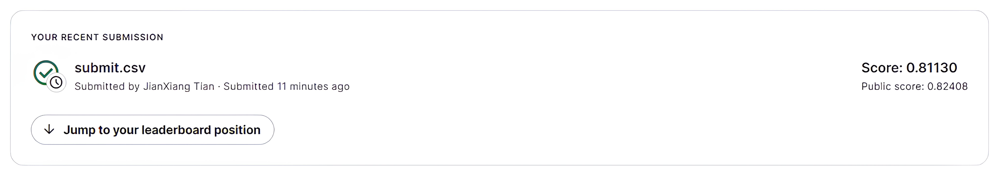

## 总览

在网络世界中，有效过滤和管理恶意评论是一项挑战。Toxic Comment Classification Challenge 项目致力于利用深度学习技术解决这一难题。该项目源于 Kaggle 竞赛，旨在开发能够精准识别在线对话中有毒评论的算法。**项目利用深度学习技术和预训练的词向量，对评论进行多类别分类，例如识别威胁、淫秽色情、侮辱和基于身份的仇恨言论等，从而帮助减少网络环境中的不良影响。**

## 数据

<figure markdown>
  {width="600"}
  <figcaption>训练集</figcaption>
</figure>

<figure markdown>
  {align=left, width="600"}
  <figcaption>测试集</figcaption>
</figure>


## 代码

```python
import os

os.environ["HF_ENDPOINT"] = "https://hf-mirror.com"
# os.environ["HTTP_PROXY"] = "http://127.0.0.1:7890"
# os.environ["HTTPS_PROXY"] = "http://127.0.0.1:7890"
```

### 数据集加载

```python
from datasets import load_dataset

data_files = {"train": "./data/train.csv"}

dataset = load_dataset("csv", data_files=data_files, num_proc=8)
train_and_test = dataset["train"].train_test_split(test_size=0.2)
```

使用 `train_test_split`方法划分出训练集和测试集。

```json title='train_and_test'
DatasetDict({
    train: Dataset({
        features: ['id', 'comment_text', 'toxic', 'severe_toxic', 'obscene', 'threat', 'insult', 'identity_hate'],
        num_rows: 127656
    })
    test: Dataset({
        features: ['id', 'comment_text', 'toxic', 'severe_toxic', 'obscene', 'threat', 'insult', 'identity_hate'],
        num_rows: 31915
    })
})
```

```python
label2id = {
    "toxic": 0,
    "severe_toxic": 1,
    "obscene": 2,
    "threat": 3,
    "insult": 4,
    "identity_hate": 5,
}

id2label = {
    0: "toxic",
    1: "severe_toxic",
    2: "obscene",
    3: "threat",
    4: "insult",
    5: "identity_hate",
}
```

### 数据预处理

```python
from transformers import AutoTokenizer
tokenizer = AutoTokenizer.from_pretrained("google-bert/bert-base-uncased")
```

```python
def tokenized_fn(example):
    tokenized_example = tokenizer(
        example["comment_text"],
        truncation=True,
        padding="max_length",
        max_length=64,
    )
    return tokenized_example
```

```python
def gen_labels(label1, label2, label3, label4, label5, label6):
    labels = []

    for i in range(len(label1)):
        labels.append(
            [
                float(label1[i]),
                float(label2[i]),
                float(label3[i]),
                float(label4[i]),
                float(label5[i]),
                float(label6[i]),
            ]
        )

    return {"labels": labels}
```

```python
def datapipe(dataset):
    dataset = dataset.map(tokenized_fn, batched=True)
    dataset = dataset.map(
        gen_labels,
        input_columns=[
            "toxic",
            "severe_toxic",
            "obscene",
            "threat",
            "insult",
            "identity_hate",
        ],
        batched=True,
    )
    return dataset
```

```python
train_and_test = datapipe(train_and_test)
train_and_test = train_and_test.select_columns(
    [
        "input_ids",
        "attention_mask",
        "labels",
    ]
)
```

```json title='train_and_test'
DatasetDict({
    train: Dataset({
        features: ['input_ids', 'attention_mask', 'labels'],
        num_rows: 127656
    })
    test: Dataset({
        features: ['input_ids', 'attention_mask', 'labels'],
        num_rows: 31915
    })
})
```

```json title='train_and_test["train"][0]'
{
  "input_ids": [101, 1045, 2134, 1005, 1056, 5382, 1998, 1045, 2572, 2047, 2182, 2074, 2893, 1996, 6865, 1997, 2009, 1012, 4283, 2005, 1996, 4641, 2039, 2295, 999, 102, 0, 0, 0, 0, 0, 0, 0, 0, 0, 0, 0, 0, 0, 0, 0, 0, 0, 0, 0, 0, 0, 0, 0, 0, 0, 0, 0, 0, 0, 0, 0, 0, 0, 0, 0, 0, 0, 0],
  "attention_mask": [1, 1, 1, 1, 1, 1, 1, 1, 1, 1, 1, 1, 1, 1, 1, 1, 1, 1, 1, 1, 1, 1, 1, 1, 1, 1, 0, 0, 0, 0, 0, 0, 0, 0, 0, 0, 0, 0, 0, 0, 0, 0, 0, 0, 0, 0, 0, 0, 0, 0, 0, 0, 0, 0, 0, 0, 0, 0, 0, 0, 0, 0, 0, 0],
  "labels": [0.0, 0.0, 0.0, 0.0, 0.0, 0.0]
}
```

多标签分类和单标签分类在数据集格式上大同小异

- 在单标签分类中，单个样本的 `labels`为一个整数
- 在多标签分类中，单个样本的 `labels`为类别个数长度个0或1组成列表。其中1代表该样本属于该类，否则不属于该类。

### 预训练模型

```python
from transformers import AutoModelForSequenceClassification
```

```python hl_lines="6"
model = AutoModelForSequenceClassification.from_pretrained(
    "google-bert/bert-base-uncased",
    num_labels=len(id2label),
    id2label=id2label,
    label2id=label2id,
    problem_type="multi_label_classification",
)
```

如果任务类型为多任务标签，那么需要加载预训练模型时指定 `problem_type`为 `multi_label_classification`。

???+ note
    Some weights of BertForSequenceClassification were not initialized from the model checkpoint at google-bert/bert-base-uncased and are newly initialized:<br><br>['classifier.bias', 'classifier.weight']<br><br>
    You should probably TRAIN this model on a down-stream task to be able to use it for predictions and inference.

```python
model.requires_grad = False
model.classifier.requires_grad = True
```

1. 将网络参数都冻结，
2. 将 `classifier.requires_grad`设置为 `True`只允许分类头参与梯度更新。

### 评价指标

```python
import numpy as np
from sklearn.metrics import accuracy_score, f1_score
```

```python
def sigmoid(x):
    return 1 / (1 + np.exp(-x))
```

```python
def compute_metrics(eval_pred):
    logits, labels = eval_pred
    preds = sigmoid(logits)
    preds = (preds > 0.5).astype(int).reshape(-1)
    labels = labels.reshape(-1)
    accuracy = accuracy_score(labels, preds)
    f1 = f1_score(labels, preds, average="macro")
    return {
        "accuracy": accuracy,
        "f1": f1,
    }
```

### 训练

```python
from transformers import TrainingArguments, Trainer
```

```python
training_args = TrainingArguments(
    output_dir="./output/",
    eval_strategy="epoch",
    per_device_train_batch_size=128,
    per_device_eval_batch_size=128,
    weight_decay=0.01,
    num_train_epochs=5,
    learning_rate=2e-5,
    save_strategy="epoch",
    load_best_model_at_end=True,
)
```

```python
trainer = Trainer(
    args=training_args,
    model=model,
    train_dataset=train_and_test["train"],
    eval_dataset=train_and_test["test"],
    compute_metrics=compute_metrics,
)
```

```python
trainer.train()
```

### 模型训练结果

| Epoch | Training Loss | Validation Loss | Accuracy | F1       |
| ----- | ------------- | --------------- | -------- | -------- |
| 1     | 0.046600      | 0.042239        | 0.984312 | 0.882476 |
| 2     | 0.036300      | 0.041644        | 0.984067 | 0.881441 |
| 3     | 0.029900      | 0.043375        | 0.983816 | 0.883072 |
| 4     | 0.024800      | 0.048329        | 0.983503 | 0.882226 |
| 5     | 0.021100      | 0.049663        | 0.983153 | 0.881117 |

### 推理

```python
data = load_dataset('csv', data_files={'val':'./data/test.csv'}, num_proc=8)
data = data.map(tokenized_fn, batched=True)
```

```python
answer = (sigmoid(trainer.predict(data['val']).predictions) > 0.5).astype(int)
```

```python
import pandas as pd

pd.DataFrame(answer).to_csv('./answer.csv', index=False)
```

经过后续的数据集格式整理，提交评测后：


