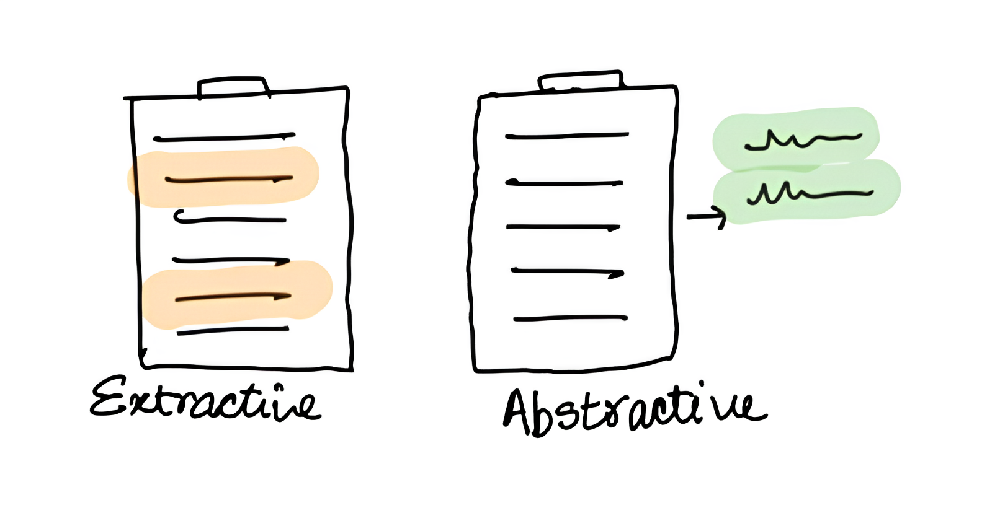

## 前言

文本摘要是从长文本中提取关键信息的过程，使得内容更简洁，同时尽可能保留原始文本的主要内容和重要细节。

## 代码

### 导入函数包

```python
import torch
import numpy as np
from peft import LoraConfig, TaskType, get_peft_model
from transformers import AutoTokenizer, AutoModelForSeq2SeqLM
from datasets import load_dataset
from transformers import (
    Seq2SeqTrainer,
    Seq2SeqTrainingArguments,
    DataCollatorForSeq2Seq,
)
from rouge_chinese import Rouge
```

```python
model_name_or_path = "Langboat/mengzi-t5-base"
file_path = "hugcyp/LCSTS"
```

### 加载数据集

```python
ds = load_dataset(file_path, num_proc=4)
ds["train"] = ds["train"].select(range(8000))
```

- 原本的数据集中训练集部分规模较大，开发者可以根据自主调节数据量。

### 数据预处理

```python
tokenizer = AutoTokenizer.from_pretrained(model_name_or_path)
```

```python
def data_pipe(example):
    text_inputs = tokenizer(
        text=["摘要生成：\n" + e for e in example["text"]],
        max_length=64,
        truncation=True,
    )

    target_inputs = tokenizer(
        text_target=example["summary"],
        max_length=32,
        truncation=True,
    )

    text_inputs["labels"] = target_inputs["input_ids"]
    return text_inputs
```

```python
tokenized_ds = ds.map(data_pipe, batched=True)
```

### 模型

```python
model = AutoModelForSeq2SeqLM.from_pretrained(model_name_or_path)

# LoRa

peft_config = LoraConfig(
    peft_type=TaskType.SEQ_2_SEQ_LM,
    inference_mode=False,
    r=8,
    lora_alpha=32,
    lora_dropout=0.1,
)

model = get_peft_model(model, peft_config)
```

```python
model.print_trainable_parameters()
```

### 性能指标

```python
rouge = Rouge()

def compute_metrics(evalPred):
    predictions, labels = evalPred
    decode_preds = tokenizer.batch_decode(predictions, skip_special_tokens=True)
    labels = np.where(labels != -100, labels, tokenizer.pad_token_id)
    decode_labels = tokenizer.batch_decode(labels, skip_special_tokens=True)
    decode_preds = [" ".join(p) for p in decode_preds]
    decode_labels = [" ".join(l) for l in decode_labels]
    scores = rouge.get_scores(decode_preds, decode_labels, avg=True)
    return {
        "rouge-1": scores["rouge-1"]["f"],
        "rouge-2": scores["rouge-2"]["f"],
        "rouge-l": scores["rouge-l"]["f"],
    }
```

### 训练参数

```python
training_args = Seq2SeqTrainingArguments(
    output_dir="./mengzi_lcsts",
    num_train_epochs=5,
    learning_rate=1e-3,
    per_device_train_batch_size=32,
    per_device_eval_batch_size=32,
    eval_strategy="epoch",
    save_total_limit=3,
    metric_for_best_model="rouge-l",
    predict_with_generate=True,
)
```

### Trainer

```python
trainer = Seq2SeqTrainer(
    model=model,
    data_collator=DataCollatorForSeq2Seq(tokenizer=tokenizer),
    train_dataset=tokenized_ds["train"],
    eval_dataset=tokenized_ds["validation"],
    tokenizer=tokenizer,
    compute_metrics=compute_metrics,
    args=training_args,
)
```

### 训练

```python
trainer.train()
```
