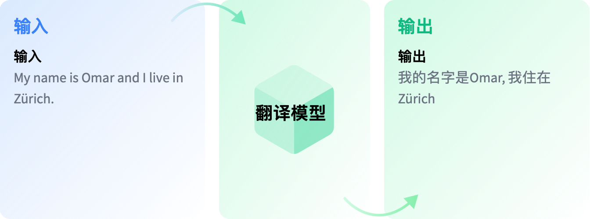

## 前言

## 代码

### 加载数据集

```python
from datasets import load_dataset

raw_datasets = load_dataset("Helsinki-NLP/news_commentary", "en-zh", trust_remote_code=True)
```

在这里选择的配置"en-zh"进行中英文文本翻译，下面为全部数据集详细信息：

<iframe
  src="https://huggingface.co/datasets/Helsinki-NLP/news_commentary/embed/viewer/en-zh/train"
  frameborder="0"
  width="100%"
  height="560px"
></iframe>

```json title="raw_datasets"
DatasetDict({
    train: Dataset({
        features: ['id', 'translation'],
        num_rows: 69206
    })
})
```

```json title='raw_datasets["train"][0]'
{'translation': {'en': '1929 or 1989?', 'zh': '1929年还是1989年?'}}
```

```python
raw_datasets = raw_datasets["train"].train_test_split(test_size=0.2)
```

```json title="raw_datasets"
DatasetDict({
    train: Dataset({
        features: ['id', 'translation'],
        num_rows: 55364
    })
    test: Dataset({
        features: ['id', 'translation'],
        num_rows: 13842
    })
})
```

### 加载分词器

```python
from transformers import AutoTokenizer

tokenizer = AutoTokenizer.from_pretrained("Helsinki-NLP/opus-mt-zh-en")
```

!!!note
    在做翻译任务中，请确保适用于多语言的分词器的原始语种和目标语种被正确设置，或者任务本身符合多语言分词器一开始的原始语言和目标语言。

查看分词器原始语言与目标语言

```python title="tokenizer.source_lang, tokenizer.target_lang"
('zho', 'eng')
```

### 定义分词函数

```python
def tokenize_fn(examples):
    inputs = [example['zh'] for example in examples['translation']]
    labels = [example['en'] for example in examples['translation']]

    model_inputs = tokenizer(
        inputs,
        text_target=labels,
        max_length = 128)

    return model_inputs
```

### 数据集转化

```python
tokenized_datasets = raw_datasets.map(
    tokenize_fn,
    batched=True,
    remove_columns=raw_datasets["train"].column_names
)
```

```json title="tokenized_datasets"
DatasetDict({
    train: Dataset({
        features: ['input_ids', 'attention_mask', 'labels'],
        num_rows: 55364
    })
    test: Dataset({
        features: ['input_ids', 'attention_mask', 'labels'],
        num_rows: 13842
    })
})
```

### 加载模型

```python
from transformers import AutoModelForSeq2SeqLM

model = AutoModelForSeq2SeqLM.from_pretrained("Helsinki-NLP/opus-mt-zh-en")
```

### 定义整理函数

```python
from transformers import DataCollatorForSeq2Seq

data_collator = DataCollatorForSeq2Seq(tokenizer, model=model)
```

```python
batch = data_collator([tokenized_datasets["train"][i] for i in range(1, 3)])
```

```json title="batch.keys()"
dict_keys(['input_ids', 'attention_mask', 'labels', 'decoder_input_ids'])
```

```python
example_input_ids = batch["input_ids"][3]
example_attention_mask = batch["attention_mask"][3]
example_labels = batch["labels"][3]
example_decoder_input_ids = batch["decoder_input_ids"][3]


print(tokenizer.decode(example_input_ids))
print(tokenizer.decode(example_labels))
print(tokenizer.decode(example_decoder_input_ids))
```

```python
'普林斯顿—美国正在崛起;欧洲正在稳定;两边日益密切。这是本月举行的一年一度的慕尼黑安全会议(MSC)放出的主要信息。MSC是各国国防部长、外交部长、高级军官、议员、记者和各领域国家安全顾问参与的高规格会议。</s> <pad> <pad> <pad> <pad> <pad> <pad> <pad> <pad> <pad> <pad> <pad> <pad> <pad> <pad> <pad> <pad> <pad> <pad>'
'Europe is stabilizing; and both are moving closer together. That was the principal message earlier this month at the annual Munich Security Conference (MSC), a high-powered gathering of defense ministers, foreign ministers, senior military officials, parliamentarians, journalists, and national-security experts of every variety.</s> <unk> <unk> <unk> <unk> <unk> <unk> <unk> <unk> <unk> <unk> <unk> <unk> <unk> <unk> <unk> <unk> <unk> <unk> <unk> <unk>'
'<pad> Europe is stabilizing; and both are moving closer together. That was the principal message earlier this month at the annual Munich Security Conference (MSC), a high-powered gathering of defense ministers, foreign ministers, senior military officials, parliamentarians, journalists, and national-security experts of every variety.</s> <pad> <pad> <pad> <pad> <pad> <pad> <pad> <pad> <pad> <pad> <pad> <pad> <pad> <pad> <pad> <pad> <pad> <pad> <pad>'
```

### 定义评估函数

```python
# pip install sacrebleu
import evaluate

metric = evaluate.load("sacrebleu")
```

```python
import numpy as np


def compute_metrics(eval_preds):
    preds, labels = eval_preds
    # In case the model returns more than the prediction logits
    if isinstance(preds, tuple):
        preds = preds[0]

    decoded_preds = tokenizer.batch_decode(preds, skip_special_tokens=True)

    # Replace -100s in the labels as we can't decode them
    labels = np.where(labels != -100, labels, tokenizer.pad_token_id)
    decoded_labels = tokenizer.batch_decode(labels, skip_special_tokens=True)

    # Some simple post-processing
    decoded_preds = [pred.strip() for pred in decoded_preds]
    decoded_labels = [[label.strip()] for label in decoded_labels]

    result = metric.compute(predictions=decoded_preds, references=decoded_labels)
    return {"bleu": result["score"]}
```

### 定义超参数

```python
from transformers import Seq2SeqTrainingArguments

args = Seq2SeqTrainingArguments(
    f"finetuned-zh-to-en",
    evaluation_strategy="no",
    save_strategy="epoch",
    learning_rate=2e-5,
    per_device_train_batch_size=32,
    per_device_eval_batch_size=64,
    weight_decay=0.01,
    save_total_limit=3,
    num_train_epochs=3,
    predict_with_generate=True,
    fp16=True,
)
```

### 定义训练器

```python
from transformers import Seq2SeqTrainer

trainer = Seq2SeqTrainer(
    model,
    args,
    train_dataset=tokenized_datasets["train"],
    eval_dataset=tokenized_datasets["validation"],
    data_collator=data_collator,
    tokenizer=tokenizer,
    compute_metrics=compute_metrics,
)
```

### 训练

```python
trainer.train()
```

## 参考资料

<div class="grid cards" markdown>

- HuggingFace社区教程

    ---

    [文本翻译](https://huggingface.co/learn/nlp-course/zh-CN/chapter7/4)

</div>
