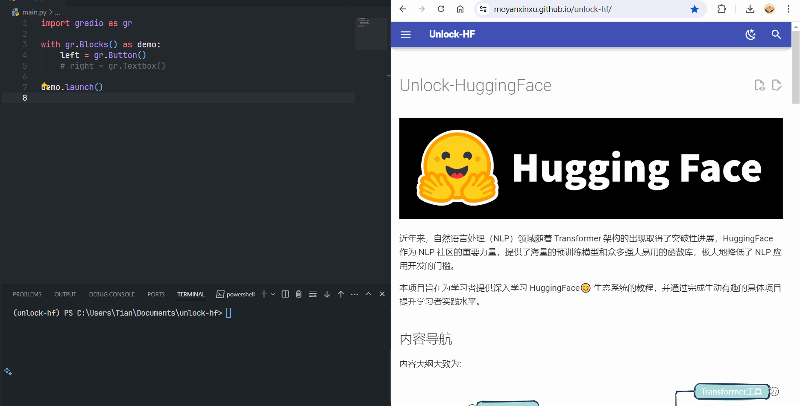

## 前言

机器学习开发者和科学家通常会专注于算法研究和开发，而缺乏时间和精力去构建用户界面和进行部署。这导致很多优秀的模型无法走出实验室，无法真正应用到实际场景中，也无法让更多人体验到其价值。另一方面，领域外的技术体验爱好者，通常缺乏足够的机器学习知识和编程经验，难以理解和使用这些模型。他们渴望体验和探索机器学习的魅力，却难以跨越技术门槛。

**而 `Gradio` 的出现正是为了解决这个困境。** 它提供了一个简单易用的工具，让机器学习开发者可以快速构建**交互式**应用，将模型功能展示给更多人，它也降低了技术体验爱好者使用机器学习模型的门槛，让体验者能够轻松地体验和探索机器学习的魅力。

市面上存在许多用于**机器学习模型部署**的工具，在下面简单对比一下。

| 工具           | 优势             | 特点                        |
| :----------- | :------------- | :------------------------ |
| **`Gradio`** | **简化开发过程**     | **提供丰富的组件和功能，直观的界面和交互方式** |
|              | **快速部署**       | **可以快速将模型部署成交互式 Web 应用**  |
|              | **易于分享**       | **可以创建外部分享链接**            |
|              | **降低使用门槛**     | **无需了解代码，直接与页面交互即可**      |
| `Streamlit`  | 快速原型设计，侧重数据可视化 | 更侧重于数据可视化和交互式展示           |
| `Flask`      | 灵活可控，功能强大      | 需要一定的 Web 开发经验            |
| $\cdots$     | $\cdots$<br>   | $\cdots$<br>              |

!!! success "结论"
	- 经过各个工具对比后，可以知道 `Gradio` 更具优势。
	- `Gradio` 的出现，将机器学习模型从实验室带到了大众面前，让更多人能够体验和使用机器学习技术，推动了机器学习技术的普及和应用。

安装：

```python
pip install gradio
```

## 热重载

在接下来的教程，将介绍 `Gradio` 提供的各式各样的组件，这些组件可以帮助你快速构建交互式机器学习应用。然而，在编写代码的过程中，开发者经常需要对代码进行增删改查，然后一遍遍运行调试，而且大部分情况还需要漫长的时间用来加载庞大的模型。

通常，`Gradio` 应用像运行任何其他 Python 脚本一样启动，只需执行 `python xxx.py`。这会启动一个 `HTTP` 服务器，渲染应用 `UI` 。如果需要修改应用，通常会停止服务器（通常使用  ++ctrl+c++ ），编辑源文件后重新运行脚本。想象一下，如果在开发中对 `Gradio` 代码改动后的结果能实时预览，那属实让人心情愉悦🤣！

**好消息是，`Gradio` 内置了热重载功能！✨** 这意味着开发者在修改代码后，可以立即看到修改后的效果，无需重新启动程序，这对于快速迭代和调试代码非常有用。开发者只需运行 `gradio app.py` 而不是 `python app.py`，即可在热重载模式下启动应用！

演示🎞：



!!! note
	热重载还有很多可圈可点的功能，但是上面的案例就足够支撑后面的教程。

## 参考资料

<div class="grid cards" markdown>

- 使用 `Gradio` 的“热重载”模式快速开发 AI 应用

    ---

    [`Gradio`热重载与进阶功能](https://huggingface.co/blog/zh/gradio-reload)

- 构建并分享令人愉快的机器学习应用程序

	---

	[`Gradio` 官方文档](https://www.gradio.app/)
</div>