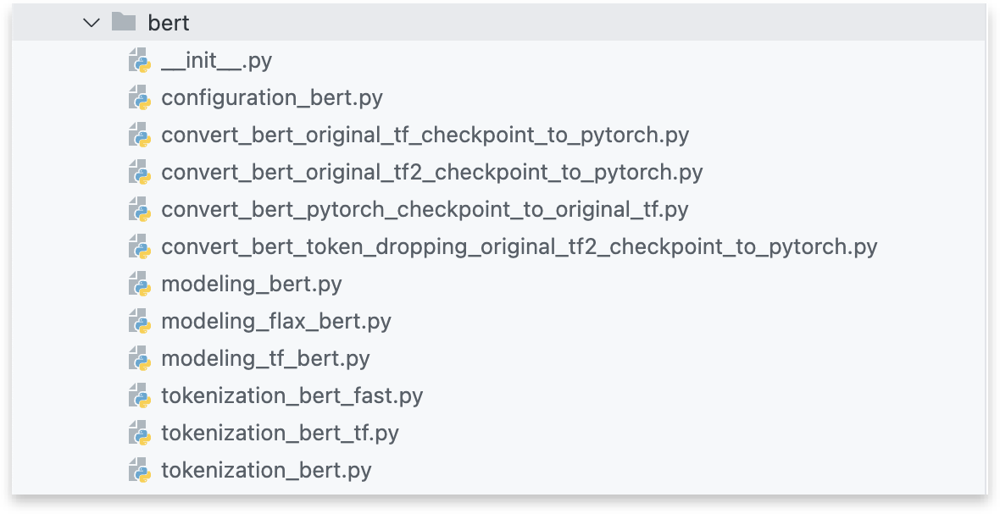
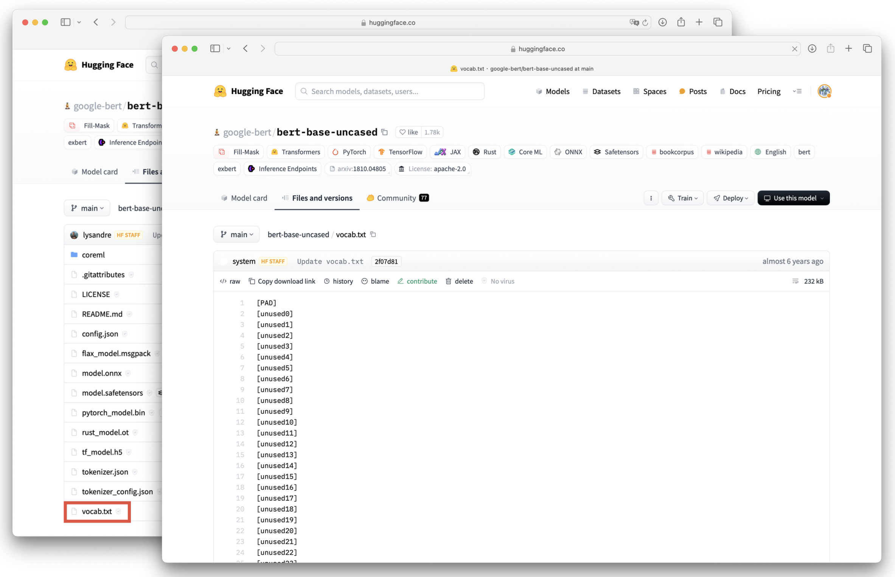
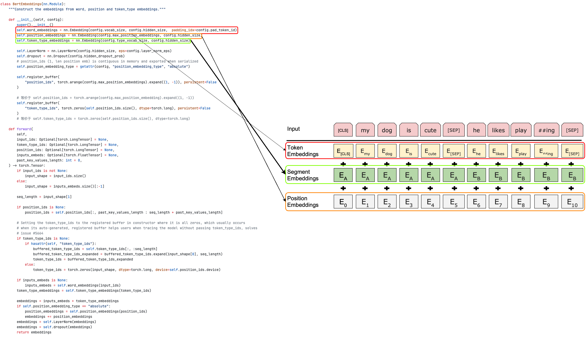

## 前言

人工智能领域发展日新月异，模型更迭速度极快，开发者们会遇见很多棘手的情况。例如：

1. 当前模型还没理解通透，另一个更加强大的模型就被提出，模型结构变动小算是幸运的事情，而面对一个与以前所学模型结构截然不同的模型，又要重新去学习内部结构，造成极大的学习成本。
2. 学习某个模型的时只有抽象的模型架构图，难以从具体流程上理解数据到底是怎么**流动**的；
3. $\cdots$

但是值得高兴的是，因为 `transformers` 的存在，这些焦虑可以统统甩到身后，因为 `transformers` ：

1. 在 `NLP` 领域，新的模型往往是基于 `transformers` 已有的代码进行改进的，也就是说如果对现有仓库足够了解，便可以快速上手新的模型。
2. 本身高度模块化，不同模块各司其职，同时代码编写规范统一，学习了某个模型，这一类的模型便可以快速理解掌握，一通百通，极大的减少学习成本。
3. $\cdots$

本文重点从 `bert` 的源码开始，不仅要了解 `bert` 的原理，还要学习每个模型在 `transformers` 的普遍**代码框架**。

<center>
{width="500"}
</center>

## 代码

### 配置文件

```python title="BertConfig"
"""BERT model configuration"""

class BertConfig(PretrainedConfig):

    model_type = "bert"

    def __init__(
        self,
        vocab_size=30522,
        hidden_size=768,
        num_hidden_layers=12,
        num_attention_heads=12,
        intermediate_size=3072,
        hidden_act="gelu",
        hidden_dropout_prob=0.1,
        attention_probs_dropout_prob=0.1,
        max_position_embeddings=512,
        type_vocab_size=2,
        initializer_range=0.02,
        layer_norm_eps=1e-12,
        pad_token_id=0,
        position_embedding_type="absolute",
        use_cache=True,
        classifier_dropout=None,
        **kwargs,
    ):
        super().__init__(pad_token_id=pad_token_id, **kwargs)

        self.vocab_size = vocab_size
        self.hidden_size = hidden_size
        self.num_hidden_layers = num_hidden_layers
        self.num_attention_heads = num_attention_heads
        self.hidden_act = hidden_act
        self.intermediate_size = intermediate_size
        self.hidden_dropout_prob = hidden_dropout_prob
        self.attention_probs_dropout_prob = attention_probs_dropout_prob
        self.max_position_embeddings = max_position_embeddings
        self.type_vocab_size = type_vocab_size
        self.initializer_range = initializer_range
        self.layer_norm_eps = layer_norm_eps
        self.position_embedding_type = position_embedding_type
        self.use_cache = use_cache
        self.classifier_dropout = classifier_dropout
```

|           参数名称           |                                 解释                                  |   默认值   |
| :--------------------------: | :-------------------------------------------------------------------: | :--------: |
|          vocab_size          |             词汇表大小，决定了模型可以处理的词语种类数量              |   30522    |
|         hidden_size          |                              隐藏层维度                               |    768     |
|      num_hidden_layers       |                              编码器层数                               |     12     |
|     num_attention_heads      |         自注意力机制的头数，影响模型对不同语义信息的捕捉能力          |     12     |
|      intermediate_size       |       编码器层中前馈神经网络的中间层维度，通常大于 hidden_size        |    3072    |
|          hidden_act          |      隐藏层激活函数，用于引入非线性变换，例如 "gelu"、"relu" 等       |   "gelu"   |
|     hidden_dropout_prob      |                  隐藏层 dropout 概率，用于防止过拟合                  |    0.1     |
| attention_probs_dropout_prob |              自注意力机制中 dropout 概率，用于防止过拟合              |    0.1     |
|   max_position_embeddings    |          最大位置编码长度，决定了模型可以处理的最长序列长度           |    512     |
|       type_vocab_size        |               句子类型编码的维度，用于区分不同的句子对                |     2      |
|      initializer_range       |                          模型参数初始化范围                           |    0.02    |
|        layer_norm_eps        |               层归一化中添加的小常数，用于防止除零错误                |   1e-12    |
|         pad_token_id         |         填充 token 的 id，用于将不同长度的序列填充到相同长度          |     0      |
|   position_embedding_type    |              位置编码类型，可选 "absolute" 或 "relative"              | "absolute" |
|          use_cache           |               是否缓存编码器的中间结果，加速训练和推理                |    True    |
|      classifier_dropout      | 分类层 dropout 概率，用于防止过拟合，仅在使用 BERT 进行分类任务时使用 |    None    |
|           **kwargs           |                               其他参数                                |            |

### 分词器

```python title="load_vocab"
def load_vocab(vocab_file):
    """Loads a vocabulary file into a dictionary."""
    vocab = collections.OrderedDict()
    with open(vocab_file, "r", encoding="utf-8") as reader:
        tokens = reader.readlines()
    for index, token in enumerate(tokens):
        token = token.rstrip("\n")
        vocab[token] = index
    return vocab
```

该函数读取指定的词表文件，将每一行视为一个词汇，并为每个词汇分配一个唯一的索引，最终返回一个包含词汇及其索引的有序字典。这个字典可以用于后续的自然语言处理任务中，例如将文本数据转换为模型可以处理的数值表示。



```python title="whitespace_tokenize"
def whitespace_tokenize(text):
    """Runs basic whitespace cleaning and splitting on a piece of text."""
    text = text.strip()
    if not text:
        return []
    tokens = text.split()
    return tokens
```

`whitespace_tokenize` 函数提供了一种简单快速的文本分词方法，适用于以空白字符作为词分隔符的文本。该函数接收一段文本作为输入，执行以下操作：

| 步骤 | 说明                                                                          |
| ---- | ----------------------------------------------------------------------------- |
| 1    | 使用 `strip()` 方法去除文本开头和结尾的空白字符（如空格、制表符、换行符等）。 |
| 2    | 经过上述处理后的文本如果为空就返回空列表，否则就以空格为分隔符分割语句。      |
| 3    | 返回语句经过分割后的序列组成的列表                                            |

```python title="WordpieceTokenizer"
class WordpieceTokenizer:
    """Runs WordPiece tokenization."""

    def __init__(self, vocab, unk_token, max_input_chars_per_word=100):
        self.vocab = vocab
        self.unk_token = unk_token
        self.max_input_chars_per_word = max_input_chars_per_word

    def tokenize(self, text):
        output_tokens = []
        for token in whitespace_tokenize(text):
            chars = list(token)
            if len(chars) > self.max_input_chars_per_word:
                output_tokens.append(self.unk_token)
                continue

            is_bad = False
            start = 0
            sub_tokens = []
            while start < len(chars):
                end = len(chars)
                cur_substr = None
                while start < end:
                    substr = "".join(chars[start:end])
                    if start > 0:
                        substr = "##" + substr
                    if substr in self.vocab:
                        cur_substr = substr
                        break
                    end -= 1
                if cur_substr is None:
                    is_bad = True
                    break
                sub_tokens.append(cur_substr)
                start = end

            if is_bad:
                output_tokens.append(self.unk_token)
            else:
                output_tokens.extend(sub_tokens)
        return output_tokens
```

`WordpieceTokenizer` 类实现了 `WordPiece` 分词算法。该类在初始化的时候接受三个参数：词汇表 `vocab`，未知词标记 `unk_token`，以及每个单词的最大字符数 `max_input_chars_per_word`，默认值为 100。

| 步骤 | 说明                                                                                                                                     |
| ---- | ---------------------------------------------------------------------------------------------------------------------------------------- |
| 1    | 使用 `whitespace_tokenize` 方法对输入文本进行初步分词，得到单词列表。                                                                    |
| 2    | 遍历每个单词，如果单词字符数超过 `max_input_chars_per_word`，则直接添加 `unk_token` 到输出列表，并跳过该单词，否则尝试将单词分解为子词。 |
| 3    | i. 从单词起始位置开始，逐渐缩小子字符串范围。                                                                                            |
| 4    | ii.  如果子字符串在词汇表中，则将其添加到子词列表，并更新起始位置。                                                                      |
| 5    | iii. 如果没有找到匹配的子字符串，则标记为无法分词。                                                                                      |
| 6    | a. 如果单词无法被有效分词，则添加 `unk_token` 到输出列表。                                                                               |
| 7    | b. 否则，将所有找到的子词添加到输出列表。                                                                                                |
| 8    | 返回分词后的结果列表。                                                                                                                   |

```python title="BasicTokenizer"
class BasicTokenizer:
    def __init__(
        self,
        do_lower_case=True,
        never_split=None,
        tokenize_chinese_chars=True,
        strip_accents=None,
        do_split_on_punc=True,
    ):
        if never_split is None:
            never_split = []
        self.do_lower_case = do_lower_case
        self.never_split = set(never_split)
        self.tokenize_chinese_chars = tokenize_chinese_chars
        self.strip_accents = strip_accents
        self.do_split_on_punc = do_split_on_punc

    def tokenize(self, text, never_split=None):
        ...
    def _run_strip_accents(self, text):
        ...
    def _run_split_on_punc(self, text, never_split=None):
        ...
    def _tokenize_chinese_chars(self, text):
        ...
    def _is_chinese_char(self, cp):
        ...
    def _clean_text(self, text):
        ...
```

`BasicTokenizer` 类用于基本的文本分词操作。其初始化时接受多个参数来配置分词行为。

|           参数           |    类型    |         默认值          |              说明              |
| :----------------------: | :--------: | :---------------------: | :----------------------------: |
|     `do_lower_case`      |   布尔值   |         `True`          |     是否将文本转换为小写。     |
|      `never_split`       | 字符串列表 | `None` (初始化为空列表) | 包含不应被分词的特殊标记列表。 |
| `tokenize_chinese_chars` |   布尔值   |         `True`          |  是否对中文字符进行单独分词。  |
|     `strip_accents`      |  可选参数  |         `None`          |   是否去除文本中的重音符号。   |
|    `do_split_on_punc`    |   布尔值   |         `True`          |   是否在标点符号处进行分词。   |

```python title="BasicTokenizer"
class BasicTokenizer:
    def __init__(
        self,
        do_lower_case=True,
        never_split=None,
        tokenize_chinese_chars=True,
        strip_accents=None,
        do_split_on_punc=True,
    ):
        ...
    def tokenize(self, text, never_split=None):
        ...
    def _run_strip_accents(self, text):
        ...
    def _run_split_on_punc(self, text, never_split=None):
        ...
    def _tokenize_chinese_chars(self, text):
        ...
    def _is_chinese_char(self, cp):
        ...
    def _clean_text(self, text):
        output = []
        for char in text:
            cp = ord(char)
            if cp == 0 or cp == 0xFFFD or _is_control(char):
                continue
            if _is_whitespace(char):
                output.append(" ")
            else:
                output.append(char)
        return "".join(output)
```

`_clean_text` 的方法，用于清理输入文本。该方法接受需要清理的文本 `text`，通过移除控制字符和替换空白字符来清理输入文本，并返回处理后的结果。

| 步骤 | 说明                                                                                      |
| ---- | ----------------------------------------------------------------------------------------- |
| 1    | 创建一个空列表，用于存储清理后的字符。                                                    |
| 2    | 使用循环遍历输入文本中的每个字符。                                                        |
| 3    | 获取当前字符的 Unicode 编码。                                                             |
| 4    | 如果字符的 Unicode 编码为 `0` 或 `0xFFFD`，或者字符是控制字符，则跳过该字符，不进行处理。 |
| 5    | 如果字符是空白字符，则将一个空格字符添加到输出列表中。                                    |
| 6    | 如果字符既不是控制字符也不是空白字符，则将该字符本身添加到输出列表中。                    |
| 7    | 将输出列表中的所有字符连接成一个字符串，并返回该字符串作为清理后的文本。                  |

```python title="BasicTokenizer"
class BasicTokenizer:
    def __init__(
        self,
        do_lower_case=True,
        never_split=None,
        tokenize_chinese_chars=True,
        strip_accents=None,
        do_split_on_punc=True,
    ):
        ...
    def tokenize(self, text, never_split=None):
        ...
    def _run_strip_accents(self, text):
        ...
    def _run_split_on_punc(self, text, never_split=None):
        ...
    def _tokenize_chinese_chars(self, text):
        ...
    def _is_chinese_char(self, cp):
        """Checks whether CP is the codepoint of a CJK character."""
        if (
            (cp >= 0x4E00 and cp <= 0x9FFF)
            or (cp >= 0x3400 and cp <= 0x4DBF)  #
            or (cp >= 0x20000 and cp <= 0x2A6DF)  #
            or (cp >= 0x2A700 and cp <= 0x2B73F)  #
            or (cp >= 0x2B740 and cp <= 0x2B81F)  #
            or (cp >= 0x2B820 and cp <= 0x2CEAF)  #
            or (cp >= 0xF900 and cp <= 0xFAFF)
            or (cp >= 0x2F800 and cp <= 0x2FA1F)  #
        ):  #
            return True

        return False
    def _clean_text(self, text):
        ...
```

`_is_chinese_char` 方法用于检查给定的 `Unicode` 编码 `cp` 是否属于汉字。

```python title="BasicTokenizer"
class BasicTokenizer:
    def __init__(
        self,
        do_lower_case=True,
        never_split=None,
        tokenize_chinese_chars=True,
        strip_accents=None,
        do_split_on_punc=True,
    ):
        ...
    def tokenize(self, text, never_split=None):
        ...
    def _run_strip_accents(self, text):
        ...
    def _run_split_on_punc(self, text, never_split=None):
        ...
    def _tokenize_chinese_chars(self, text):
        output = []
        for char in text:
            cp = ord(char)
            if self._is_chinese_char(cp):
                output.append(" ")
                output.append(char)
                output.append(" ")
            else:
                output.append(char)
        return "".join(output)

    def _is_chinese_char(self, cp):
        ...
    def _clean_text(self, text):
        ...
```

`_tokenize_chinese_chars` 方法用于对输入文本 `text` 中的中文字符前后添加空格，以便于后续的分词操作。

| 步骤 | 说明                                                                     |
| ---- | ------------------------------------------------------------------------ |
| 1    | 初始化空列表，用于存储处理后的字符。                                     |
| 2    | 遍历输入文本中的每个字符。                                               |
| 3    | 如果当前字符是中文，则在列表中依次添加一个空格、该字符、以及另一个空格。 |
| 4    | 如果当前字符不是中文，则直接将该字符添加到列表中。                       |
| 5    | 将列表中的所有元素连接成一个字符串并返回。                               |

```python title="BasicTokenizer"
class BasicTokenizer:
    def __init__(
        self,
        do_lower_case=True,
        never_split=None,
        tokenize_chinese_chars=True,
        strip_accents=None,
        do_split_on_punc=True,
    ):
        ...
    def tokenize(self, text, never_split=None):
        ...
    def _run_strip_accents(self, text):
        ...
    def _run_split_on_punc(self, text, never_split=None):
        if not self.do_split_on_punc or (never_split is not None and text in never_split):
            return [text]
        chars = list(text)
        i = 0
        start_new_word = True
        output = []
        while i < len(chars):
            char = chars[i]
            if _is_punctuation(char):
                output.append([char])
                start_new_word = True
            else:
                if start_new_word:
                    output.append([])
                start_new_word = False
                output[-1].append(char)
            i += 1

        return ["".join(x) for x in output]
    def _tokenize_chinese_chars(self, text):
        ...
    def _is_chinese_char(self, cp):
        ...
    def _clean_text(self, text):
        ...
```

`_run_split_on_punc` 方法用于在标点符号处对输入文本 `text` 进行分词。

| 步骤 | 说明                                                                                                                                                       |
| ---- | ---------------------------------------------------------------------------------------------------------------------------------------------------------- |
| 1    | 检查是否需要在标点符号处进行分词。如果为 `False`，则直接返回包含原始文本的列表，否则进行下一步。                                                           |
| 2    | 检查文本是否在不应该分词的列表中。如果在，则直接返回包含原始文本的列表。                                                                                   |
| 3    | 将输入文本转换为字符列表，并初始化循环变量和输出列表。                                                                                                     |
| 4    | 遍历字符列表中的每个字符。                                                                                                                                 |
| 5    | 如果当前字符是标点符号，将该标点符号作为一个独立的词添加到输出列表中。设置标志，表示下一个非标点符号字符应该开始一个新词。                                 |
| 6    | 如果当前字符不是标点符号，如果需要开始一个新词，则在输出列表中添加一个新的空列表，并重置标志。将当前字符添加到输出列表中最后一个子列表（即当前词）的末尾。 |
| 7    | 继续循环，直到处理完所有字符。                                                                                                                             |
| 8    | 将输出列表中的每个子列表（代表一个词）连接成字符串，并将这些字符串组成一个新的列表返回。                                                                   |

```python title="BasicTokenizer"
class BasicTokenizer:
    def __init__(
        self,
        do_lower_case=True,
        never_split=None,
        tokenize_chinese_chars=True,
        strip_accents=None,
        do_split_on_punc=True,
    ):
        ...
    def tokenize(self, text, never_split=None):
        ...
    def _run_strip_accents(self, text):
        text = unicodedata.normalize("NFD", text)
        output = []
        for char in text:
            cat = unicodedata.category(char)
            if cat == "Mn":
                continue
            output.append(char)
        return "".join(output)
    def _tokenize_chinese_chars(self, text):
        ...
    def _is_chinese_char(self, cp):
        ...
    def _clean_text(self, text):
        ...
```

`_run_strip_accents` 方法用于去除输入文本 `text` 中的重音符号。

| 步骤 | 说明                                                                                               |
| ---- | -------------------------------------------------------------------------------------------------- |
| 1    | 使用 `unicodedata.normalize("NFD", text)` 将输入文本 `text` 标准化为 `NFD` 形式。                  |
| 2    | 创建空列表 `output` 用于存储去除重音符号后的字符。                                                 |
| 3    | 遍历标准化后的文本中的每个字符。                                                                   |
| 4    | 使用 `unicodedata.category(char)` 获取字符的类别。                                                 |
| 5    | 如果类别为 "Mn"，跳过该字符，不进行任何操作；如果类别不为 "Mn"，将当前字符添加到 `output` 列表中。 |
| 6    | 将 `output` 列表中的所有字符连接成一个字符串并返回                                                 |

```python title="BasicTokenizer"
class BasicTokenizer:
    def __init__(
        self,
        do_lower_case=True,
        never_split=None,
        tokenize_chinese_chars=True,
        strip_accents=None,
        do_split_on_punc=True,
    ):
        ...
    def tokenize(self, text, never_split=None):
        never_split = self.never_split.union(set(never_split)) if never_split else self.never_split
        text = self._clean_text(text)

        if self.tokenize_chinese_chars:
            text = self._tokenize_chinese_chars(text)
        # prevents treating the same character with different unicode codepoints as different characters
        unicode_normalized_text = unicodedata.normalize("NFC", text)
        orig_tokens = whitespace_tokenize(unicode_normalized_text)
        split_tokens = []
        for token in orig_tokens:
            if token not in never_split:
                if self.do_lower_case:
                    token = token.lower()
                    if self.strip_accents is not False:
                        token = self._run_strip_accents(token)
                elif self.strip_accents:
                    token = self._run_strip_accents(token)
            split_tokens.extend(self._run_split_on_punc(token, never_split))

        output_tokens = whitespace_tokenize(" ".join(split_tokens))
        return output_tokens
    def _run_strip_accents(self, text):
        ...
    def _tokenize_chinese_chars(self, text):
        ...
    def _is_chinese_char(self, cp):
        ...
    def _clean_text(self, text):
        ...
```

`tokenize` 方法用于将输入文本 `text` 进行分词，并返回分词后的结果。

| 步骤 | 说明                                                                              |
| ---- | --------------------------------------------------------------------------------- |
| 1    | 合并特殊标记列表。                                                                |
| 2    | 清理输入文本。                                                                    |
| 3    | 选择性地处理中文字符。                                                            |
| 4    | 标准化 `Unicode` 编码为 `NFC` 形式。                                              |
| 5    | 使用空格进行初步分词。                                                            |
| 6    | 如果标记在 `never_split` 中，则跳过处理，否则，根据设置进行小写转换和去除重音符。 |
| 8    | 对标记进行标点符号分词。                                                          |
| 9    | 将处理后的标记连接成字符串，再次使用空格进行分词。                                |
| 10   | 返回最终的分词结果。                                                              |

### 模型

BERT论文：

<center>
[BERT: Pre-training of Deep Bidirectional Transformers for Language Understanding](./assests/bert.pdf){.md-button}
</center>

---



上图是 `BERT` 在接收输入序列时使用的编码类 `BertEmbeddings` 及其示意图。

| 步骤                  | 描述                                                                                                      |
| --------------------- | --------------------------------------------------------------------------------------------------------- |
| 1. 初始化嵌入层       | `word_embeddings`，用于单词嵌入，矩阵形状为(词表维度, 隐藏层维度)，并指定填充索引。对应红色边界框。       |
|                       | `position_embeddings`，用于位置嵌入，矩阵形状为(最大位置嵌入数, 隐藏层大小)。对应橙色边界框。             |
|                       | `token_type_embeddings`，用于 `token` 类型嵌入，矩阵形状为(类型数目, 隐藏层维度)。对应绿色边界框。        |
| 2. 初始化其他层       | 层归一化层                                                                                                |
|                       | 随机丢弃层。                                                                                              |
|                       | 位置嵌入类型，默认为 "absolute"。                                                                         |
| 3. 前向传播: 输入处理 | 获取输入形状 `input_shape` 和序列长度 `seq_length`。                                                      |
|                       | 如果未提供 `position_ids`，则从缓冲区中获取相应的部分。                                                   |
|                       | 对于 `token_type_ids`，如果未提供且缓冲区中存在，则从缓冲区中获取并扩展到输入形状，否则初始化为全零张量。 |
| 4. 前向传播: 计算嵌入 | 如果未提供 `inputs_embeds`，则通过 `word_embeddings` 层获取单词嵌入。                                     |
|                       | 通过 `token_type_embeddings` 层获取 `token` 类型嵌入，并将其与单词嵌入相加。                              |
|                       | 如果位置嵌入类型为 "absolute"，则通过 `position_embeddings` 层获取位置嵌入，并将其添加到嵌入中。          |
| 5. 后处理             | 对词嵌入进行**层归一化处理**和**随机丢弃**。                                                              |
|                       | 返回最终的嵌入表示。                                                                                      |

## 持续更新！