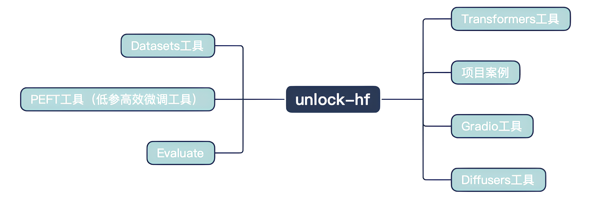

# Unlock-HuggingFace

近年来，自然语言处理（NLP）领域随着 Transformer 架构的出现取得了突破性进展，[HuggingFace](https://huggingface.co) 作为 NLP 社区的重要力量，提供了海量的预训练模型和众多强大易用的函数库，极大地降低了 NLP 应用开发的门槛。

本项目旨在为学习者提供深入学习 HuggingFace😊 生态系统的教程，并通过完成生动有趣的具体项目提升学习者实践水平。

## 内容导航

内容大纲大致为:

| 章节   | 内容                     | 备注                                             |
| :----- | :----------------------- | :----------------------------------------------- |
| 前言   | NLP与HuggingFace整体介绍 | 包括环境配置                                     |
| 第一章 | Datasets工具             |                                                  |
| 第二章 | Transformers工具         | Pipeline工具,Tokenizer工具,Model工具,Trainer工具 |
| 第三章 | PEFT工具                 |                                                  |
| 第四章 | Evaluate工具             |                                                  |
| 第五章 | Diffusers工具            |                                                  |
| 第六章 | 项目案例                 |                                                  |
| 第七章 | Gradio工具               |                                                  |

??? example "大纲具体内容"
    

## 参与贡献

- 如果你想参与到项目中来欢迎查看项目的 [Issue](https://github.com/datawhalechina/unlock-hf/issues) 查看没有被分配的任务✨。
- 如果你发现了一些问题，欢迎在 [Issue](https://github.com/datawhalechina/unlock-hf/issues) 中进行反馈🐛。

如果你对 Datawhale 很感兴趣并想要发起一个新的项目，欢迎查看 [Datawhale 贡献指南](https://github.com/datawhalechina/DOPMC#为-datawhale-做出贡献)。

## 贡献者名单

| 姓名   | 职责                   | 简介              |
| :----- | :--------------------- | :---------------- |
| 田健翔 | 项目负责人             | 内容创作者        |

- PEFT
    - LoRa：@[鑫民](https://github.com/fancyboi999)
    - AdaLoRa：@[鑫民](https://github.com/fancyboi999)
    - IA3：@[鑫民](https://github.com/fancyboi999)
    - Prefix-Tuning：@[鑫民](https://github.com/fancyboi999)
    - prompt-Tuning：@[鑫民](https://github.com/fancyboi999)
    - P-Tuning：@[鑫民](https://github.com/fancyboi999)
- 代码案例
    - 图像分类: @[陈相斌](https://github.com/chenxinxi)

项目保姆(o^^o)：高增玉

负责人联系邮箱📫:
<wwxy.mail@gmail.com>

## 关注我们

扫描下方二维码关注公众号：Datawhale

## LICENSE

 本作品采用<a rel="license" href="http://creativecommons.org/licenses/by-nc-sa/4.0/">知识共享署名-非商业性使用-相同方式共享 4.0 国际许可协议</a>进行许可。

*注：默认使用CC 4.0协议，也可根据自身项目情况选用其他协议*
